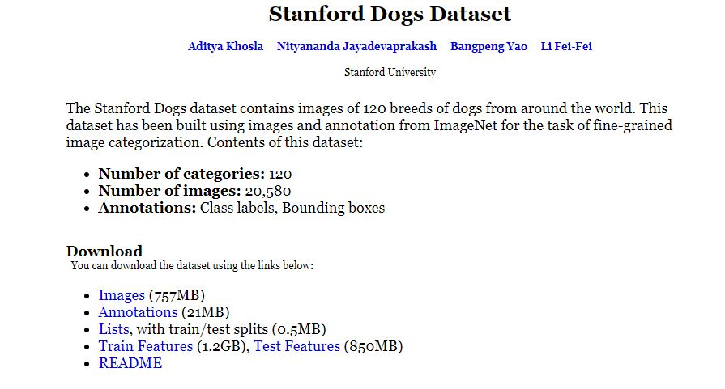
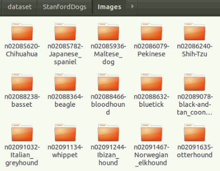
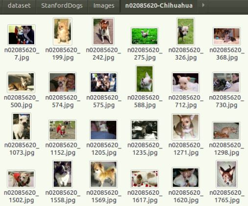
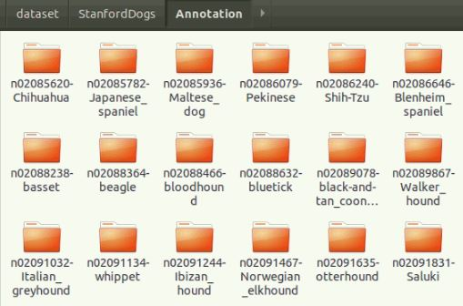
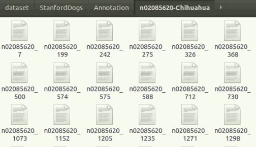
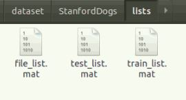
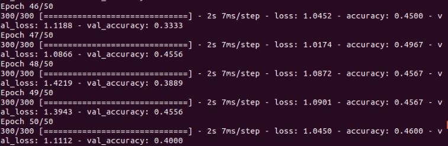
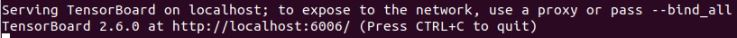
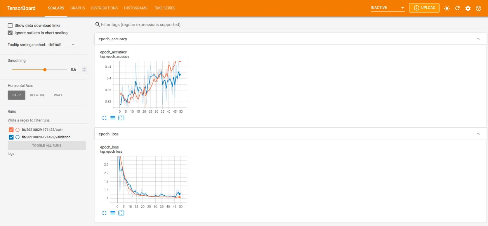

# Tensorflow insights - part 1: Image classification from zero to a trained model

When we start a machine learning project, the first mandatory question is where we get data from and how the data is prepared. Only when this stage has been completed, does we can go to the training stage. In this tutorial, we first introduce you how to use and prepare the [Stanford Dogs Dataset](http://vision.stanford.edu/aditya86/ImageNetDogs/) [1][2]; then we show the 5 core steps to implement a neural network for training in Tensorflow.

## Table of contents

1. [Requirements for the readers](#requirements-for-the-readers)
2. [Prepare the Stanford Dogs dataset](#prepare-the-stanford-dogs-dataset)
3. [All the basic components for training a deep learning model in tensorflow](#all-the-basic-components-for-training-a-deep-learning-model-in-tensorflow)
4. [Results](#results)
5. [Running the codes](#running-the-codes)
6. [Conclusion](#conclusion)
7. [References](#references)

## Requirements for the readers

You only need to know about the basics of Deep learning and Python to read this.

## Prepare the Stanford Dogs dataset
There are a lot of datasets on the internet. In this series, we use the [Stanford Dogs dataset](http://vision.stanford.edu/aditya86/ImageNetDogs/) as the main dataset for all the experiments. All other datasets often share the same characteristics with this dataset in the information provided by authors, the organization of the files, types of files, ... Thus, by working on this dataset, in the future you definely can know what to do to generalize on other datasets. Below are the steps for preparing the dataset.

- Step 1: Go to the homepage of the [Stanford Dogs dataset](http://vision.stanford.edu/aditya86/ImageNetDogs/), the interface will look like this.

<p align=center>
    
</p>
<p align=center>
    <em><b>Figure 1:</b> The interface of the Stanford Dogs Dataset website (Image from <a href="http://vision.stanford.edu/aditya86/ImageNetDogs/">Stanford Dogs dataset</a>).</em>
</p>

- Step 2: Click the ```Annotations```, ```Images``` and ```Lists``` links to download necessary files.

- Step 3: Extract each downloaded ```.tar``` file into one folder so that the directory tree of the Stanford Dogs Dataset folder will be like below:

```
.
├── Annotation
│   ├── n02085620-Chihuahua
│   ├── n02085782-Japanese_spaniel
├── Images
│   ├── n02085620-Chihuahua
│   ├── n02085782-Japanese_spaniel
├── lists
    ├── file_list.mat
    ├── test_list.mat
    └── train_list.mat
```

- Step 4: Now, let's check the structure of this dataset and the content of each file. According to the author's README:

   - Images/
      -- Images of different breeds are in separate folders
   - Annotations/
      -- Bounding box annotations of images
   - lists/
      - file_list.mat
         -- List of all files in the dataset
      - train_list.mat
         -- List and labels of all training images in dataset
      - test_list.mat
         -- List and labels of all test images in dataset

There are a lot of subfolders, each of which corresponds to one class of dog (Figure 2). In each subfolder are many sample images of that class (Figure 3).

<p align=center>
    
</p>
<p align=center>
    <em><b>Figure 2:</b> Look into the "Images" folder.</em>
</p>

<p align=center>
    
</p>
<p align=center>
    <em><b>Figure 3:</b> Look into one subfolder of the "Images" folder.</em>
</p>

The ```Annotations``` folder also stores a lot of subfolders (Figure 4). In each subfolder, not like the case above with images, are many annotation files (Figure 5). Each of the file corresponds to one sample image above. We can recognize the relation by the file name.

<p align=center>
    
</p>
<p align=center>
    <em><b>Figure 4:</b> Look into the "Annotations" folder.</em>
</p>

Open one file to know what information is stored in each annotation file.

<p align=center>
    
</p>
<p align=center>
    <em><b>Figure 5:</b> Look into the "Annotations" folder.</em>
</p>

This may be a strange format to beginners at first. To know more about it, read the [Pascal VOC XML file format](https://towardsdatascience.com/coco-data-format-for-object-detection-a4c5eaf518c5).

There are 3 files in the ```lists``` folders (Figure 6). The definition of each file has been pointed out by the author as showed above (the author's README). Here we only use the ```train_list.mat``` and ```test_list.mat``` to split the sample images into ```train``` directory and ```test``` directory. 

<p align=center>
    
</p>
<p align=center>
    <em><b>Figure 6:</b> Look into the "lists" folder.</em>
</p>

Now we go to the coding part. There are 3 objectives to prepare he dataset for training. With each objective, there is a corresponding function for it. The details of each function are described in the comments of the codes.

### <ins> Code </ins>

- Import necessary libraries
In ```data_utils.py```:
```python
# In data_utils.py
import os # the main library for operating with folders and files
from shutil import copy2 # for copying file and its metadata to another location in the machine
import xml.etree.ElementTree as ET # for reading a Pascal VOC XML file
import scipy.io # for reading .mat file
```

- Read the Pascal VOC XML file because the bounding box information for each image is saved in an XML file. Each bounding box is defined by the coordinates of two points: the upper left corner (```x_min```, ```y_min```) and the lower right corner (```x_max```, ```y_max```) of that bounding box. For more information, when working with image in Deep learning, the origin of an image is usually the top left corner and ```x``` is for the horizontal axis and ```y``` is for the vertical axis.
```python
# In data_utils.py
def read_xml_file(xml_file: str):
    '''
    Read the Pascal VOC XML file

    Arguments:
      - xml_file(str): Absolute path to an XML file of the Stanford Dogs dataset

    Returns:
      - filename(str): The file name of the corresponding sample image
      - list_of_all_boxes(str): List of all bounding boxes extracted from the XML file (there is only one bounding box in each file of this dataset)
    '''
    tree = ET.parse(xml_file) # First, parse the tree of structure in an XML file
    root = tree.getroot() # Get the root of the tree

    list_of_all_boxes = [] # Store a list of all bounding boxes read from the file

    filename = root.find("filename").text # Use the root to find the value of the tag "filename" and '.text' is for returning it as string type
    for boxes in root.iter("object"): # Iter over the sub tags of the ```object``` tag
        y_min, x_min, y_max, x_max = None, None, None, None

        y_min = int(boxes.find("bndbox/ymin").text) # slask ('/') is to access at lower levels
        x_min = int(boxes.find("bndbox/xmin").text) # bndbox is the parent tag of ymin, ...
        y_max = int(boxes.find("bndbox/ymax").text)
        x_max = int(boxes.find("bndbox/xmax").text)

        list_of_single_boxes = [x_min, y_min, x_max, y_max]
        list_of_all_boxes.append(list_of_single_boxes)
    # Here, because there is only one bbox per annotation file
    # => The for loop only has one iteration

    return filename, list_of_all_boxes
```

- Read .mat file to know what sample images belong to the train set, which ones belong to the test set.
```python
# In data_utils.py
def read_mat_file(mat_file: str, num_classes, num_files):
    '''
    Read the .mat file

    Arguments:
      - mat_file(str): Absolute path to a .mat file
      - num_classes(int): The number of classes/categories to extract. There are 120 classes/categories in the Stanford Dogs dataset, but we can only choose some first classes/categories to train for a quick introduction.
      - num_files(int): The number of files in each class to extract. We only get a small number of files for a quick introduction.
    
    Returns:
      - dic_of_used_files(dictionary) - a dictionary with:
        - key: a string represents each class/category
        - value: a list of sample file names that belong to the class specified in the key
    '''
    mat_info = scipy.io.loadmat(mat_file) # Load the .mat file

    file_list = mat_info["file_list"] # List of file names
    print('[1] file_list: ', file_list, type(file_list))

    print('[2] file_list[0, 0][0]: ', str(file_list[0, 0][0]), type(str(file_list[0, 0][0])))

    dic_of_used_files = {} # Init the returned dictionary
    cnt = 0 # temmporary variable for counting how many number of classes have been traversed
    for id, file in enumerate(file_list): # Iterate over elements in file_list
        cur_class, file_path = file[0][0].split("/") # Because file is a numpy array, we need to do indexing [0][0] to access the string value of it
        if cur_class not in dic_of_used_files: # If the current class is a new class and not exist as a key in 'dic_of_used_files'
            cnt += 1 # Increate 'cnt'
            if cnt > num_classes: # If 'cnt' is greater than the specified 'num_classes', then break the loop
                break
            dic_of_used_files[cur_class] = [] # else, add a new key to the dictionary and its values is an empty list
        if len(dic_of_used_files[cur_class]) < num_files: # Check so that the number of files in each class does not overcome the specified number 'num_files'
            dic_of_used_files[cur_class].append(file_path)

    return dic_of_used_files
```

- Split data into directories (train directory and test directory). The original image dataset has not been splitted into train directory and test directory. We need to split the image dataset into two directories so we can guide Tensorflow to know what directory it gets data for training and what directory it gets data for testing.

```python
# In data_utils.py
def split_data_into_dirs(input_data_path, output_data_path, num_classes, train_samples, test_samples):
    '''
    Split data into train directory and test directory

    Arguments:
      - input_data_path(str): Path to the Stanford Dogs dataset forlder
      - output_data_path(str): Path to the output dataset after splitting. In this folder will be two more subfolders: "train" and "test". These two folders are automatically created.
      - num_classes(int): The number of classes/categories to extract
      - train_samples(int): The number of files in each class to extract for the "train" folder
      - test_samples(int): The number of files in each class to extract for the "test" folder
    '''
    # Suppose we have a given full path "/mnt/code/tensorflow_insights/dataset" in string (in variable 'data_path'), if for some reason (like below) we want to have a full path to a file or a subfolder inside the given path, we can use the 'os.path.join'.
    # For example, if there is a file named 'train_list.mat' inside, we can get its full path like this 'os.path.join(data_path, "train_list.mat")'. The result is "/mnt/code/tensorflow_insights/dataset/train_list.mat"
    input_images_path = os.path.join(input_data_path, "Images")
    input_annotations_path = os.path.join(input_data_path, "Annotation")
    input_lists_path = os.path.join(input_data_path, "lists")
    train_mat_file_path = os.path.join(input_lists_path, "train_list.mat")
    test_mat_file_path = os.path.join(input_lists_path, "test_list.mat")

    train_dic_of_used_files = read_mat_file(train_mat_file_path, num_classes, train_samples) # Dictionary of used files for training
    test_dic_of_used_files = read_mat_file(test_mat_file_path, num_classes, test_samples) # Dictionary of used files for testing
    class_names = train_dic_of_used_files.keys() # Classes/Categories that are used

    # Use os.makedirs to create train directory and test directory
    os.makedirs(output_data_path, exist_ok=True)
    os.makedirs(os.path.join(output_data_path, 'train'), exist_ok=True)
    os.makedirs(os.path.join(output_data_path, 'test'), exist_ok=True)

    # Create directory for each class in train directory and test directory, respectively 
    for class_name in class_names:
        os.makedirs(os.path.join(output_data_path, 'train', class_name), exist_ok=True)
        os.makedirs(os.path.join(output_data_path, 'test', class_name), exist_ok=True)

    # Copy sample images to the right folder (each sample image belongs to which class of dog in train folder)
    for class_name, list_of_files in train_dic_of_used_files.items():
        for file_name in list_of_files:
            in_path = os.path.join(input_images_path, class_name, file_name)
            out_path = os.path.join(output_data_path, "train", class_name, file_name)
            copy2(in_path, out_path)

    # Copy sample images to the right folder (each sample image belongs to which class of dog in test folder)
    for class_name, list_of_files in test_dic_of_used_files.items():
        for file_name in list_of_files:
            in_path = os.path.join(input_images_path, class_name, file_name)
            out_path = os.path.join(output_data_path, "test", class_name, file_name)
            copy2(in_path, out_path)
```

- The main function: run this to complete all the steps. You need to change the 2 variables:
  - ```input_data_path```: Path to the Stanford Dogs dataset which has 3 subfolders "Images", "Annotations" and "lists" in it.
  - ```output_data_path```: Path to an output folder that stores images extracted by the code. This folder has not been created. By running the code, it is automatically created.

```python
# In ```data_utils.py```
if __name__ == "__main__":
    input_data_path = "/media/data-huy/dataset/StanfordDogs" # NEED TO CHANGE: Path to the Stanford Dogs dataset which has 3 subfolders "Images", "Annotations" and "lists" in it
    output_data_path = "/media/data-huy/dataset/StanfordDogs/train_val_test" # NEED TO CHANGE: Path to the output folder. This folder has not been created. By running the code, it is automatically created
    split_data_into_dirs(input_data_path, output_data_path, 3, 100, 30) # We want to get 3 classes/categories, 100 training samples in each class, 30 testing samples in each class
```

- Finally, use the command ```python data_utils.py``` to run the splitting process

## All the basic components for training a Deep learning model in Tensorflow

For simplicity, in this tutorial we will use Tensorflow Keras, which is the high-level API of Tensorflow.

Basically, to train a DL model in Tensorflow, you only need 5 core components:
- A data loader/generator component
- A model/network definition component
- A ```compile``` component
- A ```fit``` component
- A tool for measurements and visualizations

Next, we will give step-by-step instructions on how to code for training a neural network. In this episode and also the following episodes of this series, we show the code in a very concise way so all of the most important contents can be understood by the reader in a "fast reading" way. Therefore, the detailed information about the arguments of each function of Tensorflow will not be addressed by default. If you want to know about them, try to lookup in the [Tensorflow documentation](https://www.tensorflow.org/api_docs/python/tf).

- Step 1: Import necessary libraries

Some libraries and their functionalities:

```python
import os
import argparse
import datetime
import shutil

# TensorFlow and tf.keras
import tensorflow as tf
from tensorflow.keras.preprocessing.image import ImageDataGenerator
from tensorflow.keras.optimizers import Adam

# Helper libraries
import numpy as np
import matplotlib.pyplot as plt
```

- Step 2: Define argument parse for efficient training

```python
ap = argparse.ArgumentParser()
ap.add_argument("-trd", "--train_dir", required=True, help="Path to dataset train directory")
ap.add_argument("-td", "--test_dir", required=True, help="Path to dataset test directory")
args = vars(ap.parse_args())
```

- Step 3: A data loader/generator component

A normal way to load data is to load all the samples into a numpy array and then fit (train) the model on this array. However, this method only works if the total capacity of dataset is small enough to be loaded on the computer memory at once. In practice, it is often the case that dataset is very large so a better solution is to load data batch-by-batch from the hard drive.

```python
datagen = ImageDataGenerator( # Initialize the image data generator
    featurewise_center=True,
    featurewise_std_normalization=True,
    rotation_range=20,
    width_shift_range=0.2,
    height_shift_range=0.2,
    horizontal_flip=True,
)

train_it = datagen.flow_from_directory(args["train_dir"], target_size=(128, 128), class_mode="categorical", batch_size=1) # Data generator/iterator for the train directory

test_it = datagen.flow_from_directory(args["test_dir"], target_size=(128, 128), class_mode="categorical", batch_size=1) # Data generator/iterator for the test directory

# This part is for testing if the train data generator works
batchX, batchy = train_it.next() 
print('[*] Batch shape=%s, min=%.3f, max=%.3f' % (batchX.shape, batchX.min(), batchX.max()))
```

<ins>**Note:**</ins> You should remember this point that we use "categorical" for ```class_mode``` in both train generator and test generator.

- Step 4: A model/network definition component

Usually, a network architecture is defined using ```tf.keras.Sequential```. There are other ways of defining network architecture which will be discussed in later tutorials.

Here, we define a very simple network which just includes 3 layers: the ```Flatten``` layer is for flatten a 2-dimensional image into a 1-dimensional array, 2 ```Dense``` layers are the fully connected layers.

```python
model = tf.keras.Sequential([
    tf.keras.layers.Flatten(input_shape=(128, 128, 3)),
    tf.keras.layers.Dense(128, activation='relu'),
    tf.keras.layers.Dense(3)
])
```

<ins>**Note:**</ins> the ```input_shape``` of the ```Flatten``` layer also needs to consider the channel of an image. That is why there is a number 3 at the last dimension.

- Step 5: A ```compile``` component

Before training, we can specify some hyperparameters by using ```model.compile```

```python
model.compile(loss='categorical_crossentropy', optimizer=Adam(learning_rate=1e-7), metrics=['accuracy'])
```

In Step 3, because we have set the ```class_mode``` equal to "categorical" for both train data generator and test data generator. Therefore, when ```model.compile()```, we also need to specify ```loss``` as "categorical_crossentropy".

If we use sparse categorical entropy above, then now we also need to use sparse categorical entropy. For more information about them, read [Categorical entropy vs Sparse categorical entropy](https://stackoverflow.com/questions/49161174/tensorflow-logits-and-labels-must-have-the-same-first-dimension).

- Step 6: A ```fit``` component

When everything has completed, this is the command that starts the training process. In this episode, we use the test data for validation.

```python
model.fit(train_it, validation_data=test_it, epochs=50, callbacks=[tensorboard_callback])
```

- Step 7: A tool for measurements and visualizations

The 4 components above are enough to run a training process, but in practice you always need to do some measurements for the evaluations of the model and do some visualizations for knowing what happen in the training process.

```python
if os.path.isdir("./logs"):
    shutil.rmtree("./logs") 
log_dir = "logs/fit/" + datetime.datetime.now().strftime("%Y%m%d-%H%M%S")
tensorboard_callback = tf.keras.callbacks.TensorBoard(log_dir=log_dir, histogram_freq=1)
```

- Step 8: Now all the steps have been finished, run the command ```python train.py --train_dir "Absolute path to the train directory" --test_dir "Absolute path to the test directory"``` to train the model

## Results

Losses and accuracies after training the network through 50 epochs.

<p align=center>
    
</p>
<p align=center>
    <em><b>Figure 7:</b> Result.</em>
</p>

You will notice that there is a ```./logs``` folder created during training. This folder stores the log files that are produced by Tensorboard. To view the visualizations of losses and accuracies, use this command.

```sh
tensorboard --logdir="./logs"
```

As a result, there will have this line in the terminal. Essentialy, Tensorboard will serve a local server which we use to see the visualizations. Open the link (similar to that in the Figure 8) in browser to see Tensorboard.

<p align=center>
    
</p>
<p align=center>
    <em><b>Figure 8:</b> Local link to view Tensorboard.</em>
</p>

And this is Tensorboard. It shows the accuracies and losses of 50 epoches in both training set and test set (for validation).

<p align=center>
    
</p>
<p align=center>
    <em><b>Figure 9:</b> Results of 50 epoches in Tensorboard.</em>
</p>

We just use a "not-too-deep" neural network, so the result is not actually good. Some beautiful techniques, new modules and even different types of architectures will be gradually revealed in the next posts of this series to help you know how they can greatly increase the performances. Keep following us to gain more insightful knowledges!

## Running the codes

It is recommended that you read all the contents of this README before running the code.

- Step 1: Install required packages in your virtual environment:

```sh
pip install -r requirements
```

- Step 2: Prepare the Stanford Dogs dataset. Before running the command below, you need to change the paths as pointed out in the end of the section ["Prepare the Stanford Dogs dataset"](#prepare-the-stanford-dogs-dataset):

```sh
python data_utils.py
```

- Step 3: In the file ```train.sh``` is the command that is used for training. The command is like below. You need to change its arguments:

  - ```-trd```: the absolute path to the created train folder of "Step 2".
  - ```-td```: the absolute path to the created test folder of "Step 2".

```sh
python train.py \
-trd "/media/data-huy/dataset/StanfordDogs/train_val_test/train" \
-td "/media/data-huy/dataset/StanfordDogs/train_val_test/test" \
```

- Step 4: Train the neural network on the Stanford Dogs dataset:

```sh
chmod +x train.sh
./train.sh
```

- Step 5: View Tensorboard

```sh
tensorboard --logdir="./logs"
```

## Conclusion

The data preparation stage is very essential in every project, it always the first thing that we need to solve. This stage must be done carefully so there is no unexpected problem after that. And when having the data, with 5 main steps we can carry out to train a neural network in Tensorflow. In the next episodes, we will continue to work on this code and this dataset to add layer, increase performance, visualization for understanding, ...

## References

[1] Aditya Khosla, Nityananda Jayadevaprakash, Bangpeng Yao and Li Fei-Fei. Novel dataset for Fine-Grained Image Categorization. First Workshop on Fine-Grained Visual Categorization (FGVC), IEEE Conference on Computer Vision and Pattern Recognition (CVPR), 2011

[2]  J. Deng, W. Dong, R. Socher, L.-J. Li, K. Li and L. Fei-Fei, ImageNet: A Large-Scale Hierarchical Image Database. IEEE Computer Vision and Pattern Recognition (CVPR), 2009