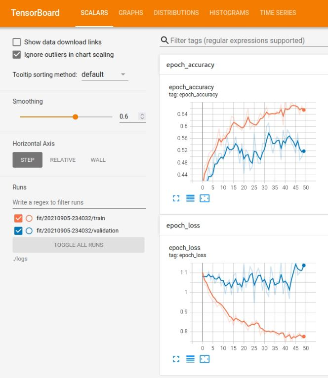

# Tensorflow insights - part 2: Basic techniques to improve the performance of a neural network

In the previous post, we have talked about the core components of Tensorflow to train a model and how to use a dataset. In this post, we will continue to work on that dataset and show some basic techniques to improve the performance of a neural network. From the state of the previous code, the new code will be added right on it.

## Table of contents

1. [More completeness](#more-completeness)
2. [Improvement 1 - Add conv layers and set learning rate to a higher value that is 1e-6](#improvement-1---add-conv-layers-and-set-learning-rate-to-a-higher-value-that-is-1e-6)
3. [Improvement 2 - Normalize image color values](#improvement-2---normalize-image-color-values)
4. [Improvement 3 - Increase learning rate to 1e-5](#improvement-3---increase-learning-rate-to-1e-5)
5. [Improvement 4 - Increase learning rate to 1e-4](#improvement-4---increase-learning-rate-to-1e-4)
6. [Running the codes](#running-the-codes)
7. [Conclusion](#conclusion)

## More completeness:

First, let's add more things to the code of part 1 for completeness: 
- Random seed to reproduce result: working with deep learning can be thought of as working with randomness (probability and statistics). One randomness comes from the process of generating batches. At a training time, batch 1 may contain sample 7 but another training time the sample 7 may not exist in batch 1. There is one drawback of this randomness when training data which is the problem of reproducible experimental results. For different training times, though their hyperparameters are the same and their network architectures are also the same (for short, everything is the same), you definitely still cannot reproduce the same training/validation results. To reproduce results, you must set the same random seed for different training time. There are 3 types of random seed you must set: the random seed of Tensorflow, the random seed of Numpy, and the random seed of Python.

```python
import tensorflow as tf
import numpy as np
import random

tf.random.set_seed(1234)
np.random.seed(1234)
random.seed(1234)
```

- Save the best model on disk: when training a neural network with multiple epochs, usually the network weights/parameters of the last epoch is not the one with highest performances. To save the best model weights in Tensorflow, you just need to add a model checkpoint callback to ```model.fit```. A model checkpoint callback is created by ```tf.keras.callbacks.ModelCheckpoint``` as below:

```python
model_checkpoint_callback = tf.keras.callbacks.ModelCheckpoint(
    filepath="".join([args["model_path"], "/models"]),
    save_weights_only=True,
    monitor='val_accuracy',
    mode='max',
    save_best_only=True)

model.fit(train_it, validation_data=test_it, epochs=50, callbacks=[tensorboard_callback, model_checkpoint_callback])
```

**Note:** The path of the argument ```filepath``` needs a trailing pattern that denotes the prefix of checkpoint files ```"/prefix"```. In the code above, the name of each created checkpoint file will have the prefix "models". 

- Add argument parser for model path: the path to the folder for saving the best model:

```python
ap.add_argument("-mdp", "--model_path", required=True, help="Path to the folder for saving checkpoints")
```

- We should let the model checkpoint folder automatically created by adding this command:

```python
os.makedirs(args["model_path"], exist_ok=True)
```

- Return ```hist``` from ```model.fit```.  From ```hist```, we can print the best accuracy and the best loss. ```hist.history``` is a dictionary that stores a list of val losses (key: ```'val_loss'```), a list of val accuracies (key: ```'val_accuracy'```), a list of train losses (key: ```'train_loss'```), a list of train accuracies (key: ```'train_accuracy'```):

```python
hist = model.fit(train_it, validation_data=test_it, epochs=50, callbacks=[tensorboard_callback, model_checkpoint_callback])

print("[*] Best validation accuracy: ", max(hist.history['val_accuracy']))
print("[*] Best validation loss: ", min(hist.history['val_loss']))
```

- Use ```model.summary()``` and ```plot_model()``` to view network architecture. Must install pydot and graphviz for ```plot_model()```.

```sh
pip install pydot
pip install graphviz
```

```python
ap.add_argument("-imp", "--image_path", required=True, help="Path to the folder for saving images") # You also need to add an argument to specify the path to the folder for saving images

model.summary() # model summary

image_path = args["image_path"] # the path to the the folder for saving an image of the network architecture
os.makedirs(image_path, exist_ok=True) # create that folder
tf.keras.utils.plot_model(model, to_file="".join([image_path, "/model.png"]), show_shapes=True) # create a plot of the network architecture
```

The outputs of ```model.summary()``` and ```plot_model()``` are in the Figure 1 and Figure 2 below:

<p align=center>
    
</p>
<p align=center>
    <em><b>Figure 1:</b> The output of "model.summary()". The information about the number of total parameters/weights and the number of trainable parameters/weights is also provided.</em>
</p>

<p align=center>
    
</p>
<p align=center>
    <em><b>Figure 2:</b> The output image of "tf.keras.utils.plot_model()". Beside the input shape, the output shape of each layer is also provided.</em>
</p>

Above, we have added some necessary steps when training a neural network in Tensorflow. Next, we will go to some basic techniques that improve performances on the Stanford Dogs dataset (the first 3 classes). However, these techniques can also be applied on other datasets, or even on different neural networks.

Let's first check the current performances of the neural network with hyperparameters and settings as pointed out in the part 1 of this series, so we can see how it improves when the techniques are added.

<p align=center>
    
</p>
<p align=center>
    <em><b>Figure 3:</b> The validation accuracy and validation loss of the neural network with 1 flatten layer and 2 dense layers, epochs=50, learning rate=1e-7</em>
</p>

## Improvement 1 - Add conv layers and set learning rate to a higher value that is 1e-6

Let's add 3 convolutional layers to the network. Each of them has 8 filters. The kernel sizes of 3 layers are set in a decreasing order - 7, 5 and 3:

```python
model = tf.keras.Sequential([
    tf.keras.layers.Conv2D(8, 7, activation='relu'), # new layer
    tf.keras.layers.Conv2D(8, 5, activation='relu'), # new layer
    tf.keras.layers.Conv2D(8, 3, activation='relu'), # new layer
    tf.keras.layers.Flatten(input_shape=(32, 32, 3)),
    tf.keras.layers.Dense(128, activation='relu'),
    tf.keras.layers.Dense(3)
])
```

Try running the training procedure, you will see an error:

```
ValueError: This model has not yet been built. Build the model first by calling `build()` or calling `fit()` with some data, or specify an `input_shape` argument in the first layer(s) for automatic build
```

Why the error has not happened before? In the previous architecture, the first layer is the flatten layer which is already defined with ```input_shape```. This ```input_shape``` is used to specify the shape of an input image including (height, width, channel). But when the convolution layer becomes the first layer, because the input shape has not been defined so we need to define the input shape and  build the ```model```. Add these lines before the ```model.summary()```.

```python
input_shape = (None, 128, 128, 3)
model.build(input_shape)
```

Try running again the training procedure, you will see another error:

```
Invalid argument: Nan in summary histogram for: conv2d/kernel_0
```

This problem is about numerical stability, you should change the activation of the last dense layer to softmax, so the last dense layer will gives the probabilities of each class. See more about sigmoid vs softmax at [link](https://stats.stackexchange.com/questions/233658/softmax-vs-sigmoid-function-in-logistic-classifier). Noticing that the default activation of ```tf.Dense``` is None, which is the reason for numerical stability. Change the activation of the last dense layer to softmax:

```python
model = tf.keras.Sequential([
    tf.keras.layers.Conv2D(8, 7, activation='relu'),
    tf.keras.layers.Conv2D(8, 5, activation='relu'),
    tf.keras.layers.Conv2D(8, 3, activation='relu'),
    tf.keras.layers.Flatten(input_shape=(32, 32, 3)),
    tf.keras.layers.Dense(128, activation='relu'),
    tf.keras.layers.Dense(3, activation='softmax') # change to softmax
])
```

Change learning rate to 1e-6 and train 50 epochs again, we will have the results in Figure 4 below.

<p align=center>
    
</p>
<p align=center>
    <em><b>Figure 4:</b> The validation accuracy and validation loss of the neural network after the improvement 1</em>
</p>

<p align=center>
    
</p>
<p align=center>
    <em><b>Figure 5:</b> The tensorboard of the neural network after the improvement 1</em>
</p>

**Note:** The tensorboard has smoothed the curves, so you need to set the smooth to zero (Smoothing slide on the left of the interface) if you want to observe the real values of loss and accuracy during training.

## Improvement 2 - Normalize image color values

A good practice in training machine learning models is to normalize the inputs. It has been proved that normalization helps the optimization process to converge faster. In Tensorflow, there are several ways to normalize the input images. In this post, we use a simple one that is  to divide each pixel of each channel by 255. In fact, it is only a change in the ```rescale``` attribute of ```ImageDataGenerator```.

```python
datagen = ImageDataGenerator(
    rescale=1./255, # add this line
    featurewise_center=True,
    featurewise_std_normalization=True,
    rotation_range=20,
    width_shift_range=0.2,
    height_shift_range=0.2,
    horizontal_flip=True,
)
```

<p align=center>
    
</p>
<p align=center>
    <em><b>Figure 6:</b> The validation accuracy and validation loss of the neural network after the improvement 2</em>
</p>

<p align=center>
    
</p>
<p align=center>
    <em><b>Figure 7:</b> The tensorboard of the neural network after the improvement 2</em>
</p>

It seems like the overfitting problem (because the train loss is more lower than val loss). But wait, there are one thing that you should have noticed. Look on the scale of the vertical axis and compare it with that of Figure 5. The values in the vertical axis of Figure 5 spans from **0 to 12** where in Figure 7 the values is only from **0 to 1.12**. Great! Thanks to the normalization, our model has further improved. Now, you must have been persuaded by the power of normalization.

Come back to the problem of overfitting. However, the train loss does not decrease to 0 yet (look Figure 7), so it also may be underfitting not overfitting. Let's try increasing the learning rate in the next two improvements.

## Improvement 3 - Increase learning rate to 1e-5

You can see from the Figure 8 below that the validation accuracy has increased from **0.53 to 0.61**. That is because the higher learning rate makes the model learn faster.

<p align=center>
    
</p>
<p align=center>
    <em><b>Figure 8:</b> The validation accuracy and validation loss of the neural network after the improvement 3</em>
</p>

<p align=center>
    
</p>
<p align=center>
    <em><b>Figure 9:</b> The tensorboard of the neural network after the improvement 3</em>
</p>

Despite the improvement, the shape of the graph is still the same as above. The validation loss is quite higher than the training loss. And the validation loss also fluctuates a lot along the epochs axis. Look at the blur blue line of which the fluctuation is even stronger. This blur blue line represents the true values of the validation losses when the smoothing slide is zero.

## Improvement 4 - Increase learning rate to 1e-4

Try increasing the learning rate to 1e-4, the best validation accuracy does not change. And the shape of the graph is still similar to the 2 cases above. Look at the 2 figures below.

<p align=center>
    
</p>
<p align=center>
    <em><b>Figure 10:</b> The validation accuracy and validation loss of the neural network after the improvement 4</em>
</p>

<p align=center>
    
</p>
<p align=center>
    <em><b>Figure 11:</b> The tensorboard of the neural network after the improvement 4</em>
</p>

## Running the codes

It is recommended that you read all the contents of this README before running the code.

- Step 1: In the file ```train.sh``` is the command that is used for training. The command is like below. You need to change its arguments:

  - ```-trd```: the absolute path to the created train folder which is set in the part 1 of this series.
  - ```-td```: the absolute path to the created test folder of "Step 2" which is set in the part 1 of this series.
  - ```-mpd```: the path to the folder for saving checkpoints.
  - ```-imp```: the path to the folder for saving the image of model plot.

```sh
python train.py \
-trd "/media/data-huy/dataset/StanfordDogs/train_val_test/train" \
-td "/media/data-huy/dataset/StanfordDogs/train_val_test/test" \
```

- Step 2: Train the neural network on the Stanford Dogs dataset:

```sh
chmod +x train.sh
./train.sh
```

- Step 3: View Tensorboard

```sh
tensorboard --logdir="./logs"
```

## Conclusion

In this post, we have talked about some basic techniques to improve the performances of a neural network. Moreover, we have also provide some practices when working with deep learning at the beginning of this post. In the next posts, we will show more ways to improve the perfomances on the Standford Dogs dataset (3 classes). Through improving the performances, we will also try to provide valuable insights for you to know why a technique/method can contribute to the increase in performance.