# Tensorflow insights - part 3: Visualizations

Deep learning is often thought of as a black-box function. Though cannot fully understand what a deep network does to give a prediction, we still have some visualization techniques to obtain information about what factors affect its prediction.

## Load model checkpoint

Let's first create a  ```test.py``` file to load the model from the model checkpoint.

First, create a function named ```create_model``` to define the network architecture. This network architecture must be the same as that in ```train.py```

```python
def create_model():
    model = tf.keras.Sequential([
        tf.keras.layers.Conv2D(8, 7, activation='relu'),
        tf.keras.layers.Conv2D(8, 5, activation='relu'),
        tf.keras.layers.Conv2D(8, 3, activation='relu'),
        tf.keras.layers.Flatten(input_shape=(32, 32, 3)),
        tf.keras.layers.Dense(128, activation='relu'),
        tf.keras.layers.Dense(3, activation='softmax')
    ])
    input_shape = (None, 128, 128, 3)
    model.build(input_shape)

    model.compile(loss='categorical_crossentropy', optimizer=Adam(learning_rate=1e-4), metrics=['accuracy'])

    return model
```

Next, create a model and load weights from checkpoint files. These checkpoint files are saved in the previous part when we do the training.

```python
model = create_model()
checkpoint_path = './models/models'
model.load_weights(checkpoint_path)
```

## Visualizing filters of convolutional layers [1]

A filter is a collection of weights that are learned by the neural network by training on data. The filter of a convolutional layer has a 2d structure, so we can visualize it as an image to get an insight into what information is learned.

Before that, from the ```model``` variable, we need to take out the convolutional layers, all the other layers are not included.

```python
for idx, layer in enumerate(model.layers):
    print('[*] layer: ', layer, end = ' ')
    if 'conv' not in layer.name: # If a layer is not convolutional layer, then print "NO"
        print('No')
        continue
```

Each convolutional layer has 2 types of weights: weights for filters and weights for biases. This code is for getting the shape of each filter. We have to do this manually because their shapes are not displayed in ```model.summary()```.

```python
for idx, layer in enumerate(model.layers):
    print('[*] layer: ', layer, end = ' ')
    if 'conv' not in layer.name:
        print('No')
        continue

    filters_weights, biases_weights = layer.get_weights()
    print('[**] id: {}, layer.name: {}, filters_weights.shape: {}, biases_weights.shape: {}'.format(idx, layer.name, filters_weights.shape, biases_weights.shape))
```

**Note:** We have already known the shape of each filter in a convolutional layer because we ourselves defined the filter sizes in ```train.py```. However, let's assume that we use a new network model and know nothing about its layers and filters.

<p align=center>
    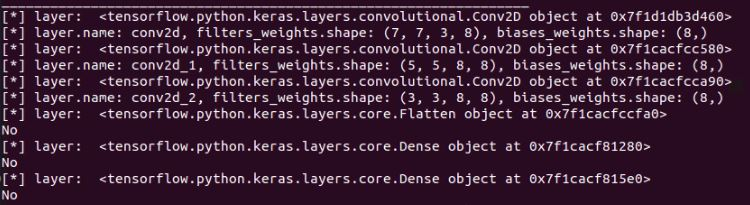
</p>
<p align=center>
    <em><b>Figure 1:</b> The shape of each filter in a convolutional layer</em>
</p>

The shape of a filter will have 4 elements ```(height, width, the depth of the input, the number of filters)```. Each filter will have a depth equal to the depth of its input. For example, in the first input layer, the input image has 3 channels, so each filter of the first convolutional layer will also have 3 channels. We can visualize these 3 channels separately, or concatenate them to visualize as an RGB image.

Try printing ```filters_weights``` of a layer by the code below (add that line inside the loop above), you can see that it has both positive and negative values. They are small and closed to zero. To visualize them on an image, we have to get rid of the negative values by normalizing them to the range 0-1.

```python
	print('[**] filters_weights: ', filters_weights)
```

<p align=center>
    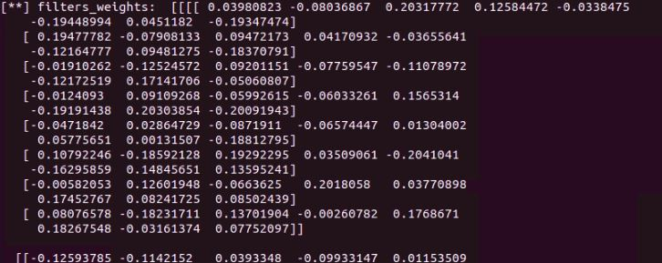
</p>
<p align=center>
    <em><b>Figure 2:</b> The filter values/weights before normalization</em>
</p>

 To visualize them on an image, we have to get rid of the negative values by normalizing these values to the range 0-1. For normalization, we add these 2 lines right before the printing line of ```filter_weights``` above.

```python
	filters_max, filters_min = filters_weights.max(), filters_weights.min()
	filters_weights = (filters_weights - filters_min)/(filters_max - filters_min)
```

<p align=center>
    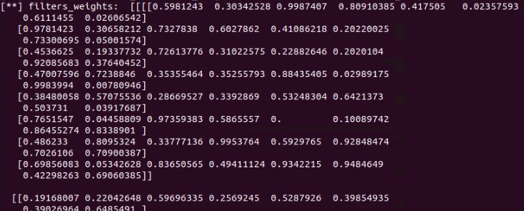
</p>
<p align=center>
    <em><b>Figure 3:</b> The filter values/weights after normalization</em>
</p>

Add a subfolder ```visualizations``` for storing all visualization functions.

**Note:** Current functions in ```visualizations``` cannot be generalized to other cases.

In the subfolder, let's create a file named ```visualizations_using_filters_and_featuremaps.py```

In this file, we create a function ```plot_filters_of_a_layer``` for visualizing filters of a layer. This function receives 2 arguments: ```filter_weights``` is for storing the filter weights of a convolutional layer that we want to visualize; ```num_filters``` is to specify the numbers of filters to visualize.

```python
def plot_filters_of_a_layer(filters_weights, num_filters):
    # plot first few filters
    ix = 1
    for i in range(num_filters):
        # get the filter
        f = filters_weights[:, :, :, i]
        # plot each channel separately
        for j in range(3):
            # specify subplot and turn of axis
            ax = plt.subplot(num_filters, 3, ix)
            ax.set_xticks([])
            ax.set_yticks([])

            # plot filter channel in grayscale
            plt.imshow(f[:, :, j], cmap='gray')
            ix += 1
    # show the figure
    plt.show()
```

- In ```test.py```, call the visualization function ```plot_filters_of_a_layer```. Call the function inside the loop above to visualize the filters of each layer.

```python
for idx, layer in enumerate(model.layers):
    print('[*] layer: ', layer)
    if 'conv' not in layer.name:
        print('No')
        continue

    filters_weights, biases_weights = layer.get_weights()
    print('[**] id: {}, layer.name: {}, filters_weights.shape: {}, biases_weights.shape: {}'.format(idx, layer.name, filters_weights.shape, biases_weights.shape))
    filters_max, filters_min = filters_weights.max(), filters_weights.min()
    filters_weights = (filters_weights - filters_min)/(filters_max - filters_min)
    print('[**] filters_weights: ', filters_weights)

    plot_filters_of_a_layer(filters_weights, 3) # ADD THIS LINE
```

Here, for each layer, there are 8 filters, but we only visualize the first 3 of them.

<p align=center>
    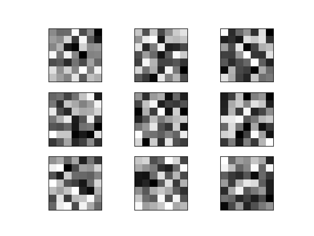
</p>
<p align=center>
    <em><b>Figure 4:</b> Filters of layer 1. Along the vertical direction are different filters. Along the horizontal direction are different channels of a filter.</em>
</p>

<p align=center>
    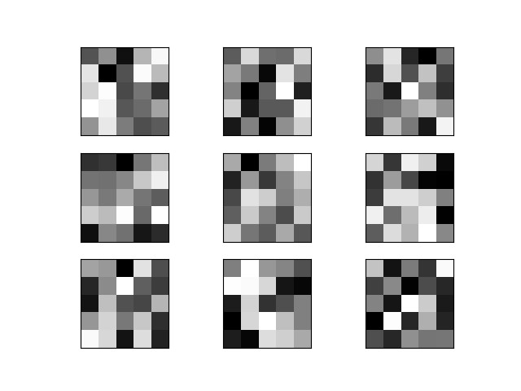
</p>
<p align=center>
    <em><b>Figure 5:</b> Filters of layer 2. Along the vertical direction are different filters. Along the horizontal direction are different channels of a filter.</em>
</p>

<p align=center>
    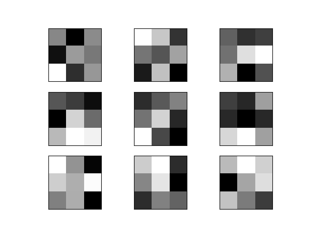
</p>
<p align=center>
    <em><b>Figure 6:</b> Filters of layer 3. Along the vertical direction are different filters. Along the horizontal direction are different channels of a filter.</em>
</p>

Those filters, though cannot be understood, have a deep meaning of classifying 3 types of dogs.

## Visualizing feature maps of convolutional layers [1]

Visualizing feature maps can let us know what features in an input image are noticed and preserved by the neural network. These features are likely the most important cues to recognize a category (dog).

Feature maps in low layers usually capture low-level detailed information. In contrast, feature maps of high layers capture high-level general information.

### Output feature maps from a single layer

Take an image from the Stanford Dogs dataset for feeding into the neural network to generate feature maps.

<p align=center>
    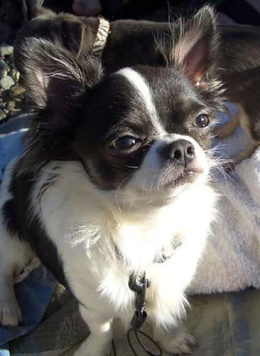
</p>
<p align=center>
    <em><b>Figure 7:</b> The chosen image that is used to visualize feature maps. "n02085620_1558.jpg" from the Chihuahua class.</em>
</p>

First, we need to clearly know the output shape of each convolutional layer. To get that information, we use ```layer.output.shape```. See the code below. Add a new line (commented with ```# ADD THIS LINE```) to the layer iteration.

```python
for idx, layer in enumerate(model.layers):
    print('[*] layer: ', layer)
    if 'conv' not in layer.name:
        print('No')
        continue

    filters_weights, biases_weights = layer.get_weights()
    print('[**] id: {}, layer.name: {}, filters_weights.shape: {}, biases_weights.shape: {}'.format(idx, layer.name, filters_weights.shape, biases_weights.shape))
    print('[**] layer.output.shape: {}'.format(layer.output.shape)) # ADD THIS LINE
    filters_max, filters_min = filters_weights.max(), filters_weights.min()
    filters_weights = (filters_weights - filters_min)/(filters_max - filters_min)
    print('[**] filters_weights: ', filters_weights)

    plot_filters_of_a_layer(filters_weights, 3)
```

Running the code will display information like below.

<p align=center>
    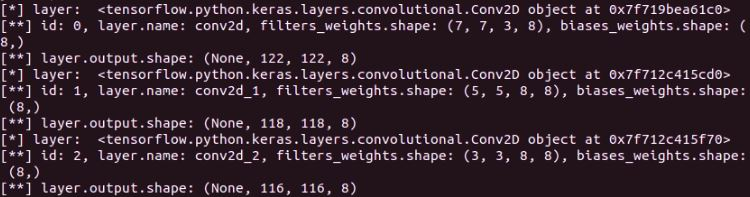
</p>
<p align=center>
    <em><b>Figure 8:</b> The output shapes of 3 convolutional layers are (None, 122, 122, 8), (None, 118, 118, 8) and (None, 116, 116, 8), respectively.</em>
</p>

In ```visualizations/visualizations_using_filters_and_featuremaps.py```, add a function ```plot_feature_maps_of_a_layer``` for visualizing feature maps of a layer. It receives the feature maps of a layer as input. For more information, the feature maps are the output of each layer. As in Figure 8, each convolutional filter has 8 feature maps (the last dimension). In this function, we visualize all 8 feature maps.

```python
def plot_feature_maps_of_a_layer(feature_maps):
    ix = 1
    for _ in range(2): # Plot 8 images in 2 row-4 column table
        for _ in range(4):
            ax = plt.subplot(2, 4, ix)
            ax.set_xticks([])
            ax.set_yticks([])
            plt.imshow(feature_maps[0, :, :, ix-1], cmap='gray')
            ix += 1 # increase the index of the last dimension to visualize 8 feature maps

    plt.show()
```

Come back to the file ```test.py```, we will try using the function above.

First, we need to load the image and do some preprocessing steps including converting to numpy array, expanding dimension for feeding into the network, and scaling the pixel value to the range [0, 1].

```python
# A PIL object
img = load_img('/media/data-huy/dataset/StanfordDogs/train_val_test/train/n02085620-Chihuahua/n02085620_1558.jpg', target_size=(128, 128))
# Convert PIL object to numpy array
img = img_to_array(img)
img = np.expand_dims(img, axis=0)
# img = model.preprocess_input(img)
img = img/255
```

To get the output of a layer, we need to create a submodel whose ```inputs``` is still the ```model.inputs``` and ```outputs``` is the output of the layer that we want to get. Then, use the new created model to predict and return feature maps.

```python
model_1 = Model(inputs=model.inputs, outputs=model.layers[0].output)
feature_maps_1 = model_1.predict(img)
print('[*] feature_maps_1.shape: ', feature_maps_1.shape)
```

The last thing is to call the function ```plot_feature_maps_of_a_layer``` on the returned feature maps.

```python
plot_feature_maps_of_a_layer(feature_maps_1)
```

<ins>Some notes</ins>
- The input image needs to be preprocessed like the same in the training stage.
- You can see the shape of the dog in all the feature maps, except that some just contain edge information and some are grayscale with a focus on patterns like furs, eyes, noses,...
- Surprisingly, from the first layer we can see that CNN can detect edges like predefined filters of edge detector.

<p align=center>
    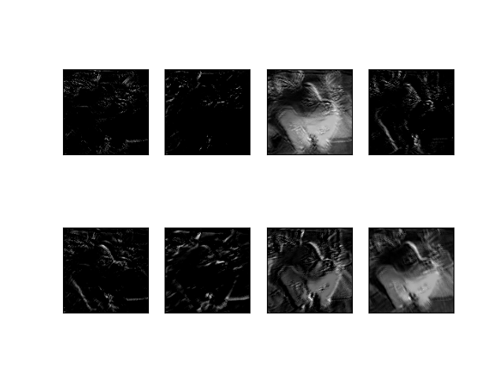
</p>
<p align=center>
    <em><b>Figure 9:</b> Feature maps of the convolutional layer 1.</em>
</p>

### Output feature maps from multiple layers

Before visualizing, we need to know the indices of all convolutional layers. Luckily, we have known that they are 0, 1, 2.

The numbers of feature map channels in all the 3 convolutional layers are equal (which is 8), so we don't need to modify the function ```plot_feature_maps_of_a_layer```.

Write a new function ```plot_feature_maps_of_multiple_layers``` that call the function ```plot_feature_maps_of_a_layer``` multiple times to plot feature maps of different layers. Each layer has a separate plot.

```python
def plot_feature_maps_of_multiple_layers(feature_maps):
    for feature_map in feature_maps:
        plot_feature_maps_of_a_layer(feature_map)
```

Then, in ```test.py```, we need to create a new submodel to return the outputs of 3 convolutional layers.

```python
list_of_outputs = [model.layers[idx].output for idx in range(3)] # Outputs of 3 convolutional layers
model_2 = Model(inputs=model.inputs, outputs=list_of_outputs)
model_2.summary()
feature_maps_2 = model_2.predict(img) 

plot_feature_maps_of_multiple_layers(feature_maps_2)
```

Run the code and below are the 3 feature map images of 3 layers.

<p align=center>
    
</p>
<p align=center>
    <em><b>Figure 10:</b> Feature maps of the convolutional layer 1.</em>
</p>

<p align=center>
    
</p>
<p align=center>
    <em><b>Figure 11:</b> Feature maps of the convolutional layer 2.</em>
</p>

<p align=center>
    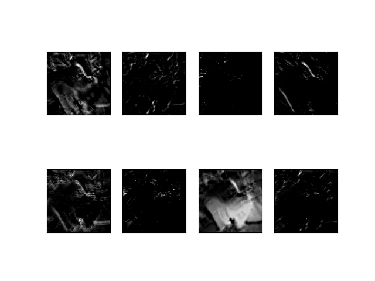
</p>
<p align=center>
    <em><b>Figure 12:</b> Feature maps of the convolutional layer 3.</em>
</p>

<ins>Some notes</ins>

- The feature maps of the third convolutional layer contain only edge information. It seems this is not a good enough semantic remaining feature for recognizing a dog. Because from these edges, one can perceive them as many things, not just a dog.
- We can also perceive that all the feature maps of 3 layers still represent the shape of the dog (even though just edges, or some parts of the dog (fur, nose, eyes)). If there are more layers, the deeper layers will not contain the information of a dog, but something more abstract will be represented, something that is a high-level feature that is good for recognition.

## tf.keras.vis [3]

The 2 visualization techniques above are based on the information got from the neural network itself. In this section, we will introduce a visualization toolkit ```tf-keras-vis``` [3] that helps us to carry out some high-level visualization techniques in Tensorflow 2.0+ with ease of use. Visualizations in this library [3] include: 

- Feature visualization:
  - ActivationMaximization
- Class Activation Maps:
  - GradCam
  - GradCam++
  - ScoreCam
  - Faster ScoreCam
- Saliency Maps:
  - Vanilla Saliency
  - SmoothGrad

Use ```pip install tf-keras-vis``` to install ```tf-keras-vis``` to your virtual environment.

In the subfolder ```visualizations```, let's create a new file named ```visualizations_using_tf_keras_vis.py``` for storing visualization functions that use ```tf.keras.vis```.

First, we need to import the required libraries in this file.

```python
import numpy as np
import tensorflow as tf
from tensorflow.keras import backend as K
from matplotlib import pyplot as plt
from matplotlib import cm
from tf_keras_vis.saliency import Saliency
from tf_keras_vis.gradcam import Gradcam
from tf_keras_vis.gradcam_plus_plus import GradcamPlusPlus
from tf_keras_vis.scorecam import Scorecam
from tf_keras_vis.activation_maximization import ActivationMaximization
from tf_keras_vis.activation_maximization.callbacks import Progress
from tf_keras_vis.activation_maximization.input_modifiers import Jitter, Rotate2D
from tf_keras_vis.activation_maximization.regularizers import TotalVariation2D, Norm
from tf_keras_vis.utils.model_modifiers import ExtractIntermediateLayer, ReplaceToLinear
from tf_keras_vis.utils.scores import CategoricalScore
```

### a) Activation maximization visualization

A significant difference of ```tf-keras-vis``` visualizations from visualizing filters and feature maps is that they need the whole learned model, not just information in one layer. Only when it is necessary to extract a layer, does it have its own method for doing that.

Activation Maximization is used to show what features the model chooses to classify an object. For more information, you should visit this [page](https://distill.pub/2017/feature-visualization/).

The function for Activation Maximization visualization receives 2 arguments: ```model``` is the learned model, ```layer_index``` is the index of the layer that we want to visualize.

```python
def plot_activation_maximization_of_a_layer(model, layer_index):
    # Instantiating a visualization class/Creating a visualization object.
    # All visualization classes has 2 main arguments: a model and model-modifier.
    # Here, model-modifier includes the function "ExtractIntermediateLayer"
    # which helps us to get the output of a specific layer by knowing its name
    activation_maximization = \
    ActivationMaximization(model,
                            model_modifier=[ExtractIntermediateLayer(model.layers[layer_index].name)],
                            clone=False)

    # Generate activations
    # Score class (here is CategoricalScore) is used to specify a filter you want to visualize.
    # You can also add regularizers or input-modifiers as needed.
    FILTER_INDEX = 7
    activations = \
    activation_maximization(CategoricalScore(FILTER_INDEX),
                            steps=100,
                            input_modifiers=[Jitter(jitter=16), Rotate2D(degree=1)],
                            regularizers=[TotalVariation2D(weight=1.0),
                                            Norm(weight=0.3, p=1)],
                            optimizer=tf.keras.optimizers.Adam(1.0, 0.999),
                            callbacks=[Progress()])

    # Plot 
    print('[*] activations.shape: ', activations.shape)
    plt.imshow(activations[0])
    plt.show()
```

Then, in ```test.py```, import the function and call it.

```python
from visualizations.visualizations_using_tf_keras_vis import plot_activation_maximization_of_a_layer
plot_activation_maximization_of_a_layer(model, 2)
```

<p align=center>
    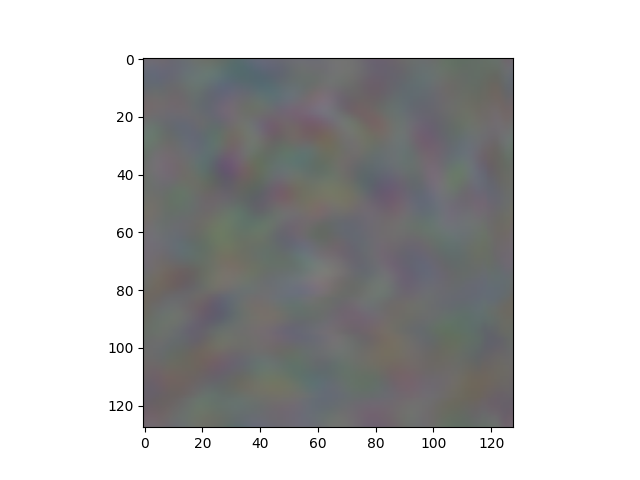
</p>
<p align=center>
    <em><b>Figure 13:</b> The activation maximization of the learned model on the Chihuahua image above.</em>
</p>

<p align=center>
    
</p>
<p align=center>
    <em><b>Figure 14:</b> Input image that is used for visualizing activation maximization (Image from [2]).</em>
</p>

<p align=center>
    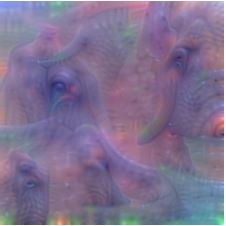
</p>
<p align=center>
    <em><b>Figure 15:</b> Activation maximization image of the VGG network on the elephant image (Image from [2]).</em>
</p>

You can see that our ActivationMaximization visualization (Figure 13) does not have good textures like that of [2] (Figure 15). One reason for this is our network is shallow so it cannot capture good information from the image. Figure 15 shows that tusk, large eyes, and trunk are the cues for recognizing an elephant.

### b) Vanilla Saliency visualization

Another type of visualization is to display the saliency maps. One method to do that is Vanilla Saliency. For more information, you should read the [Vanilla Saliency paper](https://arxiv.org/pdf/1312.6034.pdf).

The function for Vanilla Saliency visualization receives 3 arguments: ```model``` is the learned model, ```X``` is the numpy array of preprocessed input images, ```image_titles``` is the corresponding class names of images in ```X```.

```python
def plot_vanilla_saliency_of_a_model(model, X, image_titles):
    # This is different from subsection a)
    # Here, we don't give the filter index to CategoricalScore
    # but the index corresponding to "Chihuahua", "Japanese spaniel" and "Maltese dog"
    # Because there are only 3 classes, we use `list(range())` method
    # to generate list [0, 1, 2]
    score = CategoricalScore(list(range(X.shape[0])))

    # Create Saliency visualization object
    saliency = Saliency(model,
                        model_modifier=ReplaceToLinear(), # replaces the activation function of the chosen layer (here is the last layer) to linear function (for visualization)
                        clone=True)

    # Generate saliency map
    saliency_map = saliency(score, X)

    # Plot
    f, ax = plt.subplots(nrows=1, ncols=3, figsize=(12, 4))
    for i, title in enumerate(image_titles):
        ax[i].set_title(title, fontsize=16)
        ax[i].imshow(saliency_map[i], cmap='jet')
        ax[i].axis('off')
    plt.tight_layout()
    plt.show()
```

From this visualization to the ones below, we will use 3 input images of 3 classes "Chihuahua", "Japanese spaniel" and "Maltese dog". The following code is used to load images, convert them to numpy array, and normalize the pixel values.

```python
image_titles = ['Chihuahua', 'Japanese_spaniel', 'Maltese_dog']
img1 = load_img('/media/data-huy/dataset/StanfordDogs/train_val_test/train/n02085620-Chihuahua/n02085620_1558.jpg', target_size=(128, 128))
img2 = load_img('/media/data-huy/dataset/StanfordDogs/train_val_test/train/n02085782-Japanese_spaniel/n02085782_2874.jpg', target_size=(128, 128))
img3 = load_img('/media/data-huy/dataset/StanfordDogs/train_val_test/train/n02085936-Maltese_dog/n02085936_4245.jpg', target_size=(128, 128))
img1 = np.asarray(img1)
img2 = np.asarray(img2)
img3 = np.asarray(img3)
images = np.asarray([img1, img2, img3])

X = images/255
```

<p align=center>
    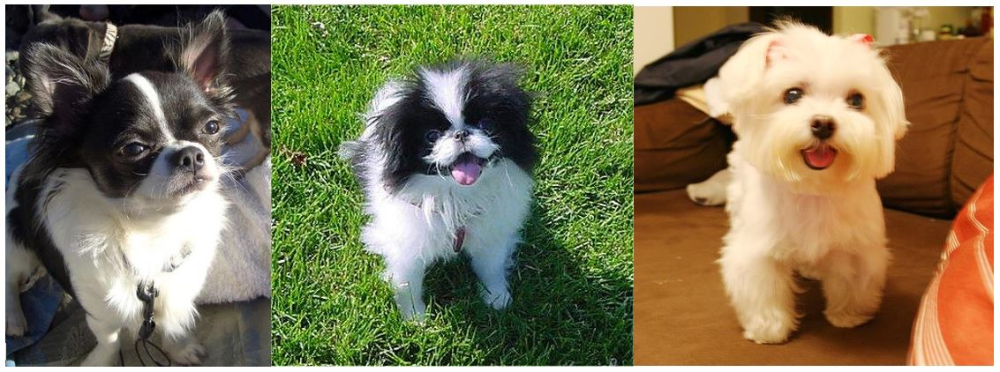
</p>
<p align=center>
    <em><b>Figure 16:</b> The 3 input images of 3 different classes "Chihuahua", "Japanese spaniel" and "Maltese dog".</em>
</p>

For comparison, we also show some visualizations which are acquired from [3]. The 3 input images they use are in Figure 17.

<p align=center>
    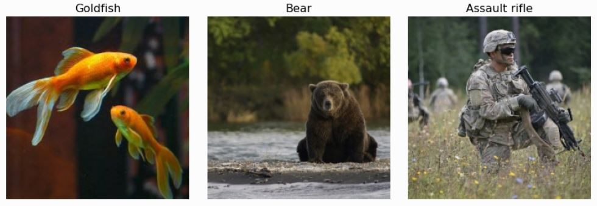
</p>
<p align=center>
    <em><b>Figure 17:</b> The 3 input images of 3 different classes "Goldfish", "Bear" and "Rifle" (from [3]).</em>
</p>

Finally, in ```test.py```, import the function and call it.

```python
from visualizations.visualizations_using_tf_keras_vis import plot_vanilla_saliency_of_a_model
plot_vanilla_saliency_of_a_model(model, X, image_titles)
```

<p align=center>
    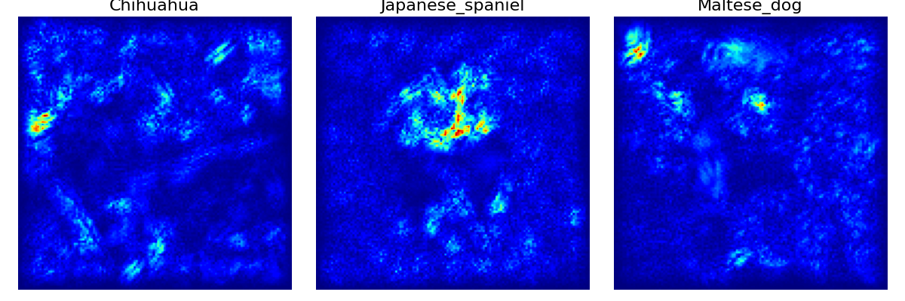
</p>
<p align=center>
    <em><b>Figure 18:</b> The vanilla saliency visualization of 3 input images.</em>
</p>

<p align=center>
    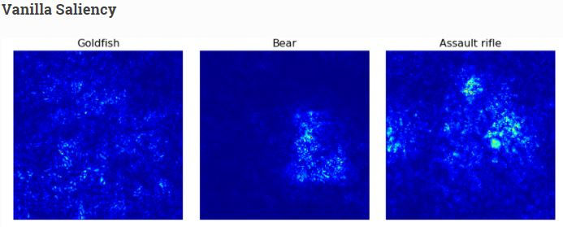
</p>
<p align=center>
    <em><b>Figure 19:</b> The vanilla saliency visualization from the web [3].</em>
</p>

In Figure 19 (from the web [3]), you can see that for the last 2 images there are bright points on the regions having bear and rifle while in the goldfish image the bright points are sparse and scatter around the regions that do not have fish.

In Figure 18, the 2 saliency images of "Chihuahua" and "Maltese dog" almost capture no useful information to recognize a dog. Actually, the bright regions are mostly in the background. The saliency image of the "Japanese spaniel" is more correct as the bright points gather on the face of the dog.

### c) SmoothGrad visualization

This is another method to visualize saliency with the aim of making the saliency image smoother by removing noises. For more information, you should read the [SmoothGrad paper](https://arxiv.org/pdf/1706.03825.pdf).

The function for SmoothGrad visualization receives 3 arguments: ```model``` is the learned model, ```X``` is the numpy array of preprocessed input images, ```image_titles``` is the corresponding class names of images in ```X```.

Basically, the function below is the same as that in subsection b) with 2 new arguments in the step of generating saliency maps: ```smooth_samples``` and ```smooth_noise```.

```python
def plot_smoothgrad_of_a_model(model, X, image_titles):
    score = CategoricalScore(list(range(X.shape[0])))

    # Create Saliency visualization object
    saliency = Saliency(model,
                        model_modifier=ReplaceToLinear(),
                        clone=True)

    # Generate saliency map
    saliency_map = saliency(score, X,
                            smooth_samples=20, # The number of calculating gradients iterations
                            smooth_noise=0.20) # noise spread level

    # Render
    f, ax = plt.subplots(nrows=1, ncols=3, figsize=(12, 4))
    for i, title in enumerate(image_titles):
        ax[i].set_title(title, fontsize=16)
        ax[i].imshow(saliency_map[i], cmap='jet')
        ax[i].axis('off')
    plt.tight_layout()
    plt.show()
```

Finally, in ```test.py```, import the function and call it.

```python
from visualizations.visualizations_using_tf_keras_vis import plot_smoothgrad_of_a_model
plot_smoothgrad_of_a_model(model, X, image_titles)
```

<p align=center>
    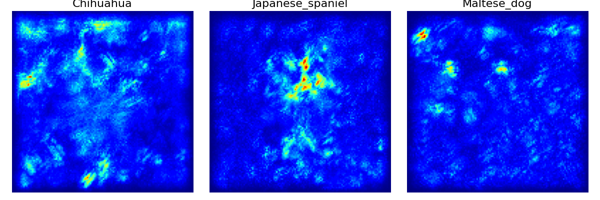
</p>
<p align=center>
    <em><b>Figure 20:</b> The SmoothGrad visualization of 3 input images.</em>
</p>

<p align=center>
    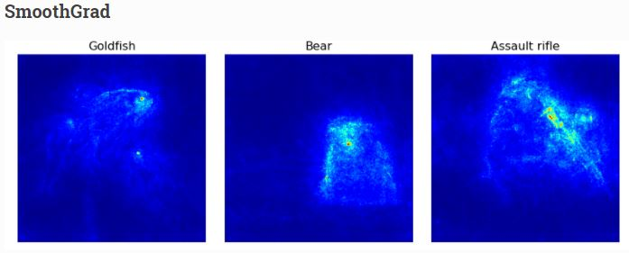
</p>
<p align=center>
    <em><b>Figure 21:</b> The SmoothGrad visualization from the web [3].</em>
</p>

In Figure 21 (from the web [3]), you can see that all the 3 objects are now obviously visible. 

In Figure 20, the 2 saliency images of "Chihuahua" and "Maltese dog" even have more noises than before. On the other hand, the saliency image of the "Japanese spaniel" becomes clearer in the face region of the dog.

### d) GradCam visualization

Vanilla saliency and SmoothGrad are for generating saliency images. Now, we come to the last type of visualization in this post which is heatmap visualization. One popular method to visualize heatmap is GradCam. For more information, you should read the [GradCam paper](https://arxiv.org/pdf/1610.02391v1.pdf).

The function for GradCam visualization receives 4 arguments (the first 3 are the same as above): ```model``` is the learned model, ```X``` is the numpy array of preprocessed input images, ```image_titles``` is the corresponding class names of images in ```X```, ```images``` is the numpy array of original input images without preprocessed (need original images because the heatmap is then drawn on top of them).


```python
def plot_gradcam_of_a_model(model, X, image_titles, images):
    score = CategoricalScore(list(range(X.shape[0])))

    # Create Gradcam visualization object
    gradcam = Gradcam(model,
                     model_modifier=ReplaceToLinear(),
                     clone=True)

    # Generate heatmap by GradCAM
    cam = gradcam(score,
                  X,
                  penultimate_layer=-1)

    # Plot
    f, ax = plt.subplots(nrows=1, ncols=3, figsize=(12, 4))
    for i, title in enumerate(image_titles):
        heatmap = np.uint8(cm.jet(cam[i])[..., :3] * 255)
        ax[i].set_title(title, fontsize=16)
        ax[i].imshow(images[i])
        ax[i].imshow(heatmap, cmap='jet', alpha=0.5) # overlay
        ax[i].axis('off')
    plt.tight_layout()
    plt.show()
```

On reading the code above, you may notice that there is a new argument ```penultimate_layer``` in the map generation step. Here, penultimate layer is the convolutional layer that is closest to the Dense layers. The output of this layer is where GradCam gets the gradients from.


Finally, in ```test.py```, import the function and call it.

```python
from visualizations.visualizations_using_tf_keras_vis import plot_gradcam_of_a_model
plot_gradcam_of_a_model(model, X, image_titles, images)
```

<p align=center>
    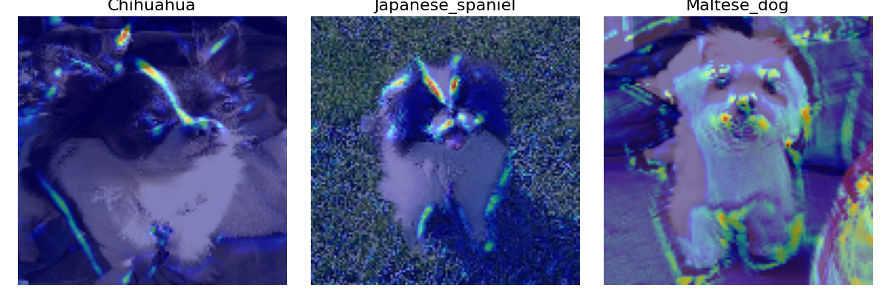
</p>
<p align=center>
    <em><b>Figure 22:</b> The GradCam visualization of 3 input images.</em>
</p>

<p align=center>
    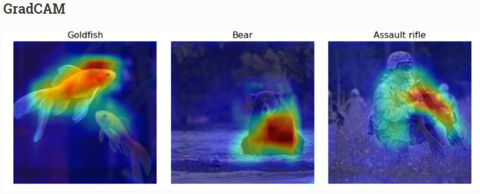
</p>
<p align=center>
    <em><b>Figure 23:</b> The GradCam visualization from the web [3].</em>
</p>

You definitely recognize the heavy difference between heatmaps in Figure 22 and Figure 23. Heatmaps in Figure 23 are large and dense, while those in Figure 22 are small and sparse. This is likely because of the fine-grained property of the Stanford Dogs dataset. Unlike objects in Figure 23 which are completely different from each other, all the objects in the Stanford Dogs dataset are dogs with just differences in the breed. It will be harder to recognize them. And partly because our current model is too shallow. Look! The Maltese dog image contains many noises.

### e) GradCam++ visualization

GradCam++ is the improved version of GradCam. For more information, you should read the [GradCam++ paper](https://arxiv.org/pdf/1710.11063.pdf).

The function for GradCam++ visualization receives 4 arguments like GradCam: ```model``` is the learned model, ```X``` is the numpy array of preprocessed input images, ```image_titles``` is the corresponding class names of images in ```X```, ```images``` is the numpy array of original input images without preprocessed (need original images because the heatmap is then drawn on top of them).

```python
def plot_gradcam_plusplus_of_a_model(model, X, image_titles, images):
    score = CategoricalScore(list(range(X.shape[0])))
    # Create GradCAM++ visualization object
    gradcam = GradcamPlusPlus(model,
                          model_modifier=ReplaceToLinear(),
                          clone=True)

    # Generate heatmap with GradCAM++
    cam = gradcam(score,
                  X,
                  penultimate_layer=-1)

    # Plot
    f, ax = plt.subplots(nrows=1, ncols=3, figsize=(12, 4))
    for i, title in enumerate(image_titles):
        heatmap = np.uint8(cm.jet(cam[i])[..., :3] * 255)
        ax[i].set_title(title, fontsize=16)
        ax[i].imshow(images[i])
        ax[i].imshow(heatmap, cmap='jet', alpha=0.5)
        ax[i].axis('off')
    plt.tight_layout()
    plt.show()
```

Finally, in ```test.py```, import the function and call it.

```python
from visualizations.visualizations_using_tf_keras_vis import plot_gradcam_plusplus_of_a_model
plot_gradcam_plusplus_of_a_model(model, X, image_titles, images)
```

<p align=center>
    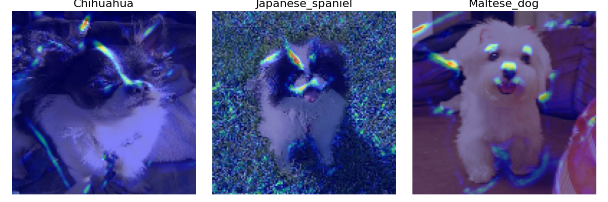
</p>
<p align=center>
    <em><b>Figure 24:</b> The GradCam++ visualization of 3 input images.</em>
</p>

<p align=center>
    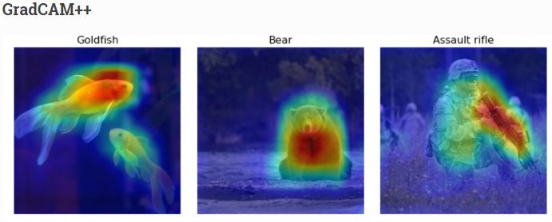
</p>
<p align=center>
    <em><b>Figure 25:</b> The GradCam++ visualization from the web [3].</em>
</p>

Now, the noises on the right side of the Maltese dog image have disappeared and the other two images also have fewer noises. More surprisingly, the heatmaps at this time have shown a sign of classification. Although they are smaller and sparser than in Figure 25, we can now have a good explanation for this problem. That is to recognize different dog breeds, detecting the whole shape of a dog should not be a good cue, but focusing on the details seems to be a better thing. 

Having looked at the 3 images of 3 different dog breeds, you might have recognized the specialty of the heatmap locations:
- "Chihuahua": On its head, there is a long heatmap that stays right on the white fur line of the dog.
- "Japanese spaniel": Unlike the Chihuahua, the Japanese spaniel has an inverted triangle on its head. There is a strong heatmap on the left side and a weak heatmap on the right side of the triangle. There are also some heatmaps near the mouth. 
- "Maltese": there are 3 heatmaps near the eyes and noses, which is possibly the indication to recognize Maltese dog with the others.


### f) ScoreCam visualization

Unlike previous approaches, ScoreCam does not depend on gradients. For more information, you should read the [ScoreCam paper](https://arxiv.org/pdf/1910.01279.pdf).

The function for ScoreCam visualization receives 4 arguments: ```model``` is the learned model, ```X``` is the numpy array of preprocessed input images, ```image_titles``` is the corresponding class names of images in ```X```, ```images``` is the numpy array of original input images without preprocessed (need original images because the heatmap is then drawn on top of them).

```python
def plot_scorecam_of_a_model(model, X, image_titles, images):
    score = CategoricalScore(list(range(X.shape[0])))
    # Create ScoreCAM visualization object
    scorecam = Scorecam(model, model_modifier=ReplaceToLinear())

    # Generate heatmap with ScoreCAM
    cam = scorecam(score, X, penultimate_layer=-1)

    # Plot
    f, ax = plt.subplots(nrows=1, ncols=3, figsize=(12, 4))
    for i, title in enumerate(image_titles):
        heatmap = np.uint8(cm.jet(cam[i])[..., :3] * 255)
        ax[i].set_title(title, fontsize=16)
        ax[i].imshow(images[i])
        ax[i].imshow(heatmap, cmap='jet', alpha=0.5)
        ax[i].axis('off')
    plt.tight_layout()
    plt.show()
```

Finally, in ```test.py```, import the function and call it.

```python
from visualizations.visualizations_using_tf_keras_vis import plot_scorecam_of_a_model
plot_scorecam_of_a_model(model, X, image_titles, images)
```

<p align=center>
    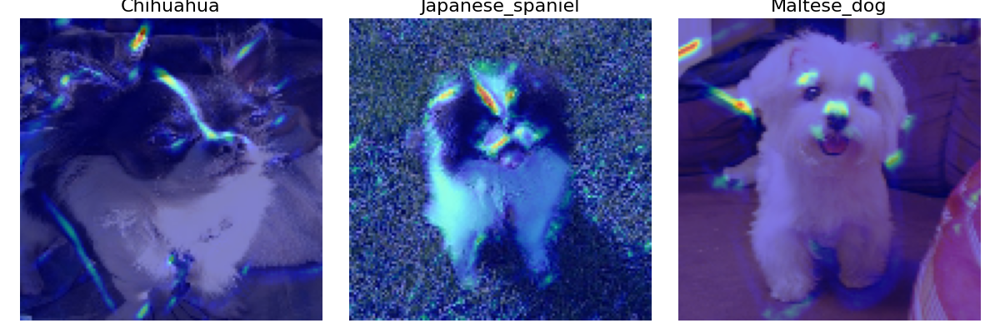
</p>
<p align=center>
    <em><b>Figure 26:</b> The ScoreCam visualization of 3 input images.</em>
</p>

<p align=center>
    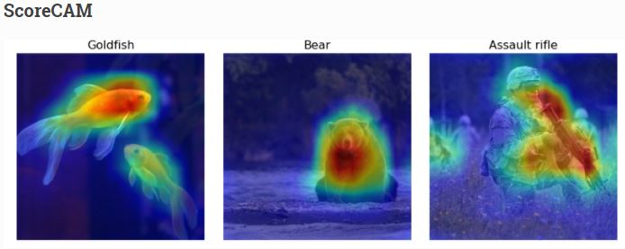
</p>
<p align=center>
    <em><b>Figure 27:</b> The ScoreCam visualization from the web [3].</em>
</p>

There is not much difference in the heatmap locations when compared with subsection e).

### g) Faster ScoreCam visualization

This is a faster version of ScoreCam. The idea of it is to keep only channels with large variances as they are supposed to mostly contribute to the final heatmap. For more information, you should read [here](https://github.com/tabayashi0117/Score-CAM/blob/master/README.md#faster-score-cam).

The function for Faster ScoreCam visualization receives 4 arguments: ```model``` is the learned model, ```X``` is the numpy array of preprocessed input images, ```image_titles``` is the corresponding class names of images in ```X```, ```images``` is the numpy array of original input images without preprocessed (need original images because the heatmap is then drawn on top of them).

```python
def plot_faster_scorecam_of_a_model(model, X, image_titles, images):
    score = CategoricalScore(list(range(X.shape[0])))
    # Create ScoreCAM visualization object
    scorecam = Scorecam(model, model_modifier=ReplaceToLinear())

    # Generate heatmap with Faster-ScoreCAM
    cam = scorecam(score,
                X,
                penultimate_layer=-1,
                max_N=8)

    # Plot 
    f, ax = plt.subplots(nrows=1, ncols=3, figsize=(12, 4))
    for i, title in enumerate(image_titles):
        heatmap = np.uint8(cm.jet(cam[i])[..., :3] * 255)
        ax[i].set_title(title, fontsize=16)
        ax[i].imshow(images[i])
        ax[i].imshow(heatmap, cmap='jet', alpha=0.5)
        ax[i].axis('off')
    plt.tight_layout()
    plt.show()
```

There is one thing to notice is the ```max_N``` argument of the heatmap generation step. It is used to specify the max number of channels that are used to generate heatmaps. This argument must be greater than or equal to 1 and lower than or equal to the number of channels that the penultimate layer has.

Finally, in ```test.py```, import the function and call it.

```python
from visualizations.visualizations_using_tf_keras_vis import plot_faster_scorecam_of_a_model
plot_faster_scorecam_of_a_model(model, X, image_titles, images)
```

<p align=center>
    
</p>
<p align=center>
    <em><b>Figure 28:</b> The Faster ScoreCam visualization of 3 input images.</em>
</p>

The fact that our current network has only 3 convolutional layers and the Stanford Dogs dataset is for fine-grained classification makes it hard for the network to learn to classify different categories. Fine-grained classification, unlike standard classification where there are strong differences between categories, requires a neural network to truly perceive the very detailed parts of each category to do the classification.

## Conclusion

In this post, we have pointed out some types of visualizations. Although several visualization techniques cannot reach their best states because the model has not been good enough, we can still have a few insights on how visualization can help us to understand more about deep neural networks. 

## References

[1] Jason Brownlee, [How to Visualize Filters and Feature Maps in Convolutional Neural Networks](https://machinelearningmastery.com/how-to-visualize-filters-and-feature-maps-in-convolutional-neural-networks/), Machine Learning Mastery.

[2] Saurabh Pal, [A Guide to Understanding Convolutional Neural Networks (CNNs) using Visualization](https://www.analyticsvidhya.com/blog/2019/05/understanding-visualizing-neural-networks/), Analytics Vidhya.

[3] Yasuhiro Kubota, [Welcome to tf-keras-vis](https://keisen.github.io/tf-keras-vis-docs/index.html), tf-keras-vis.