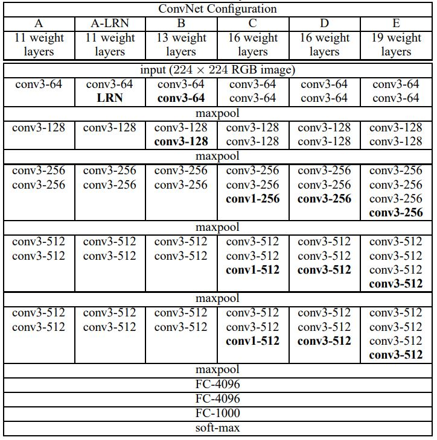
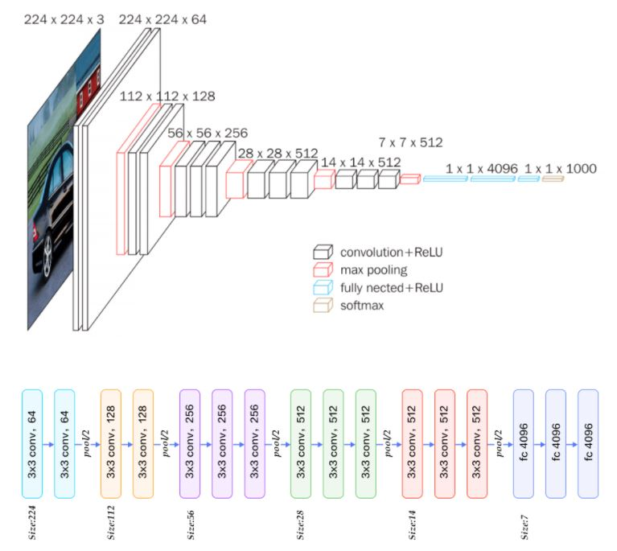
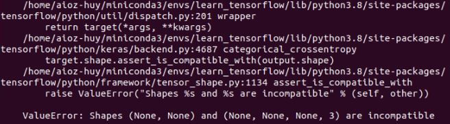
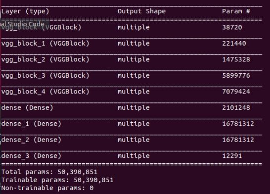
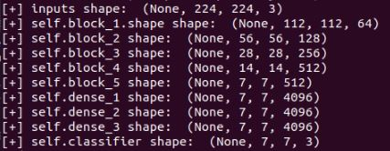
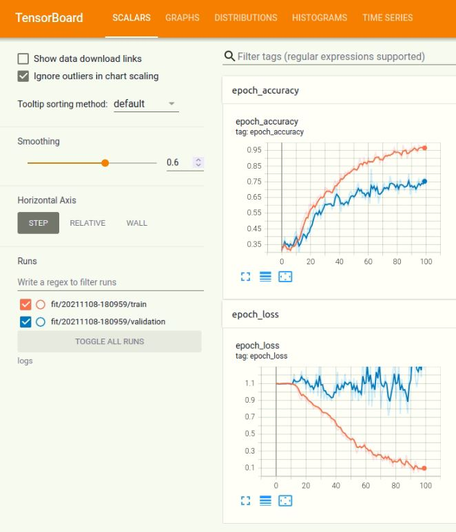

# Tensorflow insights - part 4: Custom model

Until now, our network just has 3 convolutional layers and 2 dense layers. When training with epochs=50, batch size=1, learning rate=1e-4 on the Stanford Dogs dataset, the validation accuracy is 61.1% and the validation loss is 0.928. The number of parameters is:

```sh
Total params: 13,782,835
Trainable params: 13,782,835
Non-trainable params: 0
```

## Table of contents

1. [Increase the depth of the network](#increase-the-depth-of-the-network)
2. [Implementation](#implementation)
    1. [1/ In ```vgg.py```:](#)
    2. [a) Class ```VGGBlock```:](#)
    3. [b) Class ```VGG16Net```:](#)
    4. [2/ In ```train.py```:](#)
3. [Improvement 1: increase learning rate from 1e-4 to 1e-7](#improvement-1:-increase-learning-rate-from-1e---4-to-1e---7)
4. [Improvement 2: increase train batch size from 1 to 8](#improvement-2:-increase-train-batch-size-from-1-to-8)
5. [Improvement 3: decrease the network complexity 1, learning rate=1e-4, batch size=8](#improvement-3:-decrease-the-network-complexity-1,-learning-rate=1e---4,-batch-size=8)
6. [Improvement 4: Decrease learning rate from 1e-4 to 1e-7](#improvement-4:-decrease-learning-rate-from-1e---4-to-1e---7)
7. [Improvement 5: Increase learning rate from 1e-4 to 1e-3](#improvement-5:-increase-learning-rate-from-1e---4-to-1e---3)
8. [Improvement 6: increase the filters of the convolutional layers back again, lr=1e-4, batch size=8, epochs=100](#improvement-6:-increase-the-filters-of-the-convolutional-layers-back-again,-lr=1e-4,-batch-size=8,-epochs=100)
9. [Improvement 7: decrease conv_layers of self.block_3 to 1](#improvement-7:-decrease-conv_layers-of-self.block_3-to-1)
10. [Improvement 8: decrease conv_layers of self.block_4 to 1](#improvement-8:-decrease-conv_layers-of-self.block_4-to-1)
5. [Running the codes](#running-the-codes)
6. [Conclusion](#conclusion)
7. [References](#references)

## Increase the depth of the network

According to the VGG paper [1], the network depth is one of the most important factors that lead to good visual representations. Due to this idea, in this part we try increasing the depth of the network to see how it affects to the final performances.

We also introduce and address some new terms for the implementation in Tensorflow:
- block of layers.
- custom model (custom layer).

<p align=center>
    
</p>
<p align=center>
    <em><b>Figure 1:</b> VGG ConvNet configurations (from Table 1 of paper [1]). </em>
</p>

In column E, we can see that there are 5 convolutional blocks. Each block is a stack of layers. The first two blocks are similar in that they have 2 same convolutional layers. The latter three blocks are similar in that they have 3 same convolutional layers. Because of this, the use of custom model to define block of layers would give us an efficient way to define the network architectures.

For more concrete information about the layers and the shape of each layer ouput, you should look in the figure 2 below.

<p align=center>
    
</p>
<p align=center>
    <em><b>Figure 2:</b> The VGG architecture (from [2]) </em>
</p>

Let's implement again the blocks of layers (or the network modules) that are used by the VGG architecture. All the convolutional layers in VGG  use filter size of 3x3 for the few parameters used (less computational cost).

## Implementation

First, let's create a new folder named ```networks``` for storing the code related to network architectures. Inside we will create a file ```vgg.py```.

### <ins> 1/ In ```vgg.py```: </ins>

In Figure 2, you have seen that the VGG network has 5 main blocks of convolutional layers. All of the 5 blocks have some patterns in common:
- They contain only convolutional layers.
- There are more than 1 convolutional layers in each block.
- The convolutional layers in each block have the same number of filters.
- All of the convolutional layers use a filter size of 3x3.

The 4 patterns here are enough to constitute an ideal situation that we should get familiar with custom model (custom layer) in Tensorflow.

### a) Class ```VGGBlock```:

This class can be thought of as an "exemplar" for creating any blocks that have patterns listed out above.

It must inherit the ```tf.keras.Model```.

```python
class VGGBlock(tf.keras.Model):
```

Then, we need to define 2 methods for this class:
- ```__init__```: initialize the block by layers and their configurations.
- ```call```: define the forward pass of the block.

**Method 1:** ```__init__```

As the ```VGGBlock``` inherits from another class, we need to use ```super().__init__``` for accessing the inherited methods that are overridden.

```python
def __init__(self, conv_layers=2, kernel_size=3, filters=64): # ADDED
    super(VGGBlock, self).__init__(name='') # ADDED
```

The first 3 attributes are: the number of convolutional layers, the kernel size, and the number of filters in each convolutional layer.

```python
def __init__(self, conv_layers=2, kernel_size=3, filters=64):
    super(VGGBlock, self).__init__(name='')
    self.conv_layers = conv_layers # ADDED
    self.kernel_size = kernel_size # ADDED
    self.filters = filters # ADDED
```

These 3 attributes are initialized by passing values to arguments when instantiating a ```VGGBlock``` object.

Next, we create convolutional layers for the block. If we have only one convolutional layer to create, the usual way is to explicitly define it. But here the number of convolutional layers varies among different block instantiations, so we need a special way to define the required number of layers.

Below is the layer naming convention that we use. 

```
<layer type>_<kernel size>_<the number of filters>_<layer id>
```
- ```<layer type>```: "conv2d" or "max_pool2d"
- ```<kernel size>```: 3
- ```<the number of filters>```: 32, 64, 128, 256, 512
- ```<layer id>```: "a", "b", "c", "d", "e", "f", ...

We can define a layer following to the naming convention like this:

```python
self.conv2d_3_64_a = tf.keras.layers.Conv2D(64, (3, 3), activation='relu', padding='same')
```

However, when there are more layers to define we cannot do in the same way because the number of convolutional layers vary at different instantiations. To deal with this, we can define them iteratively (i.e in a loop).

First, we need to have a list of layer ids. Each layer id is an alphabet character. In this post, we just define at most 4 layers for each block, the list below surpasses the requirement.

```python
self.layer_id = ['a', 'b', 'c', 'd', 'e', 'f', 'g', 'h'] 
```

Now, we will go to the main part of writing loop. Certainly, we need to loop over the number of convolutional layers assigned in the attribute ```self.conv_layers```.

```python
for i in range(self.conv_layers):
```

The most notable here is we define a variable by string, then use ```exec``` to execute that string. For left clause (like ```self.conv2d_3_64_a``` above):

```python
left_cls = ''.join(["self.conv2d", "_", str(self.kernel_size), "_", str(self.filters), "_", str(self.layer_id[i])])
```

For right clause (like ```tf.keras.layers.Conv2D(64, (3, 3), activation='relu', padding='same')```)

```python
right_cls = ''.join(["tf.keras.layers.Conv2D(", str(self.filters), ", ", "(", str(self.kernel_size), ", ", str(self.kernel_size), ")", ", ",
                    "activation='relu'", ", ", "padding='same'", ")"])
```

Then, combine them into an assignment:

```python
assignation = ''.join([left_cls, '=', right_cls])
```

Finally, call ```exec``` to execute the ```assignation```:

```python
exec(assignation)
```

In this case, you can see that we carry out the assignation by string. This string is exactly the same as the case of one layer above. The only difference is we use string for assignation, which helps us to easily create a single attribute name for each convolutional layer. As a result, now we do not need to worry how many layers in the block.

For catching up with the current flow, this is our code until now.

```python
class VGGBlock(tf.keras.Model):
    def __init__(self, conv_layers=2, kernel_size=3, filters=64):
        super(VGGBlock, self).__init__(name='')
        self.conv_layers = conv_layers
        self.kernel_size = kernel_size
        self.filters = filters

        self.layer_id = ['a', 'b', 'c', 'd', 'e', 'f', 'g', 'h'] 
        for i in range(self.conv_layers):
            left_cls = ''.join(["self.conv2d", "_", str(self.kernel_size), "_", str(self.filters), "_", str(self.layer_id[i])])
            right_cls = ''.join(["tf.keras.layers.Conv2D(", str(self.filters), ", ", "(", str(self.kernel_size), ", ", str(self.kernel_size), ")", ", ",
                                "activation='relu'", ", ", "padding='same'", ")"])
            assignation = ''.join([left_cls, '=', right_cls])
            exec(assignation)
```

Looking into Figure 2, can you know what is incomplete? That is in each block there needs to have a max pool as the last component layer. In the outer region of the loop, we add this:

```python
self.max_pool2d = tf.keras.layers.MaxPool2D((2, 2), strides=(2, 2), padding='valid')
```

When everything completes, the ```VGGBlock``` will look like the code below:

```python
class VGGBlock(tf.keras.Model):
    def __init__(self, conv_layers=2, kernel_size=3, filters=64):
        super(VGGBlock, self).__init__(name='')
        self.conv_layers = conv_layers
        self.kernel_size = kernel_size
        self.filters = filters

        self.layer_id = ['a', 'b', 'c', 'd', 'e', 'f', 'g', 'h']
        for i in range(self.conv_layers):
            left_cls = ''.join(["self.conv2d", "_", str(self.kernel_size), "_", str(self.filters), "_", str(self.layer_id[i])])
            right_cls = ''.join(["tf.keras.layers.Conv2D(", str(self.filters), ", ", "(", str(self.kernel_size), ", ", str(self.kernel_size), ")", ", ",
                                "activation='relu'", ", ", "padding='same'", ")"])
            assignation = ''.join([left_cls, '=', right_cls])
            exec(assignation)
        
        self.max_pool2d = tf.keras.layers.MaxPool2D((2, 2), strides=(2, 2), padding='valid')
```

You may notice that the ```padding``` of convolutional layer and maxpool layer are different. In the conv layers, we use "same"; in the max pooling layer, we use "valid" (follow the figure 2). The value "same" is for padding so that the output has the same shape as input, while the value "valid" means no padding. As you can see in Figure 2, in each block the activation maps of all convolutional layers have an equal shape. That is the reason why we need to use the value "same" for padding. For the max pool layer, its output shape is as half as the input shape. And one more thing is that all the convolutional layers have even height and even width. So, to decrease the last convolutional activation map of a block by half, we just need to have a max pool layer of size (2, 2) and strides (2, 2) and there is no need for padding (You should pause here and think a little bit about this).

**Method 2:** ```call```

This ```call``` method is to describe the forward pass of the block.

You can ignore the ```training``` argument in ```call``` because it is for the BatchNorm layer but here we do not have one.

Normally, we call the layer on an input to get the corresponding output like this (layer by layer in an sequential way):

```python
x = self.conv2d_3_64_a(input_tensor)
x = self.conv2d_3_128_a(x)
...
```

However, because we have established the convolutional layers by string in ```__init__```, we also have to call the layers by string in ```call```. To do this, we first create a string variable ```layer``` for storing the attribute name.

```python
layer = ''.join(["self.conv2d", "_", str(self.kernel_size), "_", str(self.filters), "_", str(self.layer_id[i])])
```

Then, to call that layer on an input, we use ```eval```:

```python
x = eval(layer)(input_tensor)
```

In general, there will have a loop and we will use the 2 statements above in each iteration. There is one exception case to handle at the first layer, which is it receives the ```input_tensor``` as input. For the other layers, they just receive the output of the previous layer which has already been stored in ```x```.

After the loop, we also need to call the max pool layer.

```python
x = self.max_pool2d(x)
```

Finally, the method ```call``` will look like below.

```python
def call(self, input_tensor, training=False):
    # print('[**] ', self.conv2d_3_64_a)
    # print('[**] ', self.conv2d_3_64_b)
    for i in range(self.conv_layers):
        # layer = ''.join(["self.conv2d", "_", str(self.kernel_size), "_", str(self.filters), "_", str(self.layer_id[i])])
        # print('[**] layer: ', eval(layer))
        if i == 0:
            layer = ''.join(["self.conv2d", "_", str(self.kernel_size), "_", str(self.filters), "_", str(self.layer_id[i])])
            # print('[**] layer: ', eval(layer))
            x = eval(layer)(input_tensor)
        else:
            layer = ''.join(["self.conv2d", "_", str(self.kernel_size), "_", str(self.filters), "_", str(self.layer_id[i])])
            # print('[**] layer: ', eval(layer))
            x = eval(layer)(x)
    x = self.max_pool2d(x)
    return x
```

### b) Class ```VGG16Net```:

Defining the VGG network architecture [1] in the class ```VGG16Net``` is quite easier. You just need to carefully initialize and assess layer by layer.

In ```__init__```, we construct the VGG16 network architecture according to the configuration D in Figure 1.

```python
def __init__(self, num_classes=3):
    super(VGG16Net, self).__init__()
    self.block_1 = VGGBlock(conv_layers=2, filters=64)
    self.block_2 = VGGBlock(conv_layers=2, filters=128)
    self.block_3 = VGGBlock(conv_layers=3, filters=256)
    self.block_4 = VGGBlock(conv_layers=3, filters=512)
    self.block_5 = VGGBlock(conv_layers=3, filters=512)
    self.dense_1 = tf.keras.layers.Dense(4096, activation='relu')
    self.dense_2 = tf.keras.layers.Dense(4096, activation='relu')
    self.dense_3 = tf.keras.layers.Dense(4096, activation='relu')
    self.classifier = tf.keras.layers.Dense(num_classes, activation='softmax')
```

Note that the argument ```num_classes``` is to specify the number of nodes in the last dense layer (the softmax layer).

In ```call```, we will call layer by layer (or more correctly, block by block) as the same order in ```__init__``` to represent the forward pass. 

```python
def call(self, inputs):
    x = self.block_1(inputs)
    x = self.block_2(x)
    x = self.block_3(x)
    x = self.block_4(x)
    x = self.block_5(x)
    x = self.dense_1(x)
    x = self.dense_2(x)
    x = self.dense_3(x)
    x = self.classifier(x)
    return x
```

Finally, the ```VGG16Net``` will look like below:

```python
class VGG16Net(tf.keras.Model):
    def __init__(self, num_classes=3):
        super(VGG16Net, self).__init__()
        self.block_1 = VGGBlock(conv_layers=2, filters=64)
        self.block_2 = VGGBlock(conv_layers=2, filters=128)
        self.block_3 = VGGBlock(conv_layers=3, filters=256)
        self.block_4 = VGGBlock(conv_layers=3, filters=512)
        self.block_5 = VGGBlock(conv_layers=3, filters=512)
        self.flatten = tf.keras.layers.Flatten(input_shape=(7, 7, 512))
        self.dense_1 = tf.keras.layers.Dense(4096, activation='relu')
        self.dense_2 = tf.keras.layers.Dense(4096, activation='relu')
        self.dense_3 = tf.keras.layers.Dense(4096, activation='relu')
        self.classifier = tf.keras.layers.Dense(num_classes, activation='softmax')

    def call(self, inputs):
        x = self.block_1(inputs)
        x = self.block_2(x)
        x = self.block_3(x)
        x = self.block_4(x)
        x = self.block_5(x)
        x = self.flatten(x)
        x = self.dense_1(x)
        x = self.dense_2(x)
        x = self.dense_3(x)
        x = self.classifier(x)
        return x
```


### <ins> 2/ In ```train.py```: </ins>

Now we come to the file ```train.py``` to change our previous network with the VGG network.

First, import the class ```VGG16Net```.

```python
from networks.vgg import VGG16Net
```

Then replace our previous network with it. We can do this by commenting out the current block of codes and call the ```VGG16Net```:

```python
# model = tf.keras.Sequential([
#     tf.keras.layers.Conv2D(8, 7, activation='relu'),
#     tf.keras.layers.Conv2D(8, 5, activation='relu'),
#     tf.keras.layers.Conv2D(8, 3, activation='relu'),
#     tf.keras.layers.Flatten(input_shape=(32, 32, 3)),
#     tf.keras.layers.Dense(128, activation='relu'),
#     tf.keras.layers.Dense(3, activation='softmax')
# ])

model = VGG16Net(num_classes=3)
```

Change the input shape from 128 to 224. There are 3 positions need to be changed: the train data generator, the test data generator, and the input shape that is put into the ```model.build()``` command.

- Change the ```target_size``` of ```train_it``` and ```test_it``` to (224, 224).

```python
train_it = datagen.flow_from_directory(args["train_dir"], target_size=(224, 224), class_mode="categorical", batch_size=1)

test_it = datagen.flow_from_directory(args["test_dir"], target_size=(224, 224), class_mode="categorical", batch_size=1)
```

- Change the ```input_shape``` to (None, 224, 224, 3). This is right below the call of ```VGG16Net```.

```python
input_shape = (None, 224, 224, 3)
model.build(input_shape)
```

Now, try runnning ```train.sh```. There will be a problem about incompatible shape. 

```sh
(None, None) is incompatible with (None, None, None, 3).
```

<p align=center>
    
</p>
<p align=center>
    <em><b>Figure 3:</b> The shape problem. </em>
</p>

What is this problem? How to solve it? This problem is about shape, so let's first try printing the output shape of each layer to see what happened.

There is a simple way to do this that is to use ```model.summary()```. Unluckily, it doesn't show information about the output shape, possibly because we use custom model for building blocks. We need to try another way.

<p align=center>
    
</p>
<p align=center>
    <em><b>Figure 4:</b> The result of "model.summary()". </em>
</p>

Alternatively, we can print the output shape of each layer in the forward pass. We can make it by adding some printings in the method ```call()``` of the class ```VGG16Net``` like below:

```python
def call(self, inputs):
    print('[+] inputs shape: ', inputs.shape)
    x = self.block_1(inputs)
    print('[+] self.block_1.shape shape: ', x.shape)
    x = self.block_2(x)
    print('[+] self.block_2 shape: ', x.shape)
    x = self.block_3(x)
    print('[+] self.block_3 shape: ', x.shape)
    x = self.block_4(x)
    print('[+] self.block_4 shape: ', x.shape)
    x = self.block_5(x)
    print('[+] self.block_5 shape: ', x.shape)
    x = self.flatten(x)
    print('[+] self.flatten shape: ', x.shape)
    x = self.dense_1(x)
    print('[+] self.dense_1 shape: ', x.shape)
    x = self.dense_2(x)
    print('[+] self.dense_2 shape: ', x.shape)
    x = self.dense_3(x)
    print('[+] self.dense_3 shape: ', x.shape)
    x = self.classifier(x)
    print('[+] self.classifier shape: ', x.shape)
    return x
```

Let's run the file ```train.sh``` again. We will see the shapes be printed two times: before and after the ```model.summary()```. Checking the first time, we will notice problem in the dense layers.

<p align=center>
    
</p>
<p align=center>
    <em><b>Figure 5:</b> The problem in the shape of the dense layers. </em>
</p>

A dense layer shape should be 3-dimensional (one is for the batch size). Nonetheles, there are 4-dimensional. Why is that? You should think a little bit before checking the answer below.

That is because we haven't flattened the output of the last convolutional layer. Now, add the flatten layer to both the ```__init__``` and ```call``` and run again.

```python
class VGG16Net(tf.keras.Model):
    def __init__(self, num_classes=3):
        super(VGG16Net, self).__init__()
        self.block_1 = VGGBlock(conv_layers=2, filters=64)
        self.block_2 = VGGBlock(conv_layers=2, filters=128)
        self.block_3 = VGGBlock(conv_layers=3, filters=256)
        self.block_4 = VGGBlock(conv_layers=3, filters=512)
        self.block_5 = VGGBlock(conv_layers=3, filters=512)
        self.flatten = tf.keras.layers.Flatten(input_shape=(7, 7, 512)) # ADDED
        self.dense_1 = tf.keras.layers.Dense(4096, activation='relu')
        self.dense_2 = tf.keras.layers.Dense(4096, activation='relu')
        self.dense_3 = tf.keras.layers.Dense(4096, activation='relu')
        self.classifier = tf.keras.layers.Dense(num_classes, activation='softmax')

    def call(self, inputs):
        x = self.block_1(inputs)
        x = self.block_2(x)
        x = self.block_3(x)
        x = self.block_4(x)
        x = self.block_5(x)
        x = self.flatten(x) # ADDED
        x = self.dense_1(x)
        x = self.dense_2(x)
        x = self.dense_3(x)
        x = self.classifier(x)
        return x
```

Great! Everything is okay now. However, the validation accuracy is too low (just 33%). Let's try doing several things to increase the results in the following sections of improvement.

```sh
295/300 [============================>.] - ETA: 0s - loss: 1.0987 - accuracy: 0.
297/300 [============================>.] - ETA: 0s - loss: 1.0987 - accuracy: 0.
299/300 [============================>.] - ETA: 0s - loss: 1.0987 - accuracy: 0.
300/300 [==============================] - 19s 65ms/step - loss: 1.0987 - accuracy: 0.3200 - val_loss: 1.0986 - val_accuracy: 0.3333
[*] Best validation accuracy:  0.3333333432674408
[*] Best validation loss:  1.0986113548278809
```

## Improvement 1: increase learning rate from 1e-4 to 1e-7

Try decreasing the learning rate. The accuracy has increased to 45%.

```sh
296/300 [============================>.] - ETA: 0s - loss: 1.0763 - accuracy: 0.298/300 [============================>.] - ETA: 0s - loss: 1.0758 - accuracy: 0.300/300 [==============================] - ETA: 0s - loss: 1.0756 - accuracy: 0.300/300 [==============================] - 20s 66ms/step - loss: 1.0756 - accuracy: 0.5167 - val_loss: 1.0850 - val_accuracy: 0.3889
[*] Best validation accuracy:  0.4555555582046509
[*] Best validation loss:  1.0849639177322388
```

Keep the learning rate 1e-7 and come to the next improvement

## Improvement 2: increase train batch size from 1 to 8

Change the ```batch_size``` of train data generator and test data generator to 8.

```python
train_it = datagen.flow_from_directory(args["train_dir"], target_size=(224, 224), class_mode="categorical", batch_size=8)

test_it = datagen.flow_from_directory(args["test_dir"], target_size=(224, 224), class_mode="categorical", batch_size=8)
```

```sh
36/38 [===========================>..] - ETA: 0s - loss: 1.0974 - accuracy: 0.48
37/38 [============================>.] - ETA: 0s - loss: 1.0974 - accuracy: 0.49
38/38 [==============================] - ETA: 0s - loss: 1.0974 - accuracy: 0.49
38/38 [==============================] - 11s 293ms/step - loss: 1.0974 - accuracy: 0.4933 - val_loss: 1.0980 - val_accuracy: 0.3667
[*] Best validation accuracy:  0.4444444477558136
[*] Best validation loss:  1.0978403091430664
```

This improvement seems not to bring any positive effects to the result. The validation accuracy even decreases a little bit. The reason can be the current VGG architecture is too complex while there are few data samples for training.

Keep the batch size 8 and come to the next improvement.

## Improvement 3: decrease the network complexity 1, learning rate=1e-4, batch size=8

We decrease the network complexity by removing one convolutional layer from each block. To accomplish this, we just need to change the value of ```conv_layers``` in each block. Change ```conv_layers``` of block 1 and block 2 from 2 to 1. Change ```conv_layers``` of block 3, block 4, and block 5 from 3 to 2. The ```input_shape``` of the flatten layer is also changed according to the block 5. The number of units in each of the 3 dense layers is also decreased from 4096 to 496.

More than that, The ```filters``` in each block is also decreased by half.

```python
class VGG16Net(tf.keras.Model):
    def __init__(self, num_classes=3):
        super(VGG16Net, self).__init__()
        self.block_1 = VGGBlock(conv_layers=1, filters=32)
        self.block_2 = VGGBlock(conv_layers=1, filters=64)
        self.block_3 = VGGBlock(conv_layers=2, filters=128)
        self.block_4 = VGGBlock(conv_layers=2, filters=256)
        self.block_5 = VGGBlock(conv_layers=2, filters=256)
        self.flatten = tf.keras.layers.Flatten(input_shape=(7, 7, 256))
        self.dense_1 = tf.keras.layers.Dense(496, activation='relu')
        self.dense_2 = tf.keras.layers.Dense(496, activation='relu')
        self.dense_3 = tf.keras.layers.Dense(496, activation='relu')
        self.classifier = tf.keras.layers.Dense(num_classes, activation='softmax')
```

Try running ```train.sh``` again.

```sh
36/38 [===========================>..] - ETA: 0s - loss: 0.4881 - accuracy: 0.81
37/38 [============================>.] - ETA: 0s - loss: 0.4857 - accuracy: 0.81
38/38 [==============================] - ETA: 0s - loss: 0.4931 - accuracy: 0.81
38/38 [==============================] - 4s 107ms/step - loss: 0.4931 - accuracy: 0.8100 - val_loss: 1.1629 - val_accuracy: 0.7444
[*] Best validation accuracy:  0.7444444298744202
[*] Best validation loss:  0.7772431969642639
```

You can see that the accuracy has increased a lot. This support our assumption that the previous architecture is too complex. Moreover, by using block, it is clearly that we can easily modify the network architecture with just several changes in the block arguments.

## Improvement 4: Decrease learning rate from 1e-4 to 1e-7

Continue with the network in improvement 3, try decreasing the learning rate from 1e-4 to 1e-7 to see if it helps.

```sh
36/38 [===========================>..] - ETA: 0s - loss: 1.0979 - accuracy: 0.33
37/38 [============================>.] - ETA: 0s - loss: 1.0978 - accuracy: 0.33
38/38 [==============================] - ETA: 0s - loss: 1.0979 - accuracy: 0.33
38/38 [==============================] - 3s 92ms/step - loss: 1.0979 - accuracy: 0.3333 - val_loss: 1.0986 - val_accuracy: 0.3333
[*] Best validation accuracy:  0.3444444537162781
[*] Best validation loss:  1.0982556343078613
```

Seems like decreasing lr is not a good way. Let's increase the learning rate.

## Improvement 5: Increase learning rate from 1e-4 to 1e-3

Continue with the network in improvement 3, try increasing the learning rate from 1e-4 to 1e-3 to see if it helps.

```sh
36/38 [===========================>..] - ETA: 0s - loss: 1.0989 - accuracy: 0.31
37/38 [============================>.] - ETA: 0s - loss: 1.0989 - accuracy: 0.31
38/38 [==============================] - ETA: 0s - loss: 1.0989 - accuracy: 0.32
38/38 [==============================] - 3s 91ms/step - loss: 1.0989 - accuracy: 0.3200 - val_loss: 1.0986 - val_accuracy: 0.3333
[*] Best validation accuracy:  0.3333333432674408
[*] Best validation loss:  1.0986121892929077
```

Increasing the learning rate does not help too.

## Improvement 6: increase the filters of the convolutional layers back again, lr=1e-4, batch size=8, epochs=100

In this improvement, we increase the ```filters``` back to the original state and increase the epochs from 50 to 100.

```python
class VGG16Net(tf.keras.Model):
    def __init__(self, num_classes=3):
        self.block_1 = VGGBlock(conv_layers=1, filters=64)
        self.block_2 = VGGBlock(conv_layers=1, filters=128)
        self.block_3 = VGGBlock(conv_layers=2, filters=256)
        self.block_4 = VGGBlock(conv_layers=2, filters=512)
        self.block_5 = VGGBlock(conv_layers=2, filters=512)
        self.flatten = tf.keras.layers.Flatten(input_shape=(7, 7, 512))
        self.dense_1 = tf.keras.layers.Dense(496, activation='relu')
        self.dense_2 = tf.keras.layers.Dense(496, activation='relu')
        self.dense_3 = tf.keras.layers.Dense(496, activation='relu')
        self.classifier = tf.keras.layers.Dense(num_classes, activation='softmax')
```

```sh
36/38 [===========================>..] - ETA: 0s - loss: 0.1762 - accuracy: 0.92
37/38 [============================>.] - ETA: 0s - loss: 0.1756 - accuracy: 0.92
38/38 [==============================] - ETA: 0s - loss: 0.1907 - accuracy: 0.91
38/38 [==============================] - 4s 111ms/step - loss: 0.1907 - accuracy: 0.9167 - val_loss: 1.9859 - val_accuracy: 0.6556
[*] Best validation accuracy:  0.7666666507720947
[*] Best validation loss:  0.6507346034049988
```

The validation accuracy has increased a little bit from 74.4% to 76.6%.

## Improvement 7: decrease conv_layers of self.block_3 to 1

Try decreasing the ```conv_layers``` of of ```self.block_3``` to 1.

```python
class VGG16Net(tf.keras.Model):
    def __init__(self, num_classes=3):
        self.block_1 = VGGBlock(conv_layers=1, filters=64)
        self.block_2 = VGGBlock(conv_layers=1, filters=128)
        self.block_3 = VGGBlock(conv_layers=1, filters=256)
        self.block_4 = VGGBlock(conv_layers=2, filters=512)
        self.block_5 = VGGBlock(conv_layers=2, filters=512)
        self.flatten = tf.keras.layers.Flatten(input_shape=(7, 7, 512))
        self.dense_1 = tf.keras.layers.Dense(496, activation='relu')
        self.dense_2 = tf.keras.layers.Dense(496, activation='relu')
        self.dense_3 = tf.keras.layers.Dense(496, activation='relu')
        self.classifier = tf.keras.layers.Dense(num_classes, activation='softmax')
```

```sh
36/38 [===========================>..] - ETA: 0s - loss: 0.2655 - accuracy: 0.89
37/38 [============================>.] - ETA: 0s - loss: 0.2630 - accuracy: 0.89
38/38 [==============================] - ETA: 0s - loss: 0.2587 - accuracy: 0.89
38/38 [==============================] - 4s 109ms/step - loss: 0.2587 - accuracy: 0.8967 - val_loss: 1.4345 - val_accuracy: 0.6778
[*] Best validation accuracy:  0.7777777910232544
[*] Best validation loss:  0.6979585886001587
```

The validation accuracy has increased a little bit more.

## Improvement 8: decrease conv_layers of self.block_4 to 1

Like above, try decreasing the ```conv_layers``` of of ```self.block_4``` to 1.

```python
class VGG16Net(tf.keras.Model):
    def __init__(self, num_classes=3):
        self.block_1 = VGGBlock(conv_layers=1, filters=64)
        self.block_2 = VGGBlock(conv_layers=1, filters=128)
        self.block_3 = VGGBlock(conv_layers=1, filters=256)
        self.block_4 = VGGBlock(conv_layers=1, filters=512)
        self.block_5 = VGGBlock(conv_layers=2, filters=512)
        self.flatten = tf.keras.layers.Flatten(input_shape=(7, 7, 512))
        self.dense_1 = tf.keras.layers.Dense(496, activation='relu')
        self.dense_2 = tf.keras.layers.Dense(496, activation='relu')
        self.dense_3 = tf.keras.layers.Dense(496, activation='relu')
        self.classifier = tf.keras.layers.Dense(num_classes, activation='softmax')
```

```sh
36/38 [===========================>..] - ETA: 0s - loss: 0.1018 - accuracy: 0.96
37/38 [============================>.] - ETA: 0s - loss: 0.0996 - accuracy: 0.96
38/38 [==============================] - ETA: 0s - loss: 0.0976 - accuracy: 0.96
38/38 [==============================] - 4s 106ms/step - loss: 0.0976 - accuracy: 0.9633 - val_loss: 1.2612 - val_accuracy: 0.7778
[*] Best validation accuracy:  0.8333333134651184
[*] Best validation loss:  0.716941237449646
```

It continues to increase when the network becomes less complex. The validation accuracy has now become quite better, about 83.3%.

And this is the tensorboard after improvement 8.

<p align=center>
    
</p>
<p align=center>
    <em><b>Figure 6:</b> The Tensorboard. </em>
</p>

During 100 epochs, both the train accuracy and test accuracy has a trend of increase. For the loss function, the distance between the two curves is greater than that of the accuracy.

## Running the codes

It is recommended that you read all the contents of this README before running the code.

- Step 0: Install required packages in your virtual environment:

```sh
pip install -r requirements
```

- Step 1: In the file ```train.sh``` is the command that is used for training. The command is like below. You need to change its arguments:

  - ```-trd```: the absolute path to the created train folder which is set in the part 1 of this series.
  - ```-td```: the absolute path to the created test folder of "Step 2" which is set in the part 1 of this series.
  - ```-mpd```: the path to the folder for saving checkpoints.
  - ```-imp```: the path to the folder for saving the image of model plot.

```sh
python train.py \
-trd "/media/data-huy/dataset/StanfordDogs/train_val_test/train" \
-td "/media/data-huy/dataset/StanfordDogs/train_val_test/test" \
-mdp "./models" \
-imp "./images"
```

- Step 2: Train the neural network on the Stanford Dogs dataset:

```sh
chmod +x train.sh
./train.sh
```

- Step 3: View Tensorboard

```sh
tensorboard --logdir="./logs"
```

- Step 4: For loading the trained model and do some visualizations, the ```test.py``` is used. We also have a script file ```test.sh``` for storing the command that runs ```test.py```. You need to change its arguments:
  - ```-trd```: the absolute path to the created train folder which is set in the part 1 of this series. We will use images in the train set for visualizations.
  - ```-mpd```: the path to the folder that stores saving checkpoints. We will load the trained model from this folder.

```sh
python test.py \
-trd "/media/data-huy/dataset/StanfordDogs/train_val_test/train" \
-mdp "./models" \
```

- Step 5: Test the trained model by visualizations.

```sh
chmod +x test.sh
./test.sh
```

The visualization figures will be displayed one after another. To go to the next figure, click the "close" button of the current figure.

## Conclusion

In this post, we have shown you what is a custom model (or custom layer), how to use it in Tensorflow, and see how it can bring us more efficiency when coding and experimenting with different variations of a network architecture. The results on the 3-class Stanford dataset have also become far better. In the next posts, we will continue with Tensorflow custom model to try using it to implement other popular network architecture.

## References

[1] Simonyan, Karen, and Andrew Zisserman. ["Very deep convolutional networks for large-scale image recognition."](https://arxiv.org/pdf/1409.1556.pdf(2014.pdf) arXiv preprint arXiv:1409.1556 (2014).

[2] Paras Varshney, ["VGGNet-16 Architecture: A Complete Guide"](https://www.kaggle.com/blurredmachine/vggnet-16-architecture-a-complete-guide), Kaggle, 2020.