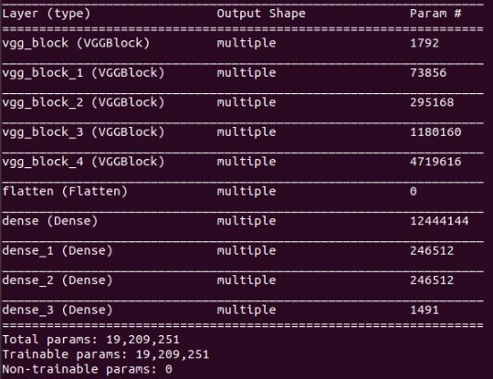
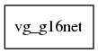
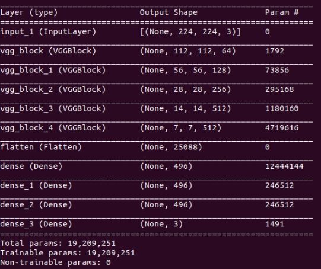
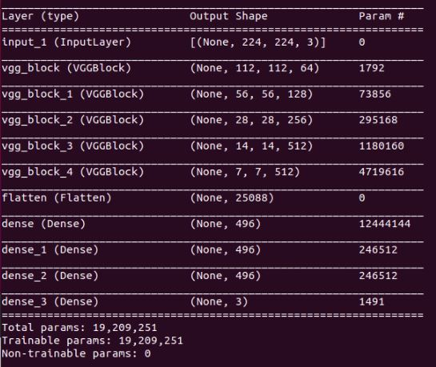

# Tensorflow insights - part 5: Custom model - continue

In the previous part, we have shown how to use custom model to implement VGG network. However, one remained problem is we cannot use model.summary() to see the output shape of each layer. In addition, we also cannot get the shape of filters. Although we have known how the VGG is constructed, overcoming this problem will help the end users - who only use our checkpoint to investigate the model. In particular, it is very important for us to get the output shape of each layer/block when using the file ```test.py```.

## Table of contents

1. [Increase the depth of the network](#increase-the-depth-of-the-network)
2. [Implementation](#implementation)
    1. [1/ In ```vgg.py```:](#)
    2. [a) Class ```VGGBlock```:](#)
    3. [b) Class ```VGG16Net```:](#)
    4. [2/ In ```train.py```:](#)
3. [Improvement 1: increase learning rate from 1e-4 to 1e-7](#improvement-1:-increase-learning-rate-from-1e---4-to-1e---7)
4. [Improvement 2: increase train batch size from 1 to 8](#improvement-2:-increase-train-batch-size-from-1-to-8)
5. [Improvement 3: decrease the network complexity 1, learning rate=1e-4, batch size=8](#improvement-3:-decrease-the-network-complexity-1,-learning-rate=1e---4,-batch-size=8)
6. [Improvement 4: Decrease learning rate from 1e-4 to 1e-7](#improvement-4:-decrease-learning-rate-from-1e---4-to-1e---7)
7. [Improvement 5: Increase learning rate from 1e-4 to 1e-3](#improvement-5:-increase-learning-rate-from-1e---4-to-1e---3)
8. [Improvement 6: increase the filters of the convolutional layers back again, lr=1e-4, batch size=8, epochs=100](#improvement-6:-increase-the-filters-of-the-convolutional-layers-back-again,-lr=1e-4,-batch-size=8,-epochs=100)
9. [Improvement 7: decrease conv_layers of self.block_3 to 1](#improvement-7:-decrease-conv_layers-of-self.block_3-to-1)
10. [Improvement 8: decrease conv_layers of self.block_4 to 1](#improvement-8:-decrease-conv_layers-of-self.block_4-to-1)
5. [Running the codes](#running-the-codes)
6. [Conclusion](#conclusion)
7. [References](#references)

Now, let's try running the file ```test.py``` by using the trained model (checkpoint files) saved in the folder ```models```. This folder was previously created when we train the "modified" VGG network on the Stanford Dogs dataset.

Before being able to do that, we need to update out ```test.py```.

## Build the VGG16 architecture

As usual, we will start from the last state of the code in part 4.

First, we need to import the class ```VGG16Net``` into ```test.py```.

```python
from networks.vgg import VGG16Net
```

Recall that in the current state of ```test.py```, we have a function to construct the old network architecture which has 3 convolutional layers and 2 dense layers. Then, we call this function and assign it to the variable ```model```. The final thing is to load weights from checkpoint files for the model.

```python
def create_model():
    model = tf.keras.Sequential([
        tf.keras.layers.Conv2D(8, 7, activation='relu'),
        tf.keras.layers.Conv2D(8, 5, activation='relu'),
        tf.keras.layers.Conv2D(8, 3, activation='relu'),
        tf.keras.layers.Flatten(input_shape=(32, 32, 3)),
        tf.keras.layers.Dense(128, activation='relu'),
        tf.keras.layers.Dense(3, activation='softmax')
    ])
    input_shape = (None, 128, 128, 3)
    model.build(input_shape)

    model.compile(loss='categorical_crossentropy', optimizer=Adam(learning_rate=1e-4), metrics=['accuracy'])

    return model

model = create_model()
checkpoint_path = os.path.join(args["model_path"], 'models')
model.load_weights(checkpoint_path)
```

Now, as the VGG architecture has already been defined by the class ```VGG16Net```, we just simply call it without the necessity of creating the function ```create_model```. The other things are the same as before. After reconstructing the network, we build model and load weights.

```python
model = VGG16Net(num_classes=3) # Construct the VGG network for 3-class classification
input_shape = (None, 224, 224, 3)
model.build(input_shape) # Build model
checkpoint_path = os.path.join(args["model_path"], 'models')
model.load_weights(checkpoint_path) # Load weights
```

Now run the ```./test.sh```, there will be an error when we try to print the ```layer.output.shape```:

```sh
Traceback (most recent call last):
  File "test.py", line 44, in <module>
    print('[**] layer.output.shape: {}'.format(layer.output.shape))
  File "/home/aioz-huy/miniconda3/envs/learn_tensorflow/lib/python3.8/site-packages/tensorflow/python/keras/engine/base_layer.py", line 2105, in output
    raise AttributeError('Layer ' + self.name + ' has no inbound nodes.')
AttributeError: Layer vgg_block has no inbound nodes.
```

There is a problems with the output shape information of each layer. We can verify it by using the ```model.summary()```. Let's add the ```model.summary()``` right after the model is built:

```python
model.summary()
```

And here is the result, all of the output shapes are "multiple":

<p align=center>
    
</p>
<p align=center>
    <em><b>Figure 1:</b> The result of model.summary(). </em>
</p>

Indeed, the ```tf.keras.utils.plot_model()``` in ```train.py``` also returns a weird plot.

<p align=center>
    
</p>
<p align=center>
    <em><b>Figure 2:</b> The result of plot_model(). </em>
</p>

This problem seems to be at the essence of Tensorflow. There is even a topic for it ([issue link](https://github.com/tensorflow/tensorflow/issues/25036)). Briefly, it is related to the static graph of layers in Tensorflow. In a Functional or Sequential model, we can get the input shape or output shape of each layer because these models are static graphs of layers, whereas there is no graph of layers in the case of a subclassed model [1].

One way to solve is to create a method ```model``` in the class ```VGG16Net```. This method explicitly infers the model by knowing its inputs and outputs [2]. 

```python
def model(self):
    x = tf.keras.layers.Input(shape=(224, 224, 3))
    return tf.keras.Model(inputs=[x], outputs=self.call(x))
```

The rationale behind the solution is when the ```self.call()``` is invoked on the input ```x```, the shape computation is executed for each layer. Besides, the ```tf.keras.Model``` instance also compute shapes which are returned in ```model.summary()```. One drawback is that we have to  define the input shape manually. Here, the input shape is the same as specified in the ```train.py```.

In ```test.py```, replace ```model.summary()``` with ```model.model().summary()```:

```python
# model.summary() # old
model.model().summary() # new
```

We also need to modify the loop which is right below the line of loading weights. In the loop, we comment out the if statement as there is no layer with "conv" in its name. And add a line for printing the length of the returned list of ```layer.get_weights()```. This information will be used below.

```python
for idx, layer in enumerate(model.layers):
    print('[*] layer: ', layer)
    # if 'conv' not in layer.name: # Comment out these 3 lines
    #     print('No')
    #     continue

    print('[**] len(layer.get_weights()): ', len(layer.get_weights()))
    filters_weights, biases_weights = layer.get_weights()
    print('[**] id: {}, layer.name: {}, filters_weights.shape: {}, biases_weights.shape: {}'.format(idx, layer.name, filters_weights.shape, biases_weights.shape))
    print('[**] layer.output.shape: {}'.format(layer.output.shape))
    filters_max, filters_min = filters_weights.max(), filters_weights.min()
    filters_weights = (filters_weights - filters_min)/(filters_max - filters_min)
    # print('[**] filters_weights: ', filters_weights)

    plot_filters_of_a_layer(filters_weights, 3)
```

Now, run again the ```test.sh```. Below is the new result of ```model.model().summary()```:

<p align=center>
    
</p>
<p align=center>
    <em><b>Figure 3:</b> The result of model.model().summary(). </em>
</p>

Printing information of the following loop also seems to be very good, except that there is an error when the iteration at the last vgg block happens:

```sh
[*] layer:  <networks.vgg.VGGBlock object at 0x7f2bf7e97400>
[**] len(layer.get_weights()):  2
[**] id: 0, layer.name: vgg_block, filters_weights.shape: (3, 3, 3, 64), biases_weights.shape: (64,)
[**] layer.output.shape: (None, 112, 112, 64)
[*] layer:  <networks.vgg.VGGBlock object at 0x7f2bf7e97f40>
[**] len(layer.get_weights()):  2
[**] id: 1, layer.name: vgg_block_1, filters_weights.shape: (3, 3, 64, 128), biases_weights.shape: (128,)
[**] layer.output.shape: (None, 56, 56, 128)
[*] layer:  <networks.vgg.VGGBlock object at 0x7f2bf421ee50>
[**] len(layer.get_weights()):  2
[**] id: 2, layer.name: vgg_block_2, filters_weights.shape: (3, 3, 128, 256), biases_weights.shape: (256,)
[**] layer.output.shape: (None, 28, 28, 256)
[*] layer:  <networks.vgg.VGGBlock object at 0x7f2bf4211d00>
[**] len(layer.get_weights()):  2
[**] id: 3, layer.name: vgg_block_3, filters_weights.shape: (3, 3, 256, 512), biases_weights.shape: (512,)
[**] layer.output.shape: (None, 14, 14, 512)
[*] layer:  <networks.vgg.VGGBlock object at 0x7f2bf41d1bb0>
[**] len(layer.get_weights()):  4
Traceback (most recent call last):
  File "test.py", line 43, in <module>
    filters_weights, biases_weights = layer.get_weights()
ValueError: too many values to unpack (expected 2)
```

The traceback points out that there are too many values to unpack at the line of getting weights. Moreover, we can see that this happens at the iteration of the last VGG block (see the layer id). To know exactly the number of elements returned by ```layer.get_weights()```, we can now take advantage of the printing line added above. In the output above, you may notice this line:

```sh
[**] len(layer.get_weights()):  4 <class 'list'>
```

While the previous iterations only have 2 elemnents from ```layer.get_weights()```, the last VGG block has twice as many as them. Why is that? Looking at the VGG architecture we specify in the last part, you can see that each of the first 4 blocks has only 1 convolutional layer while the last block has 2 convolutional layers. This is the reason why the ```layer.get_weights()``` returns 4.

```python
self.block_1 = VGGBlock(conv_layers=1, filters=64)
self.block_2 = VGGBlock(conv_layers=1, filters=128)
self.block_3 = VGGBlock(conv_layers=1, filters=256)
self.block_4 = VGGBlock(conv_layers=1, filters=512)
self.block_5 = VGGBlock(conv_layers=2, filters=512)
self.flatten = tf.keras.layers.Flatten(input_shape=(7, 7, 512))
self.dense_1 = tf.keras.layers.Dense(496, activation='relu')
self.dense_2 = tf.keras.layers.Dense(496, activation='relu')
self.dense_3 = tf.keras.layers.Dense(496, activation='relu')
self.classifier = tf.keras.layers.Dense(num_classes, activation='softmax')
```

Let's modify the loop above so it can adapt to this case. In general, everything is the same as before, we just have some modifications to adapt to the case of having more than one convolutional layer in a block. The modified loop will look like below (the idea is simple, you can read in the comment at each modified line):

```python
for idx, layer in enumerate(model.layers):
    print('[*] layer: ', layer)
    if 'vgg_block' not in layer.name: # MOD: Use this condition to ignore the Flatten layer and Dense layers. Note that the string 'conv' is replaced by 'vgg_block'.
        print('No')
        continue
    print('[**] id: {}, layer.name: {}'.format(idx, layer.name))
    print('[**] len(layer.get_weights()): ', len(layer.get_weights()))
    list_of_weights = layer.get_weights() # MOD: replace the filters_weights and biases_weights with only one variable list_of_weights, which is good for the variation in the number of convolutional layers in each block.
    num_weights = len(list_of_weights) # MOD: the number of elements in  ```list_of_weights```. We need to get this to know the nubmer of convolutional layers in the current block.
    for i in range(int(num_weights/2)): # MOD: The number of convolutional layers in each block is equal num_weights/2.
        print('[**] filters_weights.shape: {}, biases_weights.shape: {}'.format(
            list_of_weights[2*i].shape, # MOD: filter weights are at the even index of the list
            list_of_weights[2*i+1].shape) # MOD: bias weights are at the odd index of the list
        )
        filters_max, filters_min = list_of_weights[2*i].max(), list_of_weights[2*i].min() # MOD: get the filter weights by access the even index.
        filters_weights = (list_of_weights[2*i] - filters_min)/(filters_max - filters_min)
        # print('[**] filters_weights: ', filters_weights)
    print('[**] layer.output.shape: {}'.format(layer.output.shape))

    plot_filters_of_a_layer(filters_weights, 3)
```

Try running ```test.sh``` again, the loop is now okay but we have a new error:

```sh
Traceback (most recent call last):
  File "test.py", line 65, in <module>
    model_1 = Model(inputs=model.inputs, outputs=model.layers[0].output)
...
ValueError: Input tensors to a Functional must come from `tf.keras.Input`. Received: None (missing previous layer metadata)
```

In the last post of part 4, because we use a Sequential model to reconstruct a network but here

For some reasons, the ```model.inputs``` is None. It may be due to the use of custom model. So, we will define the input ourselves by using ```tf.keras.Input```:

```python
x = tf.keras.Input(shape=(224, 224, 3)) # The input shape is set to the same as in training stage
model_1 = Model(inputs=x, outputs=model.layers[0].output) # Replace model.inputs with x
```

We also need to change the ```target_size``` of the loaded image from (128, 128) to (224, 224):

```python
# === Output feature maps from a single layer ===
# A PIL object
# img = load_img(os.path.join(args["train_dir"], 'n02085620-Chihuahua', 'n02085620_1558.jpg'), target_size=(128, 128)) # old
img = load_img(os.path.join(args["train_dir"], 'n02085620-Chihuahua', 'n02085620_1558.jpg'), target_size=(224, 224)) # new
```

Then, run ```test.sh``` again.

```sh
Traceback (most recent call last):
  File "test.py", line 73, in <module>
    model_1 = Model(inputs=x, outputs=model.layers[0].output)
...
ValueError: Graph disconnected: cannot obtain value for tensor Tensor("input_1:0", shape=(None, 224, 224, 3), dtype=float32) at layer "vgg_block". The following previous layers were accessed without issue: []
```

Another error appears! As [3] points out, the ValueError above is because our model requires multiple inputs but we do not provide enough inputs. But why? Doesn't we only have one input that is an 3-channel image? Thinking again, this is because there must have been an input somewhere in the class ```VGG16Net```, but we have provide one more input which is the ```x``` - the ```tf.keras.Input```. Actually, the input layer is in the first block of the VGG network. To address it, we use ```model.layers[0].input```:

```python
# model_1 = tf.keras.Model(inputs=model.inputs, outputs=model.layers[0].output) # old
model_1 = tf.keras.Model(inputs=model.layers[0].input, outputs=model.layers[0].output) # new
# model_2 = Model(inputs=model.inputs, outputs=list_of_outputs) # old
model_2 = Model(inputs=model.layers[0].input, outputs=list_of_outputs) # new
```

Try running ```test.sh```, we see that it has succeeded in visualizing the feature maps. Now comes a new error:

```sh
Traceback (most recent call last):
  File "test.py", line 93, in <module>
    plot_activation_maximization_of_a_layer(model, 2)
  File "/part5/visualizations/automatic_plot_by_tf_keras_vis.py", line 23, in plot_activation_maximization_of_a_layer
    ActivationMaximization(model,
...
ValueError: Input tensors to a Functional must come from `tf.keras.Input`. Received: None (missing previous layer metadata).
```
 
It is practically the same error as above but this time it happens at a different line. It happens in the function ```plot_activation_maximization_of_a_layer()``` in the file ```automatic_plot_by_tf_keras_vis.py```. At this time, things are not easy as before because this function is related to the library ```tf_keras_vis```. The problem happens right when we call one of the methods of the library:

```python
ActivationMaximization(model,
                        model_modifier=[ExtractIntermediateLayer(model.layers[layer_index].name)],
                        clone=False)
```

This method receives the ```model``` directly as input, hence we cannot do anything to help it to access the ```model.layers[0].input```. No difficulty, it looks like we need to turn back to the essence of the problem which is the ```None``` of the ```model.inputs```. We have to find a way to elucidate it. This is simple than we thought. We just simply assign the ```model.layers[0].input``` to ```model.inputs```:

```python
model.inputs = model.layers[0].input
print('[*] model.inputs: ', model.inputs)
model.outputs = model.layers[-1].output
print('[*] model.outputs: ', model.outputs)
```

Now, try running ```test.sh``` again. The problem above has been solved, but again we have a new problem :).

```sh
Traceback (most recent call last):
  File "test.py", line 120, in <module>
    plot_vanilla_saliency_of_a_model(model, X, image_titles)
  File "/part5/visualizations/automatic_plot_by_tf_keras_vis.py", line 53, in plot_vanilla_saliency_of_a_model
    saliency = Saliency(model,
...
ValueError: Expected `model` argument to be a functional `Model` instance, but got a subclass model instead.
```

From now on, as being specified in part 3, the entire model is used for visualization. Therefore, we just need to directly use the variable ```model``` in ```test.py```. The problem above is again related to the library ```tf.keras.vis```. The error is that the library does not accept a subclass model, it needs a functional model.

Similar as ```model.inputs```, we define ```model.outputs```:

```python
model.outputs = model.layers[-1].output
```

Now, let's create the functional model for the class ```VGG16Net``` right after the call of ```plot_activation_maximization_of_a_layer(model, 2)```. We should also call ```model.summary()``` to verify the created model:

```python
model = tf.keras.Model(inputs=model.inputs, outputs=model.outputs)
model.summary()
```

**Note:** An alternative way to create the functional model is ```model.model()```.

<p align=center>
    
</p>
<p align=center>
    <em><b>Figure 4:</b> The result of model.summary(). </em>
</p>

Yes, everything seems to be okay. Try running ```test.sh``` (Hope everything is okay too :')).

```sh
Traceback (most recent call last):
  File "test.py", line 120, in <module>
    plot_vanilla_saliency_of_a_model(model, X, image_titles)
  File "/media/data-huy/Insights/part5/visualizations/automatic_plot_by_tf_keras_vis.py", line 53, in plot_vanilla_saliency_of_a_model
    saliency = Saliency(model,
  File "/home/aioz-huy/miniconda3/envs/learn_tensorflow/lib/python3.8/site-packages/tf_keras_vis/__init__.py", line 39, in __init__
    self.model = tf.keras.models.clone_model(self.model)
  File "/home/aioz-huy/miniconda3/envs/learn_tensorflow/lib/python3.8/site-packages/tensorflow/python/keras/models.py", line 428, in clone_model
    return _clone_functional_model(
  File "/home/aioz-huy/miniconda3/envs/learn_tensorflow/lib/python3.8/site-packages/tensorflow/python/keras/models.py", line 196, in _clone_functional_model
    model_configs, created_layers = _clone_layers_and_model_config(
  File "/home/aioz-huy/miniconda3/envs/learn_tensorflow/lib/python3.8/site-packages/tensorflow/python/keras/models.py", line 247, in _clone_layers_and_model_config
    config = functional.get_network_config(
  File "/home/aioz-huy/miniconda3/envs/learn_tensorflow/lib/python3.8/site-packages/tensorflow/python/keras/engine/functional.py", line 1278, in get_network_config
    layer_config = serialize_layer_fn(layer)
  File "/home/aioz-huy/miniconda3/envs/learn_tensorflow/lib/python3.8/site-packages/tensorflow/python/keras/models.py", line 244, in _copy_layer
    created_layers[layer.name] = layer_fn(layer)
  File "/home/aioz-huy/miniconda3/envs/learn_tensorflow/lib/python3.8/site-packages/tensorflow/python/keras/models.py", line 61, in _clone_layer
    return layer.__class__.from_config(layer.get_config())
  File "/home/aioz-huy/miniconda3/envs/learn_tensorflow/lib/python3.8/site-packages/tensorflow/python/keras/engine/training.py", line 2231, in get_config
    raise NotImplementedError
NotImplementedError
```

Nope, we continue to have error. It is even harder than the previous cases because the Traceback does not output clearly the cause of the error. There is a topic for this problem [link 1](https://stackoverflow.com/questions/51806852/cant-save-custom-subclassed-model), [link 2](https://stackoverflow.com/questions/58678836/notimplementederror-layers-with-arguments-in-init-must-override-get-conf).

Implement ```get_config()``` for 2 classes ```VGG16Net``` and ```VGGBlock```.

For ```VGG16Net```:

```python
```

For ```VGGBlock```:

```python
```

Change the base class of ```VGGBlock``` to ```tf.keras.layers.Layer``` because ```tf.keras.Model``` does not have ```get_config()``` function to be overidden.

In ```__init__```, add ```**kwargs``` and remove the argument ```name```:

```python
# def __init__(self, conv_layers=2, kernel_size=3, filters=64): # old
#        super(VGGBlock, self).__init__(name='')
def __init__(self, conv_layers=2, kernel_size=3, filters=64, **kwargs): # new
    super(VGGBlock, self).__init__(**kwargs)
```

Try running ```test.sh``` and this is the error:

```sh
TypeError: ('Keyword argument not understood:', 'conv2d_3_64_a')
```

It looks like our ```get_config()``` cannot find the argument ```conv2d_```. Do you recognize the pattern name? That is the name of a convolutional layer in a VGG block according to our naming convention. We do not know exactly the reason, but there is a high chance that it is related to the underlying code of Tensorflow Keras. And it is hard to dig into the lower-level code, so it is better to get away from it. As far we have come here, we really have make the wrong complex choice at first (in part 4). We should not have used the ```exec``` or ```eval``` because it is unofficial way to declare variables in Python. No matter what have happened, the use of ```exec``` is a neat way to define many variants of a network architecture. One last word, you should always explicitly define the component layers in a custom layer/model. Here is our redefinition of the class ```VGGBlock```:

```python
class VGGBlock(tf.keras.layers.Layer):
    def __init__(self, conv_layers=2, kernel_size=3, filters=64, **kwargs):
        super(VGGBlock, self).__init__(**kwargs)
        self.conv_layers = conv_layers
        self.kernel_size = kernel_size
        self.filters = filters

    def build(self, input_shape):
        self.conv2d_3_64_a = tf.keras.layers.Conv2D(self.filters, (self.kernel_size, self.kernel_size), activation='relu', padding='same')
        if self.conv_layers == 2:
            self.conv2d_3_64_b = tf.keras.layers.Conv2D(self.filters, (self.kernel_size, self.kernel_size), activation='relu', padding='same')
        self.max_pool2d = tf.keras.layers.MaxPool2D((2, 2), strides=(2, 2), padding='valid')

    def call(self, input_tensor, training=False):
        x = self.conv2d_3_64_a(input_tensor)
        if self.conv_layers == 2:
            x = self.conv2d_3_64_b(x)
        x = self.max_pool2d(x)
        return x

    def get_config(self):
        config = super().get_config().copy()
        config.update({
            'conv_layers': self.conv_layers,
            'kernel_size': self.kernel_size,
            'filters': self.filters,
        })
        return config
```

The details of how to implement a custom layer in Tensorflow should be read in the [official document](https://www.tensorflow.org/guide/keras/custom_layers_and_models#the_model_class).

Also, remember to change the ```target_size``` when loading input images:

```python
# img1 = load_img(os.path.join(args["train_dir"], 'n02085620-Chihuahua', 'n02085620_1558.jpg'), target_size=(128, 128)) # old
# img2 = load_img(os.path.join(args["train_dir"], 'n02085782-Japanese_spaniel', 'n02085782_2874.jpg'), target_size=(128, 128)) # old
# img3 = load_img(os.path.join(args["train_dir"], 'n02085936-Maltese_dog', 'n02085936_4245.jpg'), target_size=(128, 128)) # old
img1 = load_img(os.path.join(args["train_dir"], 'n02085620-Chihuahua', 'n02085620_1558.jpg'), target_size=(224, 224)) # new
img2 = load_img(os.path.join(args["train_dir"], 'n02085782-Japanese_spaniel', 'n02085782_2874.jpg'), target_size=(224, 224)) # new
img3 = load_img(os.path.join(args["train_dir"], 'n02085936-Maltese_dog', 'n02085936_4245.jpg'), target_size=(224, 224)) # new
```

There is an error:

```sh
Traceback (most recent call last):
  File "test.py", line 129, in <module>
    plot_gradcam_of_a_model(model, X, image_titles, images)
  File "/media/data-huy/Insights/part5/visualizations/automatic_plot_by_tf_keras_vis.py", line 101, in plot_gradcam_of_a_model
    cam = gradcam(score,
  File "/home/aioz-huy/miniconda3/envs/learn_tensorflow/lib/python3.8/site-packages/tf_keras_vis/gradcam.py", line 89, in __call__
    model = ModelModifier(penultimate_layer, seek_penultimate_conv_layer)(self.model)
  File "/home/aioz-huy/miniconda3/envs/learn_tensorflow/lib/python3.8/site-packages/tf_keras_vis/utils/model_modifiers.py", line 129, in __call__
    raise ValueError("Unable to determine penultimate `Conv` layer. "
ValueError: Unable to determine penultimate `Conv` layer. `penultimate_layer`=-1
```

By default, the GradCam function of ```tf.keras.vis``` seeks the last convolutional layer in the network architecture if the ```penultimate_layer``` is set to -1. However, here we do not have Conv layers because everything has been put into block. Thus, we do not want it to seek automatically by set the ```seek_penultimate_conv_layer``` to False. Moreover, we have to point out what is the ```penultimate_layer```. We choose the last VGG block "vgg_block_4" as the ```penultimate_layer``` (you can get the layer name from ```model.summary()```):

```python
cam = gradcam(score,
                X,
                seek_penultimate_conv_layer=False, # new
                penultimate_layer='vgg_block_4') # new
```

Similarly, we also modify like above for all the other visualization methods.

Now, run ```test.sh``` and see the visualization results.

## Check again the filters_weights.shape, biases_weights.shape

## Conclusion

Many things have been overcome to complete this part.

## References

[1] https://github.com/tensorflow/tensorflow/issues/25036#issuecomment-504125711

[2] https://github.com/tensorflow/tensorflow/issues/25036#issuecomment-542087377

[3] https://github.com/keras-team/keras/issues/12532#issuecomment-519031142