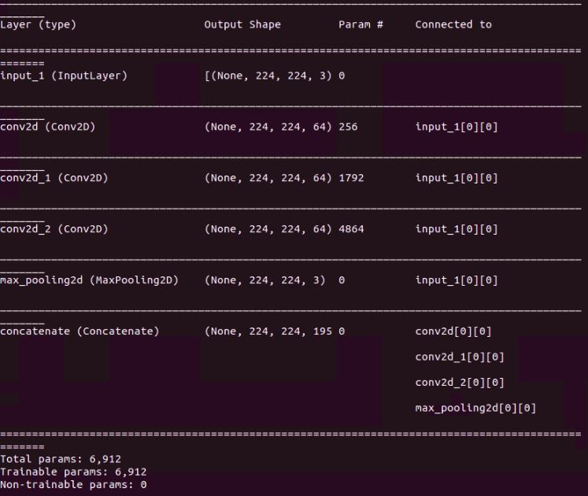
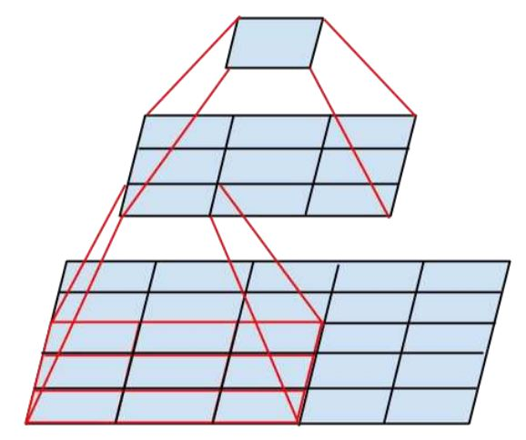

# Tensorflow insights - part 6:

The VGG block boils down to a sub networks that contains a sequence of convolutional layers and a max-pooling layer. Each layer is just connected right after another layer, which is exactly in the same way as all the networks that we used before part 4. For that reason, you might not have felt the true advantage of using Tensorflow custom layer/model. In this post, we will get familiar with and implement the Inception module which is used by the variants of the Inception network. Through it, you will see more the power of using Tensorflow custom layer/model.

## Inception module

"a block of parallel convolutional layers with different sized filters (e.g. 1x1, 3x3, 5x5), and a 3x3 max pooling layer, the results of which are then concatenated." [3]

"current incarnations of the Inception architechture are restricted to filter sizes 1x1, 3x3, 5x5, this decision was based more on convenience rather than necessity" [1]

"adding an alternative parallel pooling path in each such stage should have additional beneficial effect, too" [1]

"This is a very simple and powerful architectural unit that allows the model to learn not only parallel filters of the same size, but parallel filters of differing sizes, allowing learning at multiple scale" [3]

## Implementating the class ```InceptionModule``` (naive version)

<ins> **Note:** </ins> We will start from the previous state of the code in part 5.

First, create the Python file ```/networks/inceptionv3.py```.

We start the implementation by using the ```tf.keras.layers.Layer``` base model.

Need to define 4 methods:
- ```__init__```
- ```build```
- ```call```
- ```get_config```

### ```__init__```

The attributes are the numbers of filters, each of which is for a convolutional layer.

```python
 def __init__(self, nf1, nf2, nf3, **kwargs):
     super(InceptionModule, self).__init__(**kwargs)
     self.n_filters_of_conv_layer_1 = nf1
     self.n_filters_of_conv_layer_2 = nf2
     self.n_filters_of_conv_layer_3 = nf3
```

### ```build```

Check again the padding. The padding "same" is very important here, so that the output height and width of the 3 convolutional layers and the max pooling are the same (224x224). Therefore, they can be concatenated.

Multiscale - convolutional layers with different kernel size.

```python
def build(self, input_shape):
    self.conv2d_1_nf1 = tf.keras.layers.Conv2D(self.n_filters_of_conv_layer_1,
                                               (1, 1),
                                               padding='same',
                                               activation='relu')
    self.conv2d_3_nf2 = tf.keras.layers.Conv2D(self.n_filters_of_conv_layer_2,
                                               (3, 3),
                                               padding='same',
                                               activation='relu')
    self.conv2d_5_nf3 = tf.keras.layers.Conv2D(self.n_filters_of_conv_layer_3,
                                               (5, 5),
                                               padding='same',
                                               activation='relu')
    self.max_pool2d = tf.keras.layers.MaxPool2D((3, 3), 
                                                strides=(1, 1), 
                                                padding='same')
    self.concatenation = tf.keras.layers.Concatenate(axis=-1)
```

### ```call```

The 3 convolutional layers and the max pooling layers are executed in parallel. They all receive input from the previous layer. You should notice that the max pooling also receives the input from the previous layer (which is stored in ```input_tensor```).

```python
def call(self, input_tensor, training=False):
    conv2d_1_nf1 = self.conv2d_1_nf1(input_tensor)
    conv2d_3_nf2 = self.conv2d_3_nf2(input_tensor)
    conv2d_5_nf3 = self.conv2d_5_nf3(input_tensor)
    max_pool2d = self.max_pool2d(input_tensor)
    concatenation = self.concatenation([conv2d_1_nf1, conv2d_3_nf2, conv2d_5_nf3, max_pool2d])

    return concatenation
```

### ```get_config```

There is nothing special about the definition of ```get_config```.

```python
def get_config(self):
    config = super().get_config().copy()
    config.update({
        'n_filters_of_conv_layer_1': self.n_filters_of_conv_layer_1,
        'n_filters_of_conv_layer_2': self.n_filters_of_conv_layer_2,
        'n_filters_of_conv_layer_3': self.n_filters_of_conv_layer_3,
    })

    return config
```

### ```model```

As mentioned in the previous post (part 5), we need a Sequential model for using ```.summary()```.

```python
def model(self):
    x = tf.keras.layers.Input(shape=(224, 224, 3))
    return tf.keras.Model(inputs=[x], outputs=self.call(x))
```

## First running

<ins> **Note:** </ins> We will start from the previous state of the code in part 5.

Import the ```InceptionModule``` in ```train.py``` and use it as a model for training (replace the ```VGG16Net``` with ```InceptionModule```). We set the filter numbers of all three convolutional layers to 64.

```python
from networks.inceptionv3 import InceptionModule

# model = VGG16Net(num_classes=3) # old
model = InceptionModule(nf1=64, nf2=64, nf3=64) # new
```

Then try running. The ```model.model().summary()``` will not show the parallel structure of the inception module, it is better to use the ```plot_model()``` to explore the parallel structure.

```python
tf.keras.utils.plot_model(model.model(), to_file="".join([image_path, "/model.png"]), show_shapes=True)
```

<p align=center>
    
</p>
<p align=center>
    <em><b>Figure 1:</b> The result of ```summary()```. </em>
</p>

<p align=center>
    
</p>
<p align=center>
    <em><b>Figure 2:</b> The output image of ```plot_model()```. </em>
</p>

"The version of the inception module that we have implemented is called the naive inception module." [3]

"A modification to the module was made in order to reduce the amount of computation required. Specifically, 1×1 convolutional layers were added to reduce the number of filters before the 3×3 and 5×5 convolutional layers, and to increase the number of filters after the pooling layer." [3]

"This leads to the second idea of the Inception architecture: judiciously reducing dimension wherever the computational requirements would increase too much otherwise. […] That is, 1×1 convolutions are used to compute reductions before the expensive 3×3 and 5×5 convolutions. Besides being used as reductions, they also include the use of rectified linear activation making them dual-purpose." [1]

"If you intend to use many inception modules in your model, you may require this computational performance-based modification." [3]

"The function below implements this optimization improvement with parameterization so that you can control the amount of reduction in the number of filters prior to the 3×3 and 5×5 convolutional layers and the number of increased filters after max pooling." [3]

## Implementating the class ```InceptionModule``` (full version)

### ```__init__```

```python
def __init__(self, nf1, nf2_a, nf2_b, nf3_a, nf3_b, nf4, **kwargs):
    super(InceptionModule, self).__init__(**kwargs)
    self.n_filters_of_conv_layer_1 = nf1
    self.n_filters_of_conv_layer_2_a = nf2_a
    self.n_filters_of_conv_layer_2_b = nf2_b
    self.n_filters_of_conv_layer_3_a = nf3_a
    self.n_filters_of_conv_layer_3_b = nf3_b
    self.n_filters_of_conv_layer_4 = nf4
```

### ```build```

You can see the Inception module as the collection of paths. Each path contains several layers in sequence and all the paths are executed in parallel.

```python
def build(self, input_shape):
    # === Path for the 1x1 convolutional layer ===
    self.conv2d_1_nf1 = tf.keras.layers.Conv2D(self.n_filters_of_conv_layer_1,
                                               (1, 1),
                                               padding='same',
                                               activation='relu')
    # === Path for the 3x3 convolutional layer ===
    self.conv2d_1_nf2_a = tf.keras.layers.Conv2D(self.n_filters_of_conv_layer_2_a,
                                                 (1, 1),
                                                 padding='same',
                                                 activation='relu')
    self.conv2d_3_nf2_b = tf.keras.layers.Conv2D(self.n_filters_of_conv_layer_2_b,
                                                 (3, 3),
                                                 padding='same',
                                                 activation='relu')
    # === Path for the 5x5 convolutional layer ===
    self.conv2d_1_nf3_a = tf.keras.layers.Conv2D(self.n_filters_of_conv_layer_3_a,
                                                 (1, 1),
                                                 padding='same',
                                                 activation='relu')
    self.conv2d_5_nf3_b = tf.keras.layers.Conv2D(self.n_filters_of_conv_layer_3_b,
                                                 (5, 5),
                                                 padding='same',
                                                 activation='relu')
    # === Path for the 3x3 max-pool layer ===
    self.max_pool2d = tf.keras.layers.MaxPool2D((3, 3), 
                                                strides=(1, 1), 
                                                padding='same')
    self.conv2d_1_nf4 = tf.keras.layers.Conv2D(self.n_filters_of_conv_layer_4,
                                                 (1, 1),
                                                 padding='same',
                                                 activation='relu')
    self.concatenation = tf.keras.layers.Concatenate(axis=-1)
```

### ```call```

```python
def call(self, input_tensor, training=False):
    # === Path for the 1x1 convolutional layer ===
    conv2d_1_nf1 = self.conv2d_1_nf1(input_tensor)

    # === Path for the 3x3 convolutional layer ===
    conv2d_1_nf2_a = self.conv2d_1_nf2_a(input_tensor)
    conv2d_3_nf2_b = self.conv2d_3_nf2_b(conv2d_1_nf2_a)

    # === Path for the 5x5 convolutional layer ===
    conv2d_1_nf3_a = self.conv2d_1_nf3_a(input_tensor)
    conv2d_5_nf3_b = self.conv2d_5_nf3_b(conv2d_1_nf3_a)

    # === Path for the 3x3 max-pool layer ===
    max_pool2d = self.max_pool2d(input_tensor)
    conv2d_1_nf4 = self.conv2d_1_nf4(max_pool2d)
    concatenation = self.concatenation([conv2d_1_nf1, 
                                        conv2d_3_nf2_b, 
                                        conv2d_5_nf3_b, 
                                        conv2d_1_nf4])

    return concatenation
```

### ```get_config```

```python
def get_config(self):
    config = super().get_config().copy()
    config.update({
        'n_filters_of_conv_layer_1': self.n_filters_of_conv_layer_1,
        'n_filters_of_conv_layer_2_a': self.n_filters_of_conv_layer_2_a,
        'n_filters_of_conv_layer_2_b': self.n_filters_of_conv_layer_2_b,
        'n_filters_of_conv_layer_3_a': self.n_filters_of_conv_layer_3_a,
        'n_filters_of_conv_layer_3_b': self.n_filters_of_conv_layer_3_b,
        'n_filters_of_conv_layer_4': self.n_filters_of_conv_layer_4,
    })

    return config
```

## Implement a custom Inception model

Let's implement a custom Inception model which is composed of several Inception modules.

We have 2 inception modules followed by a flatten layer and 4 dense layers. The configuration of the numbers of filters in the 2 Inception modules is based on that in the paper [1]?

```python
class InceptionNet(tf.keras.layers.Model):
    def __init__(self, num_classes=3):
        super(InceptionNet, self).__init__()
        self.inception_module_1 = InceptionModule(64, 96, 128, 16, 32, 32)
        self.inception_module_2 = InceptionModule(128, 128, 192, 32, 96, 64)
        self.flatten = tf.keras.layers.Flatten(input_shape=(7, 7, 512))
        self.dense_1 = tf.keras.layers.Dense(496, activation='relu')
        self.dense_2 = tf.keras.layers.Dense(496, activation='relu')
        self.dense_3 = tf.keras.layers.Dense(496, activation='relu')
        self.classifier = tf.keras.layers.Dense(num_classes, activation='softmax')

    def call(self, inputs):
        x = self.inception_module_1(inputs)
        x = self.inception_module_2(x)
        x = self.flatten(x)
        x = self.dense_1(x)
        x = self.dense_2(x)
        x = self.dense_3(x)
        x = self.classifier(x)

        return x

    def model(self):
        x = tf.keras.layers.Input(shape=(224, 224, 3))
        return tf.keras.Model(inputs=[x], outputs=self.call(x))
```

In ```train.py```, we import the class ```InceptionNet``` and use ```InceptionNet``` in stead of ```InceptionModule```:

```python
from networks.inceptionv3 import InceptionModule, InceptionNet
# model = InceptionModule(nf1=64, nf2=64, nf3=64) # old 
model = InceptionNet(num_classes=3) # new
```

## Inception-v3 [2]

"Although increased model size and computational cost tend to translate to immediate quality gains for most tasks (as long as enough labeled data is provided for training), computational efficiency and low parameter count are still enabling factors for various use cases such as mobile vision and big-data scenarios."

"Here we are exploring ways to scale up networks in ways that aim at utilizing the added computation as efficiently as possible by suitably factorized convolutions and aggressive regularization."

"Although VGGNet has the compelling feature of architectural simplicity, this comes at a high cost: evaluating the network requires a lot of computation. On the other hand, the Inception architecture of GoogLeNet was also designed to perform well even under strict constraints on memory and computational budget."

### Factorizing convolutions

Factorizing convolutions is the core idea of Inception-v3 for the reduction in the number of connections/parameters.

In the current version of ```InceptionModule```, there is one path that uses a 5x5 convolutional filter. Therefore, the number of parameters for that filter is 25 (= 5x5). To reduce that number, [2] factorizes it into two smaller convolutions (two 3x3 convolutions). The solution will decrease the number of parameters from 25 to 18 (= 3x3 + 3x3, as there are 2 3x3 convolutional filters). You can look at the figure below to see how the use of the two 3x3 convolutional filters is the same as the use of one 5x5 convolutional filter. Both of the cases outputs a 1x1 unit (Figure 3).

<p align=center>
    
</p>
<p align=center>
    <em><b>Figure 3:</b> Factorization into smaller convolutions. </em>
</p>

In code, we just need to modify one path that has a 5x5 convolutional layer. But wait! We will address some more things before going into the code.

One more technique to reduce the number of parameters is to use "Asymmetric convolutions". This technique allows us to continue to factorize a 3x3 convolutional filter into two asymmetric convolutions: one 3x1 filter followed by one 1x3 filter. The asymmetry here means the height and the width of a filter are not equal. The solution will decrease the number of parameters from 18 to 6 (= 3x1 + 1x3). You can look at the figure below to see how the use of the two asymmetric convolutional filters is the same as the use of one 3x3 convolutional filter. Both of the cases outputs a 1x1 unit (Figure 4).

<p align=center>
    
</p>
<p align=center>
    <em><b>Figure 4:</b> Asymmetric convolutions. </em>
</p>

Now, let's create a new class for this Inception module and call it ```InceptionModuleWithFactorization```. This class is implemented in the same way as the ```InceptionModule``` with some changes in the two methods ```build``` and ```call```:

```python
def build(self, input_shape):
    # === Path for the 1x1 convolutional layer ===
    self.conv2d_1_nf1 = tf.keras.layers.Conv2D(self.n_filters_of_conv_layer_1,
                                               (1, 1),
                                               padding='same',
                                               activation='relu')
    # === Path for the 3x3 convolutional layer ===
    self.conv2d_1_nf2_a = tf.keras.layers.Conv2D(self.n_filters_of_conv_layer_2_a,
                                                 (1, 1),
                                                 padding='same',
                                                 activation='relu')
    self.conv2d_3_nf2_b_i = tf.keras.layers.Conv2D(self.n_filters_of_conv_layer_2_b,
                                                   (3, 1),
                                                   padding='same',
                                                   activation='relu')
    self.conv2d_3_nf2_b_ii = tf.keras.layers.Conv2D(self.n_filters_of_conv_layer_2_b,
                                                    (1, 3),
                                                    padding='same',
                                                    activation='relu')
    # === Path for the 5x5 convolutional layer ===
    self.conv2d_1_nf3_a = tf.keras.layers.Conv2D(self.n_filters_of_conv_layer_3_a,
                                                 (1, 1),
                                                 padding='same',
                                                 activation='relu')
    self.conv2d_3_nf3_b_i = tf.keras.layers.Conv2D(self.n_filters_of_conv_layer_3_b,
                                                   (3, 1),
                                                   padding='same',
                                                   activation='relu')
    self.conv2d_3_nf3_b_ii = tf.keras.layers.Conv2D(self.n_filters_of_conv_layer_3_b,
                                                    (1, 3),
                                                    padding='same',
                                                    activation='relu')
    self.conv2d_3_nf3_b_iii = tf.keras.layers.Conv2D(self.n_filters_of_conv_layer_3_b,
                                                     (3, 1),
                                                     padding='same',
                                                     activation='relu')
    self.conv2d_3_nf3_b_iv = tf.keras.layers.Conv2D(self.n_filters_of_conv_layer_3_b,
                                                    (1, 3),
                                                    padding='same',
                                                    activation='relu')
    # === Path for the 3x3 max-pool layer ===
    self.max_pool2d = tf.keras.layers.MaxPool2D((3, 3), 
                                                strides=(1, 1), 
                                                padding='same')
    self.conv2d_1_nf4 = tf.keras.layers.Conv2D(self.n_filters_of_conv_layer_4,
                                               (1, 1),
                                               padding='same',
                                               activation='relu')
                                               
    self.concatenation = tf.keras.layers.Concatenate(axis=-1)

def call(self, input_tensor, training=False):
    # === Path for the 1x1 convolutional layer ===
    conv2d_1_nf1 = self.conv2d_1_nf1(input_tensor)

    # === Path for the 3x3 convolutional layer ===
    conv2d_1_nf2_a = self.conv2d_1_nf2_a(input_tensor)
    conv2d_3_nf2_b_i = self.conv2d_3_nf2_b_i(conv2d_1_nf2_a)
    conv2d_3_nf2_b_ii = self.conv2d_3_nf2_b_ii(conv2d_3_nf2_b_i)

    # === Path for the 5x5 convolutional layer ===
    conv2d_1_nf3_a = self.conv2d_1_nf3_a(input_tensor)
    conv2d_3_nf3_b_i = self.conv2d_3_nf3_b_i(conv2d_1_nf3_a)
    conv2d_3_nf3_b_ii = self.conv2d_3_nf3_b_ii(conv2d_3_nf3_b_i)
    conv2d_3_nf3_b_iii = self.conv2d_3_nf3_b_iii(conv2d_3_nf3_b_ii)
    conv2d_3_nf3_b_iv = self.conv2d_3_nf3_b_iv(conv2d_3_nf3_b_iii)

    # === Path for the 3x3 max-pool layer ===
    max_pool2d = self.max_pool2d(input_tensor)
    conv2d_1_nf4 = self.conv2d_1_nf4(max_pool2d)

    # === Concatenation ===
    concatenation = self.concatenation([conv2d_1_nf1, 
                                        conv2d_3_nf2_b_ii, 
                                        conv2d_3_nf3_b_iv, 
                                        conv2d_1_nf4])

    return concatenation
```

Next, each of the 3x3 (or 5x5) convolutional layers will be split into several smaller convolutional layers. For consistency with the previous implementation, we will set the same number of filters for all the smaller convolutional layers.

There is another type of Inception module proposed by the authors of [2] to promote high dimensional representations for the coarsest grid (what is the coarsest grid?). Let's create another class for this Inception module and call it ```InceptionModuleForHighDimRepresentations```. This class is implemented in the same way as the ```InceptionModule``` with some changes in the two methods ```build``` and ```call```:

```python
def build(self, input_shape):
    # === Path for the 1x1 convolutional layer ===
    self.conv2d_1_nf1 = tf.keras.layers.Conv2D(self.n_filters_of_conv_layer_1,
                                               (1, 1),
                                               padding='same',
                                               activation='relu')
    # === Path for the 3x3 convolutional layer ===
    self.conv2d_1_nf2_a = tf.keras.layers.Conv2D(self.n_filters_of_conv_layer_2_a,
                                                 (1, 1),
                                                 padding='same',
                                                 activation='relu')
    self.conv2d_3_nf2_b_i = tf.keras.layers.Conv2D(self.n_filters_of_conv_layer_2_b,
                                                   (3, 1),
                                                   padding='same',
                                                   activation='relu')
    self.conv2d_3_nf2_b_ii = tf.keras.layers.Conv2D(self.n_filters_of_conv_layer_2_b,
                                                    (1, 3),
                                                    padding='same',
                                                    activation='relu')
    # === Path for the 5x5 convolutional layer ===
    self.conv2d_1_nf3_a = tf.keras.layers.Conv2D(self.n_filters_of_conv_layer_3_a,
                                                 (1, 1),
                                                 padding='same',
                                                 activation='relu')
    self.conv2d_3_nf3_b_i = tf.keras.layers.Conv2D(self.n_filters_of_conv_layer_3_b,
                                                   (3, 3),
                                                   padding='same',
                                                   activation='relu')
    self.conv2d_3_nf3_b_ii = tf.keras.layers.Conv2D(self.n_filters_of_conv_layer_3_b,
                                                    (3, 1),
                                                    padding='same',
                                                    activation='relu')
    self.conv2d_3_nf3_b_iii = tf.keras.layers.Conv2D(self.n_filters_of_conv_layer_3_b,
                                                     (1, 3),
                                                     padding='same',
                                                     activation='relu')
    # === Path for the 3x3 max-pool layer ===
    self.max_pool2d = tf.keras.layers.MaxPool2D((3, 3), 
                                                strides=(1, 1), 
                                                padding='same')
    self.conv2d_1_nf4 = tf.keras.layers.Conv2D(self.n_filters_of_conv_layer_4,
                                                 (1, 1),
                                                 padding='same',
                                                 activation='relu')
    self.concatenation = tf.keras.layers.Concatenate(axis=-1)

def call(self, input_tensor, training=False):
    # === Path for the 1x1 convolutional layer ===
    conv2d_1_nf1 = self.conv2d_1_nf1(input_tensor)

    # === Path for the 3x3 convolutional layer ===
    conv2d_1_nf2_a = self.conv2d_1_nf2_a(input_tensor)
    conv2d_3_nf2_b_i = self.conv2d_3_nf2_b_i(conv2d_1_nf2_a)
    conv2d_3_nf2_b_ii = self.conv2d_3_nf2_b_ii(conv2d_1_nf2_a)

    # === Path for the 5x5 convolutional layer ===
    conv2d_1_nf3_a = self.conv2d_1_nf3_a(input_tensor)
    conv2d_3_nf3_b_i = self.conv2d_3_nf3_b_i(conv2d_1_nf3_a)
    conv2d_3_nf3_b_ii = self.conv2d_3_nf3_b_ii(conv2d_3_nf3_b_i)
    conv2d_3_nf3_b_iii = self.conv2d_3_nf3_b_iii(conv2d_3_nf3_b_i)

    # === Path for the 3x3 max-pool layer ===
    max_pool2d = self.max_pool2d(input_tensor)
    conv2d_1_nf4 = self.conv2d_1_nf4(max_pool2d)

    # === Concatenation ===
    concatenation = self.concatenation([conv2d_1_nf1, 
                                        conv2d_3_nf2_b_i, 
                                        conv2d_3_nf2_b_ii, 
                                        conv2d_3_nf3_b_ii, 
                                        conv2d_3_nf3_b_iii, 
                                        conv2d_1_nf4])

    return concatenation
```

One explanation for the guarantee of promoting high dimensional representations is there are more output paths in this type of Inception module when compared with the other types (6 vs 4).

So far, we have mentioned some types of the Inception module. It is good to systematically look again at the 4 types of the Inception module in the paper [2].

<p align=center>
    
</p>
<p align=center>
    <em><b>Figure 5:</b> Inception module type 1. </em>
</p>

<p align=center>
    
</p>
<p align=center>
    <em><b>Figure 6:</b> Inception module type 2. </em>
</p>

<p align=center>
    
</p>
<p align=center>
    <em><b>Figure 7:</b> Inception module type 3. </em>
</p>

<p align=center>
    
</p>
<p align=center>
    <em><b>Figure 8:</b> Inception module type 4. </em>
</p>


### Auxiliary classifiers

### Efficient grid size reduction

### Inception-v3 architecture

### Label smoothing as regularization

## References

[1] Christian Szegedy et al., "Going Deeper with Convolutions", 2015.

[2] Christian Szegedy et al., "Rethinking the Inception Architecture for Computer Vision", 2015.

[3] "How to implement major architecture innovations for convolutional neural networks", Machine Learning Mastery, 2016.

[4] Sik-Ho Tsang, Review: Inception-v3 - 1st Runner Up (Image Classification) in ILSVRC 2015, Medium, 2018.