# Tensorflow insights - part 6: Custom model - Inception V3

The VGG block boils down to only a sub networks that contains a sequence of convolutional layers and a max-pooling layer. Each layer is just connected right after another layer in a consecutive manner, which is exactly in the same way as all the networks that we used before part 4. For that reason, you might not have gained the full advantage of using Tensorflow custom layer/model. In this post, we will get familiar with the idea of parallel paths and implement the Inception module which is used by the variants of the Inception network. To be practical, we will then show you how to implement the Inception-v3 network architecture. Throughout this post, you will see a lot more of the power of using Tensorflow custom layer/model.

## Inception module [1][2][3]

The Inception module is a block of parallel paths each of which contains some convolutional layers or pooling layer. The output of the module is made from the combination (more correctly, concatenation) of all the outputs of these paths. You can think of the Inception module as a complex high-level layer that is created from many simpler ones (convolution, pooling). According to the original paper [1][2][4], the Inception module will help us to create a deeper networks (many layers) but still keep the computation efficiency.

The convolutional layers inside the Inception module use a kernel size of 1x1, 3x3, 5x5 or 7x7.

As being pointed out in the paper "Rethinking the Inception Architecture for Computer Vision" [3], "This is a very simple and powerful architectural unit that allows the model to learn not only parallel filters of the same size, but parallel filters of differing sizes, allowing learning at multiple scale".

## Implement the simple version of the Inception module (class ```InceptionModule```)

<ins> **Note:** </ins> We will start from the previous state of the code in part 5.

First, create the Python file ```/networks/inceptionv3.py```.

We start the implementation by using the ```tf.keras.layers.Layer``` base model.

```python
class InceptionModule(tf.keras.layers.Layer):
```

Then as usual, need to define 4 methods:
- ```__init__```
- ```build```
- ```call```
- ```get_config```

### ```__init__```

The attributes ```nf1```, ```nf2``` and ```nf3``` are the numbers of filters, each of which is for the setting of one path in the Inception module. Here, each path has only one layer.

```python
 def __init__(self, nf1, nf2, nf3, **kwargs):
     super(InceptionModule, self).__init__(**kwargs)
     self.n_filters_of_conv_layer_1 = nf1
     self.n_filters_of_conv_layer_2 = nf2
     self.n_filters_of_conv_layer_3 = nf3
```

### ```build```

Inside this method, we define the module architecture. There are 4 paths, each path has only 1 layer. In particular, there are 3 convolutional layers and 1 max pooling layer.

```python
def build(self, input_shape):
    self.conv2d_1_nf1 = tf.keras.layers.Conv2D(self.n_filters_of_conv_layer_1,
                                               (1, 1),
                                               padding='same',
                                               activation='relu')
    self.conv2d_3_nf2 = tf.keras.layers.Conv2D(self.n_filters_of_conv_layer_2,
                                               (3, 3),
                                               padding='same',
                                               activation='relu')
    self.conv2d_5_nf3 = tf.keras.layers.Conv2D(self.n_filters_of_conv_layer_3,
                                               (5, 5),
                                               padding='same',
                                               activation='relu')
    self.max_pool2d = tf.keras.layers.MaxPool2D((3, 3), 
                                                strides=(1, 1), 
                                                padding='same')
    self.concatenation = tf.keras.layers.Concatenate(axis=-1)
```

The padding "same" is very important here so that all the paths have the same output height and width (224x224). As a result, they can be concatenated into the final output of the module.

The convolutional layers of different kernel size (1x1, 3x3 and 5x5) will guarantee the multiscale property of the Inception network.

### ```call```

The 3 convolutional layers and the max pooling layer are executed in a parallel way. They all receive input from the previous layer. You should notice that the max pooling also receives the input from the previous layer (which is stored in ```input_tensor```). And then, their output are concatenated to create the final output of the module. We pass a list of outputs to the layer ```self.concatenation``` and everything will be automatically done.

```python
def call(self, input_tensor, training=False):
    conv2d_1_nf1 = self.conv2d_1_nf1(input_tensor)
    conv2d_3_nf2 = self.conv2d_3_nf2(input_tensor)
    conv2d_5_nf3 = self.conv2d_5_nf3(input_tensor)
    max_pool2d = self.max_pool2d(input_tensor)
    concatenation = self.concatenation([conv2d_1_nf1, conv2d_3_nf2, conv2d_5_nf3, max_pool2d])

    return concatenation
```

<ins> **Note:** </ins> Because all the paths'outputs have the same width and height and are different only in the number of filters, they can be concatenated across the axis that represents the number of filters. The final module output will also have the same width and height, but with an increase in the number of filters.

### ```get_config```

There is nothing special about the definition of ```get_config```. We just need to declare the appearance of the 3 attributes defined in the ```__init__```.

```python
def get_config(self):
    config = super().get_config().copy()
    config.update({
        'n_filters_of_conv_layer_1': self.n_filters_of_conv_layer_1,
        'n_filters_of_conv_layer_2': self.n_filters_of_conv_layer_2,
        'n_filters_of_conv_layer_3': self.n_filters_of_conv_layer_3,
    })

    return config
```

## First running

<ins> **Note:** </ins> We will start from the previous state of the code in part 5.

Import the ```InceptionModule``` in ```train.py``` and use it as a model for training (replace the ```VGG16Net``` with ```InceptionModule```). We set the filter numbers of all three convolutional layers to 64.

```python
from networks.inceptionv3 import InceptionModule

# model = VGG16Net(num_classes=3) # old
model = InceptionModule(nf1=64, nf2=64, nf3=64) # new
```

Then try running. 

The ```model.model().summary()``` will not show the parallel structure of the inception module (Figure 1 below), it is better to use the ```plot_model()``` to explore the parallel structure (Figure 2 below).

```python
model.model().summary()
```

<p align=center>
    
</p>
<p align=center>
    <em><b>Figure 1:</b> The result of "summary()". </em>
</p>

```python
tf.keras.utils.plot_model(model.model(), to_file="".join([image_path, "/model.png"]), show_shapes=True)
```

<p align=center>
    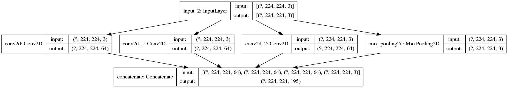
</p>
<p align=center>
    <em><b>Figure 2:</b> The output image of ```plot_model()```. </em>
</p>

Yes! The plot really shows the true parallel architecture of the Inception module. When implementing module like this, it is better to use the ```plot_model()``` for debugging.

Above, we have just implemented a simple version of the Inception module. There are more things need to be done for the improvement in the computation efficiency.

One of them is the inclusion of a 1x1 convolutional layer at the first place of each path. As you may have known, the 1x1 convolutional layer is usually utilized to decrease the number of channels (or filters) in the given input without any change to the width and the height. This update will enhance the efficiency of the Inception module. Instead of putting the whole output (all the channels) of the previous layer into, for example, the 5x5 layer we just need to put a more compact tensor with less channels into the layer. Also, the 1x1 convolutional layer is not as highly computational as the 5x5 computational layer, so give it the responsibility to receive the full-channel output of the last layer is therefore more efficient.

For the case of the path having one pooling layer, the 1x1 convolutional layer helps to increase the number of filters.

The 1x1 convolutional layer also has another duty, it has the rectified linear activation to increase the nonlinearity of the network. 

In the next section, we will address the implementation that incorporates the idea of using 1x1 convolutional layers in the Inception module.

## Implement a more complete version of the Inception module (update to the class ```InceptionModule```)

### ```__init__```

The number of attributes increases from 3 to 6. The second path and the third path, each of them now has 2 attributes. The fourth path has an additional convolutional layer, so we also need an attribute to specify the number of filters for that layer.

```python
def __init__(self, nf1, nf2_a, nf2_b, nf3_a, nf3_b, nf4, **kwargs):
    super(InceptionModule, self).__init__(**kwargs)
    self.n_filters_of_conv_layer_1 = nf1 # The number of filters for the convolutional layer in the first path
    self.n_filters_of_conv_layer_2_a = nf2_a # The number of filters for the 1x1 convolutional layer of the second path
    self.n_filters_of_conv_layer_2_b = nf2_b # The number of filters for the 3x3 convolutional layer of the second path
    self.n_filters_of_conv_layer_3_a = nf3_a # The number of filters for the 1x1 convolutional layer of the third path
    self.n_filters_of_conv_layer_3_b = nf3_b # The number of filters for the 5x5 convolutional layer of the third path
    self.n_filters_of_conv_layer_4 = nf4 # The number of filters for the convolutional layer in the fourth path
```

### ```build```

You can see the Inception module as the collection of paths. Each path contains several layers in sequence and all the paths are executed in parallel. In the method ```build```, we will define the layers of each path. The first three paths all have a 1x1 convolution as their first layer. The second path and the third path have a layer with larger filter size which follows their first layers (3x3 and 5x5 respectively).

As mentioned above, we set the ```padding``` of all layer to ```'same'``` so the outputs of all the paths can then be concatenated.

```python
def build(self, input_shape):
    # === Path for the 1x1 convolutional layer ===
    self.conv2d_1_nf1 = tf.keras.layers.Conv2D(self.n_filters_of_conv_layer_1,
                                               (1, 1),
                                               padding='same',
                                               activation='relu')
    # === Path for the 3x3 convolutional layer ===
    self.conv2d_1_nf2_a = tf.keras.layers.Conv2D(self.n_filters_of_conv_layer_2_a,
                                                 (1, 1),
                                                 padding='same',
                                                 activation='relu')
    self.conv2d_3_nf2_b = tf.keras.layers.Conv2D(self.n_filters_of_conv_layer_2_b,
                                                 (3, 3),
                                                 padding='same',
                                                 activation='relu')
    # === Path for the 5x5 convolutional layer ===
    self.conv2d_1_nf3_a = tf.keras.layers.Conv2D(self.n_filters_of_conv_layer_3_a,
                                                 (1, 1),
                                                 padding='same',
                                                 activation='relu')
    self.conv2d_5_nf3_b = tf.keras.layers.Conv2D(self.n_filters_of_conv_layer_3_b,
                                                 (5, 5),
                                                 padding='same',
                                                 activation='relu')
    # === Path for the 3x3 max-pool layer ===
    self.max_pool2d = tf.keras.layers.MaxPool2D((3, 3), 
                                                strides=(1, 1), 
                                                padding='same')
    self.conv2d_1_nf4 = tf.keras.layers.Conv2D(self.n_filters_of_conv_layer_4,
                                                 (1, 1),
                                                 padding='same',
                                                 activation='relu')

    self.concatenation = tf.keras.layers.Concatenate(axis=-1)
```

### ```call```

In ```call```, we define the forward step of the Inception module. All the paths receive the ```input_tensor``` as their inputs. The ```input_tensor``` is actually the output tensor of the previous layer/module. In each path, one layer is called after another and receives the output of the previous layer as input. Finally, the final output of each path is concatenated in to the final output of the module.

```python
def call(self, input_tensor, training=False):
    # === Path for the 1x1 convolutional layer ===
    conv2d_1_nf1 = self.conv2d_1_nf1(input_tensor)

    # === Path for the 3x3 convolutional layer ===
    conv2d_1_nf2_a = self.conv2d_1_nf2_a(input_tensor)
    conv2d_3_nf2_b = self.conv2d_3_nf2_b(conv2d_1_nf2_a)

    # === Path for the 5x5 convolutional layer ===
    conv2d_1_nf3_a = self.conv2d_1_nf3_a(input_tensor)
    conv2d_5_nf3_b = self.conv2d_5_nf3_b(conv2d_1_nf3_a)

    # === Path for the 3x3 max-pool layer ===
    max_pool2d = self.max_pool2d(input_tensor)
    conv2d_1_nf4 = self.conv2d_1_nf4(max_pool2d)

    concatenation = self.concatenation([conv2d_1_nf1, 
                                        conv2d_3_nf2_b, 
                                        conv2d_5_nf3_b, 
                                        conv2d_1_nf4])

    return concatenation
```

### ```get_config```

We need to declare all the attributes that was defined in ```__init__```.

```python
def get_config(self):
    config = super().get_config().copy()
    config.update({
        'n_filters_of_conv_layer_1': self.n_filters_of_conv_layer_1,
        'n_filters_of_conv_layer_2_a': self.n_filters_of_conv_layer_2_a,
        'n_filters_of_conv_layer_2_b': self.n_filters_of_conv_layer_2_b,
        'n_filters_of_conv_layer_3_a': self.n_filters_of_conv_layer_3_a,
        'n_filters_of_conv_layer_3_b': self.n_filters_of_conv_layer_3_b,
        'n_filters_of_conv_layer_4': self.n_filters_of_conv_layer_4,
    })

    return config
```

Above, we have implemented the original Inception module:

<p align=center>
    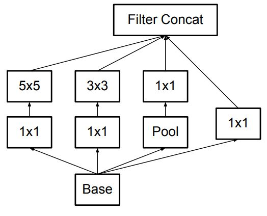
</p>
<p align=center>
    <em><b>Figure 3:</b> The original Inception module (Image from [2]). </em>
</p>

## Implement a custom Inception model

Let's implement a custom Inception network which is composed of several Inception modules.

We have 2 inception modules followed by a flatten layer and 4 dense layers. The configuration of the numbers of filters in the 2 Inception modules are arbitrarily set and not based on the original papers [1][2].

Below is the code we add to the file ```/networks/inceptionv3.py```. The class ```InceptionNet``` subclasses the base class ```tf.keras.layers.Model``` to create a custom model/network.

```python
class InceptionNet(tf.keras.layers.Model):
    def __init__(self, num_classes=3):
        super(InceptionNet, self).__init__()
        self.inception_module_1 = InceptionModule(64, 96, 128, 16, 32, 32)
        self.inception_module_2 = InceptionModule(128, 128, 192, 32, 96, 64)
        self.flatten = tf.keras.layers.Flatten(input_shape=(7, 7, 512))
        self.dense_1 = tf.keras.layers.Dense(496, activation='relu')
        self.dense_2 = tf.keras.layers.Dense(496, activation='relu')
        self.dense_3 = tf.keras.layers.Dense(496, activation='relu')
        self.classifier = tf.keras.layers.Dense(num_classes, activation='softmax')

    def call(self, inputs):
        x = self.inception_module_1(inputs)
        x = self.inception_module_2(x)
        x = self.flatten(x)
        x = self.dense_1(x)
        x = self.dense_2(x)
        x = self.dense_3(x)
        x = self.classifier(x)

        return x

    def model(self):
        x = tf.keras.layers.Input(shape=(224, 224, 3)) # Still keep the image resolution the same as the previous parts
        return tf.keras.Model(inputs=[x], outputs=self.call(x))
```

In ```train.py```, we import the class ```InceptionNet``` and use ```InceptionNet``` instead of ```InceptionModule```:

```python
from networks.inceptionv3 import InceptionModule, InceptionNet

# model = InceptionModule(nf1=64, nf2=64, nf3=64) # old 
model = InceptionNet(num_classes=3) # new
```

You can try running the training by using the file ```train.sh```. This is just to check whether everything works as expected.

The basic things have been mentioned. In the next section, we will truly implement the Inception-v3 network architecture. This architecture is a bit large and complex, thus you should devote more attention to understand it.

## Inception-v3

Below are some significant problem statements of the Inception-v3 that we gather from the paper "Rethinking the Inception Architecture for Computer Vision" [2]:

- "Although increased model size and computational cost tend to translate to immediate quality gains for most tasks (as long as enough labeled data is provided for training), computational efficiency and low parameter count are still enabling factors for various use cases such as mobile vision and big-data scenarios."

- "Here we are exploring ways to scale up networks in ways that aim at utilizing the added computation as efficiently as possible by suitably factorized convolutions and aggressive regularization."

- "Although VGGNet has the compelling feature of architectural simplicity, this comes at a high cost: evaluating the network requires a lot of computation. On the other hand, the Inception architecture of GoogLeNet was also designed to perform well even under strict constraints on memory and computational budget."

Techniques that are proposed by the authors of [2] to deal with the problem statements will be explained as clearly as possible by us in the next subsections. First, we list them here so you can somewhat grasp their notions:

- Factorizing convolutions.
- Inception module with asymmetric convolution.
- Inception module for high dimensional representations.
- Grid size reduction.
- Auxiliary classifier.

### Factorizing convolutions

Factorizing convolutions is the core idea of Inception-v3 for the reduction in the number of connections/parameters.

In the current version of ```InceptionModule```, there is one path that uses a 5x5 convolutional filter. Therefore, the number of parameters for that filter is 25 (= 5x5). To reduce that number, [2] factorizes it into two smaller convolutions (two 3x3 convolutions). The solution will decrease the number of parameters from 25 to 18 (= 3x3 + 3x3, as there are 2 3x3 convolutional filters). You can look at the figure below to see how the use of the two 3x3 convolutional filters is the same as the use of one 5x5 convolutional filter. Both of the cases outputs a 1x1 unit (Figure 3).

<p align=center>
    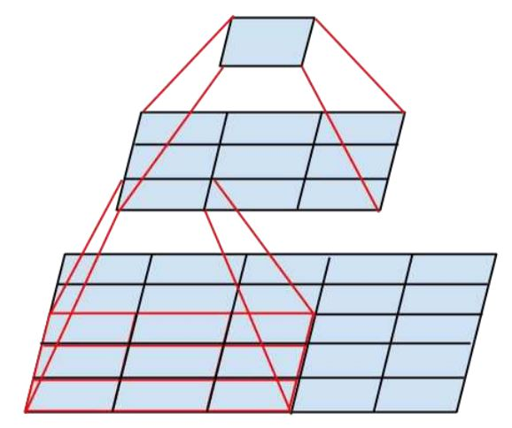
</p>
<p align=center>
    <em><b>Figure 4:</b> Factorization into smaller convolutions. </em>
</p>

In code, we just need to modify one path that has a 5x5 convolutional layer. The method ```build``` and the method ```call``` of the class ```InceptionModule``` are modified like below:

```python
def build(self, input_shape):
    # === First path for the 1x1 convolutional layer ===
    self.conv2d_1_nf1 = tf.keras.layers.Conv2D(self.n_filters_of_conv_layer_1,
                                               (1, 1),
                                               padding='same',
                                               activation='relu')
    self.bn_1_nf1 = tf.keras.layers.BatchNormalization()
    # === Second path for the 3x3 convolutional layer ===
    self.conv2d_1_nf2_a = tf.keras.layers.Conv2D(self.n_filters_of_conv_layer_2_a, # The attribute 2_a is used for the first layer
                                                 (1, 1),
                                                 padding='same',
                                                 activation='relu')
    self.bn_1_nf2_a = tf.keras.layers.BatchNormalization()
    self.conv2d_3_nf2_b = tf.keras.layers.Conv2D(self.n_filters_of_conv_layer_2_b, # The attribute 2_b is used for the last layer
                                                 (3, 3),
                                                 padding='same',
                                                 activation='relu')
    self.bn_3_nf2_b = tf.keras.layers.BatchNormalization()
    # === Third path for the 5x5 convolutional layer ===
    self.conv2d_1_nf3_a = tf.keras.layers.Conv2D(self.n_filters_of_conv_layer_3_a, # The attribute 3_a is used for the first layer
                                                 (1, 1),
                                                 padding='same',
                                                 activation='relu')
    self.bn_1_nf3_a = tf.keras.layers.BatchNormalization()
    # **MODIFICATION:** One 5x5 convolution into two 3x3 convolutions
    self.conv2d_3_nf3_b_i = tf.keras.layers.Conv2D(self.n_filters_of_conv_layer_3_b, # The attribute 3_b is used for all the remained layers
                                                 (3, 3),
                                                 padding='same',
                                                 activation='relu')
    self.bn_3_nf3_b_i = tf.keras.layers.BatchNormalization()
    self.conv2d_3_nf3_b_ii = tf.keras.layers.Conv2D(self.n_filters_of_conv_layer_3_b, # The attribute 3_b is used for all the remained layers
                                                 (3, 3),
                                                 padding='same',
                                                 activation='relu')
    self.bn_3_nf3_b_ii = tf.keras.layers.BatchNormalization()
    # === Fourth path for the 3x3 max-pool layer ===
    self.avg_pool2d = tf.keras.layers.AveragePooling2D((3, 3),
                                                strides=(1, 1), 
                                                padding='same')
    self.conv2d_1_nf4 = tf.keras.layers.Conv2D(self.n_filters_of_conv_layer_4,
                                                 (1, 1),
                                                 padding='same',
                                                 activation='relu')
    self.bn_1_nf4 = tf.keras.layers.BatchNormalization()
    self.concatenation = tf.keras.layers.Concatenate(axis=-1)

def call(self, input_tensor, training=False):
    # === First path for the 1x1 convolutional layer ===
    conv2d_1_nf1 = self.conv2d_1_nf1(input_tensor)
    bn_1_nf1 = self.bn_1_nf1(conv2d_1_nf1, training=training)

    # === Second path for the 3x3 convolutional layer ===
    conv2d_1_nf2_a = self.conv2d_1_nf2_a(input_tensor)
    bn_1_nf2_a = self.bn_1_nf2_a(conv2d_1_nf2_a, training=training)
    conv2d_3_nf2_b = self.conv2d_3_nf2_b(bn_1_nf2_a)
    bn_3_nf2_b = self.bn_3_nf2_b(conv2d_3_nf2_b, training=training)

    # === Third path for the 5x5 convolutional layer ===
    conv2d_1_nf3_a = self.conv2d_1_nf3_a(input_tensor)
    bn_1_nf3_a = self.bn_1_nf3_a(conv2d_1_nf3_a, training=training)
    conv2d_3_nf3_b_i = self.conv2d_3_nf3_b_i(bn_1_nf3_a)
    bn_3_nf3_b_i = self.bn_3_nf3_b_i(conv2d_3_nf3_b_i, training=training)
    conv2d_3_nf3_b_ii = self.conv2d_3_nf3_b_ii(bn_3_nf3_b_i)
    bn_3_nf3_b_ii = self.bn_3_nf3_b_ii(conv2d_3_nf3_b_ii, training=training)

    # === Fourth path for the 3x3 max-pool layer ===
    avg_pool2d = self.avg_pool2d(input_tensor)
    conv2d_1_nf4 = self.conv2d_1_nf4(avg_pool2d)
    bn_1_nf4 = self.bn_1_nf4(conv2d_1_nf4, training=training)

    # === Concatenation ===
    concatenation = self.concatenation([bn_1_nf1, 
                                        bn_3_nf2_b, 
                                        bn_3_nf3_b_ii, 
                                        bn_1_nf4])

    return concatenation
```

All the ```padding```s are set to ```'same'``` and all the ```activation```s are set to ```'relu'```.

From now, the Inception module uses the average pooling layer in place of the max pooling layer.

The concatenation receives the list of outputs from the Batch Norm layers.

<ins> **Note:** </ins> The batch normalization layer has also been added after every convolutional layer. The default setting of the Tensorflow Batch Normalization layer is used.

In total, we have three types of Inception module. This is the first one. **Let's call this Inception module as type A.**

Above, we have implemented the type-A Inception module:

<p align=center>
    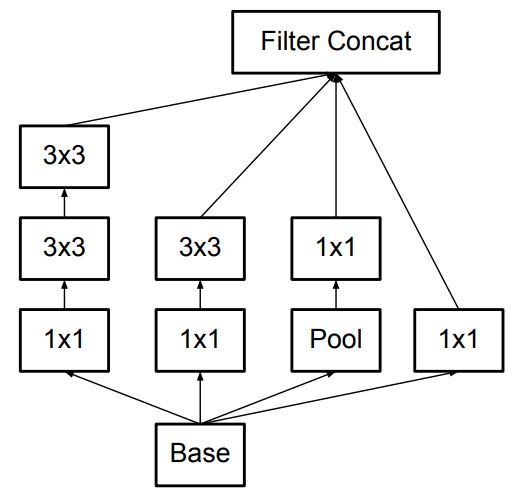
</p>
<p align=center>
    <em><b>Figure 5:</b> The type-A Inception module (Image from [2]). </em>
</p>

### Asymmetric convolution

One more technique to reduce the number of parameters is to use "Asymmetric convolution". This technique allows us to continue to factorize a 3x3 convolutional filter into two asymmetric convolutions: one 3x1 filter followed by one 1x3 filter. The asymmetry here means the height and the width of a filter are not equal. The solution will decrease the number of parameters from 9 (= 3x3) to 6 (= 3x1 + 1x3). You can look at the figure below to see how the use of the two asymmetric convolutional filters is the same as the use of one 3x3 convolutional filter. Both of the cases outputs a 1x1 unit (Figure 4 below).

<p align=center>
    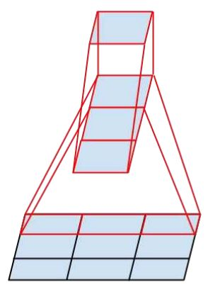
</p>
<p align=center>
    <em><b>Figure 6:</b> Asymmetric convolutions. </em>
</p>

Now, let's create a new class for this Inception module and call it ```InceptionModuleWithAsymmetricFactorization```. This class is implemented in the same way as the ```InceptionModule``` with some changes in the two methods ```build``` and ```call```. The information about the modifications will be given below:

- We replace the 3x3 convolutional layers with 7x7 convolutional layers. Each of them is then split into two asymmetric convolutional layers: 1x7 and 7x1.
- The second path has two asymmetric convolutional layers (1x7 and 7x1) that come in sequence after the 1x1 convolutional layer.
- The third path has four asymmetric convolutional layers that come in sequence after the 1x1 convolutional layer.

```python
def build(self, input_shape):
    # === First path for the 1x1 convolutional layer ===
    self.conv2d_1_nf1 = tf.keras.layers.Conv2D(self.n_filters_of_conv_layer_1,
                                               (1, 1),
                                               padding='same',
                                               activation='relu')
    self.bn_1_nf1 = tf.keras.layers.BatchNormalization()
    # === Second path for the 3x3 convolutional layer ===
    self.conv2d_1_nf2_a = tf.keras.layers.Conv2D(self.n_filters_of_conv_layer_2_a, # The attribute 2_a is used for the first layer
                                                 (1, 1),
                                                 padding='same',
                                                 activation='relu')
    self.bn_1_nf2_a = tf.keras.layers.BatchNormalization()
    self.conv2d_3_nf2_b_i = tf.keras.layers.Conv2D(self.n_filters_of_conv_layer_2_a, # The attribute 2_a is also used for the second layer
                                                   (1, 7),
                                                   padding='same',
                                                   activation='relu')
    self.bn_3_nf2_b_i = tf.keras.layers.BatchNormalization()
    self.conv2d_3_nf2_b_ii = tf.keras.layers.Conv2D(self.n_filters_of_conv_layer_2_b, # The attribute 2_b is used for the last layer
                                                    (7, 1),
                                                    padding='same',
                                                    activation='relu')
    self.bn_3_nf2_b_ii = tf.keras.layers.BatchNormalization()
    # === Third path for the 5x5 convolutional layer ===
    self.conv2d_1_nf3_a = tf.keras.layers.Conv2D(self.n_filters_of_conv_layer_3_a, # The attribute 3_a is used for all the layers, except the last layer
                                                 (1, 1),
                                                 padding='same',
                                                 activation='relu')
    self.bn_1_nf3_a = tf.keras.layers.BatchNormalization()
    self.conv2d_3_nf3_b_i = tf.keras.layers.Conv2D(self.n_filters_of_conv_layer_3_a, # The attribute 3_a is used for all the layers, except the last layer
                                                   (7, 1),
                                                   padding='same',
                                                   activation='relu')
    self.bn_3_nf3_b_i = tf.keras.layers.BatchNormalization()
    self.conv2d_3_nf3_b_ii = tf.keras.layers.Conv2D(self.n_filters_of_conv_layer_3_a, # The attribute 3_a is used for all the layers, except the last layer
                                                    (1, 7),
                                                    padding='same',
                                                    activation='relu')
    self.bn_3_nf3_b_ii = tf.keras.layers.BatchNormalization()
    self.conv2d_3_nf3_b_iii = tf.keras.layers.Conv2D(self.n_filters_of_conv_layer_3_a, # The attribute 3_a is used for all the layers, except the last layer
                                                     (7, 1),
                                                     padding='same',
                                                     activation='relu')
    self.bn_3_nf3_b_iii = tf.keras.layers.BatchNormalization()
    self.conv2d_3_nf3_b_iv = tf.keras.layers.Conv2D(self.n_filters_of_conv_layer_3_b, # The attribute 3_a is used for all the layers, except the last layer
                                                    (1, 7),
                                                    padding='same',
                                                    activation='relu')
    self.bn_3_nf3_b_iv = tf.keras.layers.BatchNormalization()
    # === Fourth path for the 3x3 max-pool layer ===
    self.avg_pool2d = tf.keras.layers.AveragePooling2D((3, 3), 
                                                strides=(1, 1), 
                                                padding='same')
    self.conv2d_1_nf4 = tf.keras.layers.Conv2D(self.n_filters_of_conv_layer_4,
                                               (1, 1),
                                               padding='same',
                                               activation='relu')
    self.bn_1_nf4 = tf.keras.layers.BatchNormalization()

    self.concatenation = tf.keras.layers.Concatenate(axis=-1)

def call(self, input_tensor, training=False):
    # === First path for the 1x1 convolutional layer ===
    conv2d_1_nf1 = self.conv2d_1_nf1(input_tensor)
    bn_1_nf1 = self.bn_1_nf1(conv2d_1_nf1, training=training)

    # === Second path for the 3x3 convolutional layer ===
    conv2d_1_nf2_a = self.conv2d_1_nf2_a(input_tensor)
    bn_1_nf2_a = self.bn_1_nf2_a(conv2d_1_nf2_a, training=training)
    conv2d_3_nf2_b_i = self.conv2d_3_nf2_b_i(bn_1_nf2_a)
    bn_3_nf2_b_i = self.bn_3_nf2_b_i(conv2d_3_nf2_b_i, training=training)
    conv2d_3_nf2_b_ii = self.conv2d_3_nf2_b_ii(bn_3_nf2_b_i)
    bn_3_nf2_b_ii = self.bn_3_nf2_b_ii(conv2d_3_nf2_b_ii, training=training)

    # === Third path for the 5x5 convolutional layer ===
    conv2d_1_nf3_a = self.conv2d_1_nf3_a(input_tensor)
    bn_1_nf3_a = self.bn_1_nf3_a(conv2d_1_nf3_a, training=training)
    conv2d_3_nf3_b_i = self.conv2d_3_nf3_b_i(bn_1_nf3_a)
    bn_3_nf3_b_i = self.bn_3_nf3_b_i(conv2d_3_nf3_b_i, training=training)
    conv2d_3_nf3_b_ii = self.conv2d_3_nf3_b_ii(bn_3_nf3_b_i)
    bn_3_nf3_b_ii = self.bn_3_nf3_b_ii(conv2d_3_nf3_b_ii, training=training)
    conv2d_3_nf3_b_iii = self.conv2d_3_nf3_b_iii(bn_3_nf3_b_ii)
    bn_3_nf3_b_iii = self.bn_3_nf3_b_iii(conv2d_3_nf3_b_iii, training=training)
    conv2d_3_nf3_b_iv = self.conv2d_3_nf3_b_iv(bn_3_nf3_b_iii)
    bn_3_nf3_b_iv = self.bn_3_nf3_b_iv(conv2d_3_nf3_b_iv, training=training)

    # === Fourth path for the 3x3 max-pool layer ===
    avg_pool2d = self.avg_pool2d(input_tensor)
    conv2d_1_nf4 = self.conv2d_1_nf4(avg_pool2d)
    bn_1_nf4 = self.bn_1_nf4(conv2d_1_nf4, training=training)

    # === Concatenation ===
    concatenation = self.concatenation([bn_1_nf1, 
                                        bn_3_nf2_b_ii, 
                                        bn_3_nf3_b_iv, 
                                        bn_1_nf4])

    return concatenation
```

You can see that the number of layers in the second path and the third path has increased. Though there is an increase in the number of layers, the Asymmetric convolution really help us to gain more computational efficiency.

**This is the second type of Inception module. Let's call this Inception module as type B.**

Above, we have implemented the type-B Inception module:

<p align=center>
    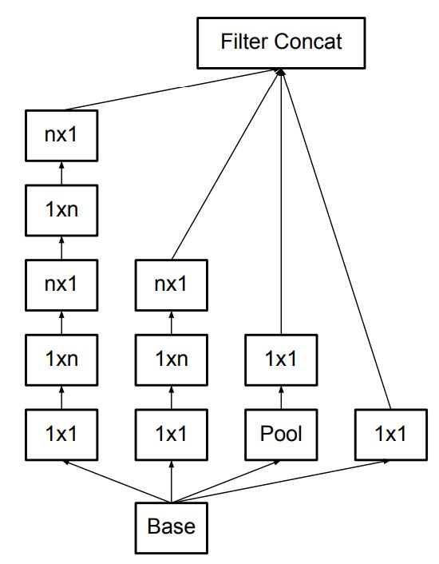
</p>
<p align=center>
    <em><b>Figure 7:</b> The type-B Inception module (Image from [2]). </em>
</p>

### Inception module for high dimensional representations

There is another type of Inception module proposed by the authors of [2] to promote high dimensional representations for the coarsest grid (you should read more about this in the paper [2]). Each of the 3x3 (or 5x5) convolutional layers is still split into several smaller convolutional layers like the two version above, but at this time the smaller convolutional layers **come in parallel (not in sequence)**.

Let's create another class for this Inception module and call it ```InceptionModuleForHighDimRepresentations```. This class is implemented in the same way as the ```InceptionModule``` with some changes in the two methods ```build``` and ```call```:

```python
def build(self, input_shape):
    # === First path for the 1x1 convolutional layer ===
    self.conv2d_1_nf1 = tf.keras.layers.Conv2D(self.n_filters_of_conv_layer_1,
                                               (1, 1),
                                               padding='same',
                                               activation='relu')
    self.bn_1_nf1 = tf.keras.layers.BatchNormalization()
    # === Second path for the 3x3 convolutional layer ===
    self.conv2d_1_nf2_a = tf.keras.layers.Conv2D(self.n_filters_of_conv_layer_2_a,
                                                 (1, 1),
                                                 padding='same',
                                                 activation='relu')
    self.bn_1_nf2_a = tf.keras.layers.BatchNormalization()
    self.conv2d_3_nf2_b_i = tf.keras.layers.Conv2D(self.n_filters_of_conv_layer_2_b,
                                                   (1, 3),
                                                   padding='same',
                                                   activation='relu')
    self.bn_3_nf2_b_i = tf.keras.layers.BatchNormalization()
    self.conv2d_3_nf2_b_ii = tf.keras.layers.Conv2D(self.n_filters_of_conv_layer_2_b,
                                                    (3, 1),
                                                    padding='same',
                                                    activation='relu')
    self.bn_3_nf2_b_ii = tf.keras.layers.BatchNormalization()
    # === Third path for the 5x5 convolutional layer ===
    self.conv2d_1_nf3_a = tf.keras.layers.Conv2D(self.n_filters_of_conv_layer_3_a,
                                                 (1, 1),
                                                 padding='same',
                                                 activation='relu')
    self.bn_1_nf3_a = tf.keras.layers.BatchNormalization()
    self.conv2d_3_nf3_b_i = tf.keras.layers.Conv2D(self.n_filters_of_conv_layer_3_b,
                                                   (3, 3),
                                                   padding='same',
                                                   activation='relu')
    self.bn_3_nf3_b_i = tf.keras.layers.BatchNormalization()
    self.conv2d_3_nf3_b_ii = tf.keras.layers.Conv2D(self.n_filters_of_conv_layer_3_b,
                                                    (1, 3),
                                                    padding='same',
                                                    activation='relu')
    self.bn_3_nf3_b_ii = tf.keras.layers.BatchNormalization()
    self.conv2d_3_nf3_b_iii = tf.keras.layers.Conv2D(self.n_filters_of_conv_layer_3_b,
                                                     (3, 1),
                                                     padding='same',
                                                     activation='relu')
    self.bn_3_nf3_b_iii = tf.keras.layers.BatchNormalization()
    # === Fourth path for the 3x3 max-pool layer ===
    self.avg_pool2d = tf.keras.layers.AveragePooling2D((3, 3), 
                                                strides=(1, 1), 
                                                padding='same')
    self.conv2d_1_nf4 = tf.keras.layers.Conv2D(self.n_filters_of_conv_layer_4,
                                               (1, 1),
                                               padding='same',
                                               activation='relu')
    self.bn_1_nf4 = tf.keras.layers.BatchNormalization()

    self.concatenation = tf.keras.layers.Concatenate(axis=-1)

def call(self, input_tensor, training=False):
    # === First path for the 1x1 convolutional layer ===
    conv2d_1_nf1 = self.conv2d_1_nf1(input_tensor)
    bn_1_nf1 = self.bn_1_nf1(conv2d_1_nf1, training=training)

    # === Second path for the 3x3 convolutional layer ===
    conv2d_1_nf2_a = self.conv2d_1_nf2_a(input_tensor)
    bn_1_nf2_a = self.bn_1_nf2_a(conv2d_1_nf2_a, training=training)
    conv2d_3_nf2_b_i = self.conv2d_3_nf2_b_i(bn_1_nf2_a)
    bn_3_nf2_b_i = self.bn_3_nf2_b_i(conv2d_3_nf2_b_i, training=training)
    conv2d_3_nf2_b_ii = self.conv2d_3_nf2_b_ii(bn_1_nf2_a)
    bn_3_nf2_b_ii = self.bn_3_nf2_b_ii(conv2d_3_nf2_b_ii, training=training)

    # === Third path for the 5x5 convolutional layer ===
    conv2d_1_nf3_a = self.conv2d_1_nf3_a(input_tensor)
    bn_1_nf3_a = self.bn_1_nf3_a(conv2d_1_nf3_a, training=training)
    conv2d_3_nf3_b_i = self.conv2d_3_nf3_b_i(bn_1_nf3_a)
    bn_3_nf3_b_i = self.bn_3_nf3_b_i(conv2d_3_nf3_b_i, training=training)
    conv2d_3_nf3_b_ii = self.conv2d_3_nf3_b_ii(bn_3_nf3_b_i)
    bn_3_nf3_b_ii = self.bn_3_nf3_b_ii(conv2d_3_nf3_b_ii, training=training)
    conv2d_3_nf3_b_iii = self.conv2d_3_nf3_b_iii(bn_3_nf3_b_i)
    bn_3_nf3_b_iii = self.bn_3_nf3_b_iii(conv2d_3_nf3_b_iii, training=training)

    # === Fourth path for the 3x3 max-pool layer ===
    avg_pool2d = self.avg_pool2d(input_tensor)
    conv2d_1_nf4 = self.conv2d_1_nf4(avg_pool2d)
    bn_1_nf4 = self.bn_1_nf4(conv2d_1_nf4, training=training)

    # === Concatenation ===
    concatenation = self.concatenation([bn_1_nf1, 
                                        bn_3_nf2_b_i, 
                                        bn_3_nf2_b_ii, 
                                        bn_3_nf3_b_ii, 
                                        bn_3_nf3_b_iii, 
                                        bn_1_nf4])

    return concatenation
```

**This is the second type of Inception module. Let's call this Inception module as type C.**

Above, we have implemented the type-C Inception module:

<p align=center>
    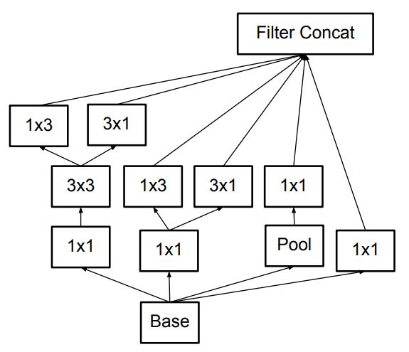
</p>
<p align=center>
    <em><b>Figure 8:</b> The type-C Inception module (Image from [2]). </em>
</p>

So far, we have mentioned four types of the Inception module.

By using factorization, the number of weights/parameters has decreased a lot. Consequently, not only the network can have more layers (more deep), but it is also more unlikely to be overfitting [4].

### Auxiliary classifiers

Auxiliary classifiers were first used to improve the convergence of very deep networks, but according to [2] they support the training stage by serving as a regularizer (for more information, you should read the paper [2]). For the current case, the classification stage happens only at the top of a network (the last layers of the network). With auxiliary classifier, now the network has two heads for classification. Because of that, training and evaluation will have two losses and two accuracies.

<p align=center>
    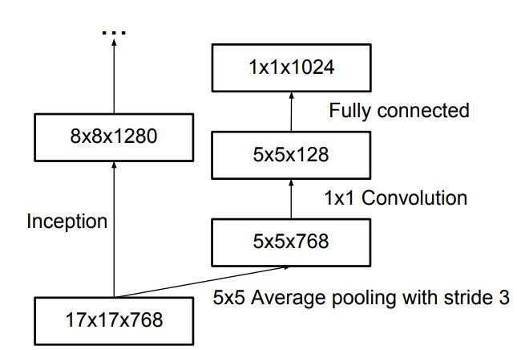
</p>
<p align=center>
    <em><b>Figure 9:</b> Auxiliary classifier (Image from [4]). </em>
</p>

Below is the code for the class ```AuxiliaryClassifier```. Notice that its first layer is the Average Pooling layer (look at Figure 9). Also notice that the last convolutional layer acts as a dense layer, so we specify the number of filters to a value that is equal to the number of categories in the used dataset:

```python
class AuxiliaryClassifier(tf.keras.layers.Layer):
    def __init__(self, **kwargs):
        super(AuxiliaryClassifier, self).__init__(**kwargs)

    def build(self, input_shape):
        self.average_pooling = tf.keras.layers.AveragePooling2D(pool_size=(5, 5),
                                                                strides=(3, 3),
                                                                padding='valid')
        self.conv2d_5_a = tf.keras.layers.Conv2D(128,
                                                 (1, 1),
                                                 padding='same')
        self.bn_5_a = tf.keras.layers.BatchNormalization()
        self.conv2d_5_b = tf.keras.layers.Conv2D(768,
                                                 (5, 5),
                                                 padding='valid',
                                                 kernel_initializer=tf.keras.initializers.TruncatedNormal(0.01))
        self.bn_5_b = tf.keras.layers.BatchNormalization()
        self.conv2d_5_c = tf.keras.layers.Conv2D(3, # The number of filters is equal to the number of categories in the used dataset
                                                 (1, 1),
                                                 activation=None,
                                                 kernel_initializer=tf.keras.initializers.TruncatedNormal(0.001))
        self.bn_5_c = tf.keras.layers.BatchNormalization()

    def call(self, input_tensor, training=False):
        average_pooling = self.average_pooling(input_tensor)
        conv2d_5_a = self.conv2d_5_a(average_pooling)
        bn_5_a = self.bn_5_a(conv2d_5_a, training=training)
        conv2d_5_b = self.conv2d_5_b(bn_5_a)
        bn_5_b = self.bn_5_b(conv2d_5_b, training=training)
        conv2d_5_c = self.conv2d_5_c(bn_5_b)
        bn_5_c = self.bn_5_c(conv2d_5_c, training=training) # The output of `bn_5_c` has shape (3, 1, 1)
        squeeze = tf.squeeze(bn_5_c, [1, 2]) # Squeeze the output of `bn_5_c` in axis 1 and 2 => The shape of the tensor becomes (3,), which is well seen as the dense layer

        return squeeze

    def get_config(self):
        config = super().get_config().copy()
        return config
```

It is not much to say about the implementation of the class ```AuxiliaryClassifier```. It is just a small module containing one average pooling layer and three convolutional layers (The batch normalization is also used). The important thing is how to integrate the module into the final network architecture. The integration will be showed below.

### Efficient grid size reduction

This part is to talk about the grid size reduction.

<p align=center>
    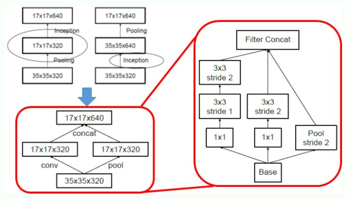
</p>
<p align=center>
    <em><b>Figure 10:</b> Conventional downsizing (Top Left), Efficient Grid Size Reduction (Bottom Left), Detailed Architecture of Efficient Grid Size Reduction (Right) (Image from [4])(notice that the architecture needs to be read from the bottom-up). </em>
</p>

The max pooling is usually used to decrease the size of a feature map for efficiency. However, there are two main problems with it [4]:
- "A max pooling layer followed by a convolutional layer is too greedy": Look at the picture in [4] (top left), we first do the pooling on the input and only get what we need and get rid of all the others by decreasing the number of channels.
- "A convolutional layer followed by a max pooling is too expensive": Look at the picture in [4] (top left), we use all the information from the input to feed into the convolutional layer => This is very expensive.

The two mentioned problems above are the main reasons leading to the proposition of the Efficient Grid Size Reduction in Inceptionnet-v3.

In the bottom left of the picture in [4], the primitive version of the Efficient Grid Size Reduction module is drawn. Having the two separated paths like this tackles both the problems above. The input information is not lost and the convolutional operation is not too expensive (as the number of filters is decreased by half). More importantly, the output shape is kept (17x17x640) by concatening the outputs of the two paths. It has the best of both worlds. This primitive module is then expanded into the detailed Efficient Grid Size Reduction module with 3 paths (the right of picture in [4]).

The implementation of Efficient Grid Size Reduction is below (we get references from [4]):

```python
class GridSizeReduction(tf.keras.layers.Layer):
    def __init__(self, nf1_a, nf1_b, nf2_a, nf2_b, **kwargs):
        super(GridSizeReduction, self).__init__(**kwargs)
        self.n_filters_of_layer_1_a = nf1_a
        self.n_filters_of_layer_1_b = nf1_b
        self.n_filters_of_layer_2_a = nf2_a
        self.n_filters_of_layer_2_b = nf2_b

    def build(self, input_shape):
        # === First path ===
        self.conv2d_1_nf1_a = tf.keras.layers.Conv2D(self.n_filters_of_layer_1_a, # The attribute 1_a is used in the first layer
                                                     (1, 1),
                                                     padding='same',
                                                     activation='relu')
        self.bn_1_nf1_a = tf.keras.layers.BatchNormalization()
        self.conv2d_3_nf1_b = tf.keras.layers.Conv2D(self.n_filters_of_layer_1_b, # The attribute 1_b is used in all the remained layers
                                                     (3, 3),
                                                     padding='same',
                                                     activation='relu')
        self.bn_3_nf1_b = tf.keras.layers.BatchNormalization()
        self.conv2d_3_nf1_c = tf.keras.layers.Conv2D(self.n_filters_of_layer_1_b, # The attribute 1_b is used in all the remained layers
                                                     (3, 3),
                                                     strides=(2, 2),
                                                     padding='valid',
                                                     activation='relu')
        self.bn_3_nf1_c = tf.keras.layers.BatchNormalization()

        # === Second path ===
        self.conv2d_1_nf2_a = tf.keras.layers.Conv2D(self.n_filters_of_layer_2_a, # The attribute 2_a is used in the first layer
                                                     (1, 1),
                                                     padding='same',
                                                     activation='relu')
        self.bn_1_nf2_a = tf.keras.layers.BatchNormalization()
        self.conv2d_3_nf2_b = tf.keras.layers.Conv2D(self.n_filters_of_layer_2_b, # The attribute 2_b is used in the last layer
                                                     (3, 3),
                                                     strides=(2, 2),
                                                     padding='valid',
                                                     activation='relu')
        self.bn_3_nf2_b = tf.keras.layers.BatchNormalization()

        # === Third path ===
        self.max_pool2d = tf.keras.layers.MaxPool2D((3, 3), # Max pooling is used instead of average pooling
                                                     strides=(2, 2),
                                                     padding='valid')

        # === Concatenation ===
        self.concatenation = tf.keras.layers.Concatenate(axis=-1)

    def call(self, input_tensor, training=False):
        # === First path ===
        conv2d_1_nf1_a = self.conv2d_1_nf1_a(input_tensor)
        bn_1_nf1_a = self.bn_1_nf1_a(conv2d_1_nf1_a)
        conv2d_3_nf1_b = self.conv2d_3_nf1_b(bn_1_nf1_a)
        bn_3_nf1_b = self.bn_3_nf1_b(conv2d_3_nf1_b)
        conv2d_3_nf1_c = self.conv2d_3_nf1_c(bn_3_nf1_b)
        bn_3_nf1_c = self.bn_3_nf1_c(conv2d_3_nf1_c)

        # === Second path ===
        conv2d_1_nf2_a = self.conv2d_1_nf2_a(input_tensor)
        bn_1_nf2_a = self.bn_1_nf2_a(conv2d_1_nf2_a)
        conv2d_3_nf2_b = self.conv2d_3_nf2_b(bn_1_nf2_a)
        bn_3_nf2_b = self.bn_3_nf2_b(conv2d_3_nf2_b)

        # === Third path ===
        max_pool2d = self.max_pool2d(input_tensor)

        # === Concatenation ===
        concatenation = self.concatenation([bn_3_nf1_c,
                                            bn_3_nf2_b,
                                            max_pool2d])
        return concatenation

    def get_config(self):
        config = super().get_config().copy()
        config.update({
            'n_filters_of_layer_1': self.n_filters_of_layer_1,
            'n_filters_of_layer_2': self.n_filters_of_layer_2,
            'n_filters_of_layer_3': self.n_filters_of_layer_3,
        })

        return config
```

### Inception-v3 architecture

Now that we have completed all the required modules, let's build the Inception-v3 network architecture.

<p align=center>
    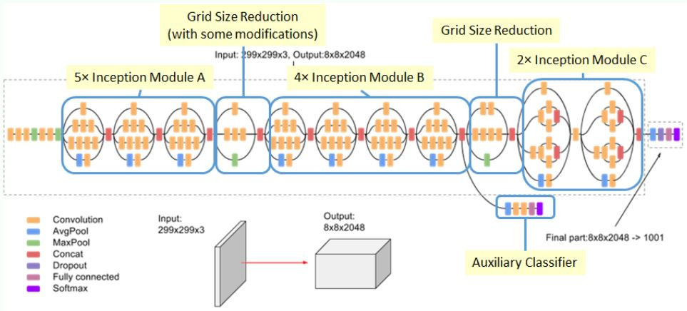
</p>
<p align=center>
    <em><b>Figure 11:</b> The Inception-v3 architecture (Image from [4]). </em>
</p>

In case you do not notice, there are some convolutional layers and max pooling layers coming before the Inception modules. If we think each Inception module as one layer, the Inception-v3 network will have 18 layers: 7 primitive layers (convolution and max pooling) + 11 Inception layers (or Inception modules). Here, we only consider the layers for feature extraction, not the layers for classification (the top layers). We also do not consider the Auxiliary classifier module.

We have implemented all the module in the InceptionNet-v3, now we connect all the modules to build the InceptionNet-v3 as described in Figure 10. 

The code for the Inception-V3 network is below. Everything is implemented in the same architecture specified in Figure 11:

```python
class InceptionNet(tf.keras.Model):
    def __init__(self, num_classes=3):
        super(InceptionNet, self).__init__()
        self.conv2d_a_1 = tf.keras.layers.Conv2D(filters=32,
                                                 kernel_size=(3, 3),
                                                 strides=(2, 2),
                                                 padding='valid',
                                                 activation=None)
        self.conv2d_a_2 = tf.keras.layers.Conv2D(filters=32,
                                                 kernel_size=(3, 3),
                                                 padding='valid',
                                                 activation=None)
        self.conv2d_a_3 = tf.keras.layers.Conv2D(filters=64,
                                                 kernel_size=(3, 3),
                                                 padding='same',
                                                 activation=None)
        self.max_pool2d_a = tf.keras.layers.MaxPool2D(pool_size=(3, 3),
                                                      strides=(2, 2),
                                                      padding='valid')
        self.conv2d_b_1 = tf.keras.layers.Conv2D(filters=80,
                                                 kernel_size=(1, 1),
                                                 padding='valid',
                                                 activation=None)
        self.conv2d_b_2 = tf.keras.layers.Conv2D(filters=192,
                                                 kernel_size=(3, 3),
                                                 padding='valid',
                                                 activation=None)
        self.max_pool2d_b = tf.keras.layers.MaxPool2D(pool_size=(3, 3),
                                                      strides=(2, 2),
                                                      padding='valid')
        self.inception_module_a_1 = InceptionModule(64, 48, 64, 64, 96, 32)
        self.inception_module_a_2 = InceptionModule(64, 48, 64, 64, 96, 64)
        self.inception_module_a_3 = InceptionModule(64, 48, 64, 64, 96, 64)
        self.grid_size_reduction_1 = GridSizeReduction(64, 96, 384, 384)
        self.inception_module_b_1 = InceptionModuleWithAsymmetricFactorization(192, 128, 192, 128, 192, 192)
        self.inception_module_b_2 = InceptionModuleWithAsymmetricFactorization(192, 160, 192, 160, 192, 192)
        self.inception_module_b_3 = InceptionModuleWithAsymmetricFactorization(192, 160, 192, 160, 192, 192)
        self.inception_module_b_4 = InceptionModuleWithAsymmetricFactorization(192, 192, 192, 192, 192, 192)
        self.auxiliary_classifier = AuxiliaryClassifier()
        self.grid_size_reduction_2 = GridSizeReduction(192, 192, 192, 320)
        self.inception_module_c_1 = InceptionModuleForHighDimRepresentations(320, 384, 384, 448, 384, 192)
        self.inception_module_c_2 = InceptionModuleForHighDimRepresentations(320, 384, 384, 448, 384, 192)
        self.average_pooling = tf.keras.layers.AveragePooling2D(pool_size=(2, 2),
                                                            strides=None,
                                                            padding='valid')
        self.dropout = tf.keras.layers.Dropout(rate=0.2,
                                               noise_shape=None,
                                               seed=None)
        self.flatten = tf.keras.layers.Flatten(input_shape=(3, 3, 10))
        self.classifier = tf.keras.layers.Dense(num_classes, activation='softmax')

    def call(self, inputs):
        x = self.conv2d_a_1(inputs)
        x = self.conv2d_a_2(x)
        x = self.conv2d_a_3(x)
        x = self.max_pool2d_a(x)
        x = self.conv2d_b_1(x)
        x = self.conv2d_b_2(x)
        x = self.max_pool2d_b(x)
        x = self.inception_module_a_1(x)
        x = self.inception_module_a_2(x)
        x = self.inception_module_a_3(x)
        x = self.grid_size_reduction_1(x)
        x = self.inception_module_b_1(x)
        x = self.inception_module_b_2(x)
        x = self.inception_module_b_3(x)
        x = self.inception_module_b_4(x)
        out1 = self.auxiliary_classifier(x) 
        x = self.grid_size_reduction_2(x)
        x = self.inception_module_c_1(x)
        x = self.inception_module_c_2(x)
        x = self.average_pooling(x)
        x = self.dropout(x)
        x = self.flatten(x)
        out2 = self.classifier(x)

        return [out1, out2]

    def model(self):
        x = tf.keras.layers.Input(shape=(299, 299, 3))
        return tf.keras.Model(inputs=[x], outputs=self.call(x))
```

The number of filters, kernel size, strides, and other settings of each layer have already been set according to the paper [2] and the code [5].

In ```call```, we return the list of two outputs as their are two classifier: the original one at the top and the auxiliary one.

Then, try running and we will see that there are 2 train losses, 2 train accuracies and 2 validation accuracies. That is because we have 2 classifiers.

In ```train.py```, set the image_size from 224 to 299. This is the default image size used by [2] and [5].

We should verify whether the network architecture has been correctly implemented. One way to do this is to compare the output new "plot_model.png" with Figure 11.

<p align=center>
    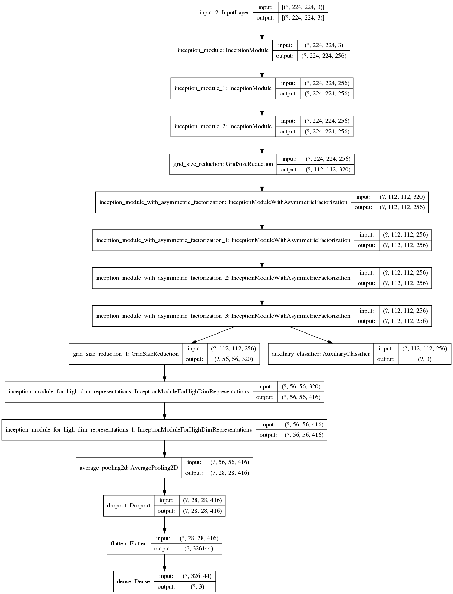
</p>
<p align=center>
    <em><b>Figure 12:</b> The plot image of the Inception-v3 architecture. </em>
</p>

The validation result after training 100 epochs is:

```sh
```

## Conclusion

Overall, the Inception-v3 architecture is very complex and you can also see that this post for it is also very long. However, with the help of Tensorflow custom layer/model, we have the ability to implement the variants of the Inception module in a compact and systematic way. Hope that from this post you have truly acknowledged the advantages of using Tensorflow custom layer/model.

## References

[1] Christian Szegedy et al., "Going Deeper with Convolutions", 2015.

[2] Christian Szegedy et al., "Rethinking the Inception Architecture for Computer Vision", 2015.

[3] "How to implement major architecture innovations for convolutional neural networks", Machine Learning Mastery, 2016.

[4] Sik-Ho Tsang, Review: Inception-v3 - 1st Runner Up (Image Classification) in ILSVRC 2015, Medium, 2018.

[5] [Tensorflow Inception-v3](https://github.com/tensorflow/models/blob/master/research/slim/nets/inception_v3.py)